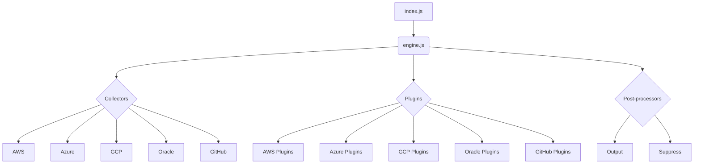
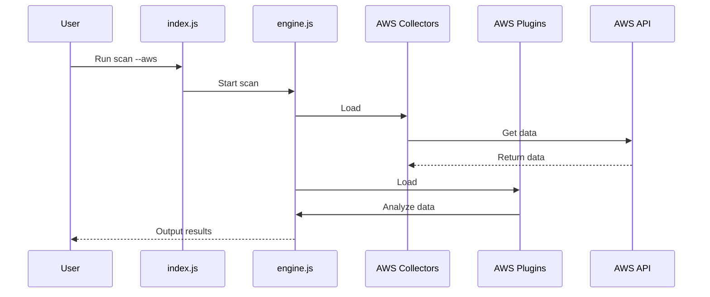

# Architecture Documentation

This document provides a comprehensive overview of the system's architecture, including its components, interactions, and technologies.

## Architecture Overview

The system follows a modular architecture, with distinct components for different cloud providers (AWS, Azure, GCP, Oracle, GitHub) and functionalities. The core of the system is the `engine.js` file, which orchestrates the scanning process. It loads the appropriate collectors and plugins based on the specified cloud provider and executes them.

The collectors are responsible for gathering data from the cloud provider's API, while the plugins analyze the collected data to identify potential security risks. The results are then post-processed and presented to the user.



## Use Cases

The primary use case for the system is to scan cloud environments for security vulnerabilities. The user can initiate a scan for a specific cloud provider and receive a report of the findings.

### Use Case: Scan AWS Environment

1. **User Interaction:** The user runs the `index.js` script with the `--aws` flag.
2. **System Process:**
    - `index.js` parses the command-line arguments and calls `engine.js`.
    - `engine.js` loads the AWS collectors and plugins.
    - The AWS collectors gather data from the AWS API.
    - The AWS plugins analyze the collected data.
    - The post-processors format the results.
3. **Expected Outcome:** The system outputs a report of the security vulnerabilities found in the AWS environment.

## System Diagrams

### Deployment Diagram

```mermaid
deployment
    user
    server
    subgraph AWS
        ec2
    end
    subgraph Azure
        vm
    end
    subgraph GCP
        gce
    end

    user -> server: Run scan
    server -> ec2: Scan
    server -> vm: Scan
    server -> gce: Scan
```

### Sequence Diagram: AWS Scan



## Technology Stack

- **Programming Language:** Node.js
- **Frameworks:**
    - Mocha: Testing framework
    - Chai: Assertion library
- **Libraries:**
    - aws-sdk: AWS SDK for Node.js
    - @azure/storage-blob: Azure Storage Blob client library for js
    - @azure/storage-queue: Azure Storage Queue client library for js
    - @azure/storage-file-share: Azure Storage File Share client library for js
    - google-auth-library: Google Auth Library for nodejs
    - @octokit/rest: GitHub REST API client
    - ali-oss: Alibaba Cloud OSS SDK for Node.js
- **Tools:**
    - ESLint: Linting tool
    - nyc: Code coverage tool

## Key Design Decisions

- **Modular Architecture:** The system is designed to be modular, with separate collectors and plugins for each cloud provider. This makes it easy to add support for new cloud providers and to update existing plugins.
- **Asynchronous Operations:** The system uses asynchronous operations to improve performance. This allows the collectors to gather data from multiple sources in parallel.
- **Extensibility:** The system is designed to be extensible, with a simple interface for creating new plugins.
