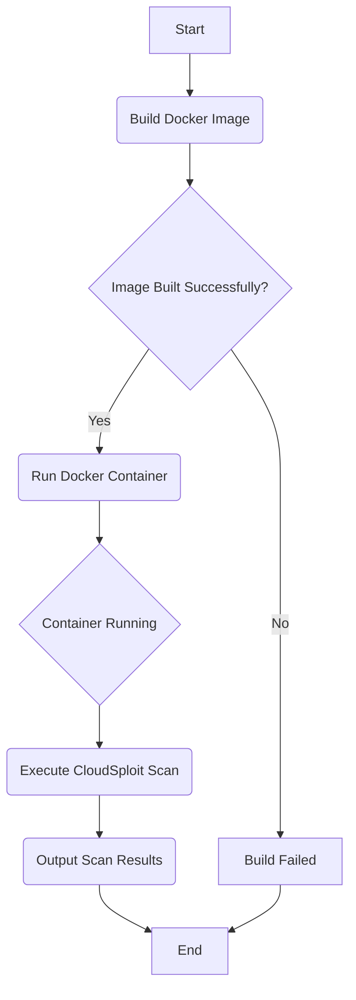

# Dockerfile Documentation

## File Overview

The `Dockerfile` is used to create a Docker container image for the CloudSploit scanner. It sets up the environment, installs dependencies, and configures the container to run the scan.

## Class/Function Descriptions

This file does not contain any classes or functions. It consists of Dockerfile instructions.

- **`FROM node:lts-alpine3.12`**: Sets the base image for the container to the long-term support (LTS) version of Node.js on Alpine Linux 3.12.
- **`ARG PACKAGENAME=cloudsploit`**: Defines a build argument `PACKAGENAME` with a default value of `cloudsploit`. This allows users to specify a different package name when building the container, for example, to use a forked version.
- **`RUN addgroup -S cloudsploit && adduser -S cloudsploit -G cloudsploit`**: Creates a non-root user and group named `cloudsploit` for improved security.
- **`COPY . /var/scan/cloudsploit/`**: Copies the entire project directory into the `/var/scan/cloudsploit/` directory within the container.
- **`WORKDIR /var/scan`**: Sets the working directory to `/var/scan`.
- **`RUN npm init --yes && npm install ${PACKAGENAME} && npm link /var/scan/cloudsploit && chown -R cloudsploit:cloudsploit /var/scan`**: Initializes a `package.json` file, installs the CloudSploit package (either the default or the one specified by `PACKAGENAME`), links the local source code for development purposes, and changes the ownership of the `/var/scan` directory to the `cloudsploit` user.
- **`ENV PATH "$PATH:/var/scan/node_modules/.bin"`**: Adds the `node_modules/.bin` directory to the system's PATH, allowing the `cloudsploitscan` executable to be run directly.
- **`USER cloudsploit`**: Switches the user to the non-root `cloudsploit` user.
- **`ENTRYPOINT ["cloudsploitscan"]`**: Sets the entry point of the container to the `cloudsploitscan` command.
- **`CMD []`**: Provides a default command, which is empty. This allows users to pass command-line arguments to the `cloudsploitscan` command when running the container.

## Use Cases

The primary use case for this `Dockerfile` is to build a containerized version of the CloudSploit scanner. This allows for easy distribution and execution of the scanner in various environments without needing to manually install dependencies.

### Example Usage

To build the container:
```bash
docker build -t cloudsploit/scan .
```

To run the scanner using the container:
```bash
docker run cloudsploit/scan --help
```

To run the scanner with specific options:
```bash
docker run cloudsploit/scan --aws --all
```
## System Diagrams

### Docker Build and Run Flow


