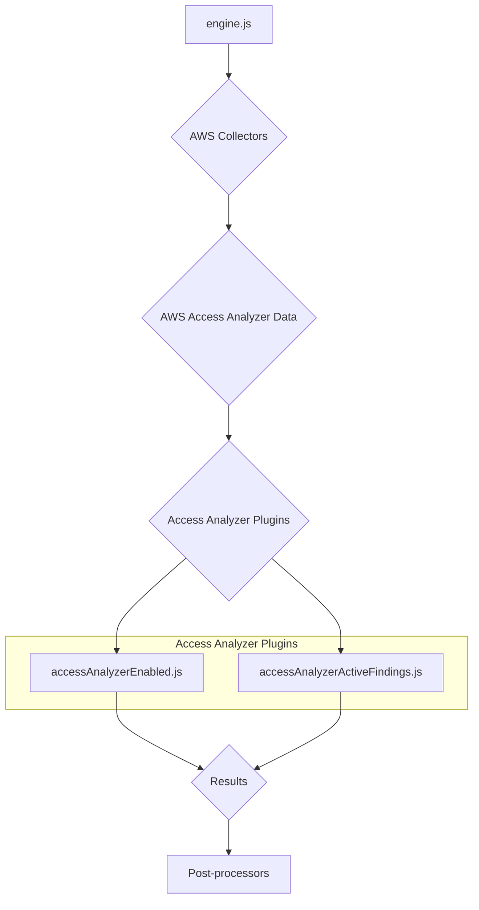
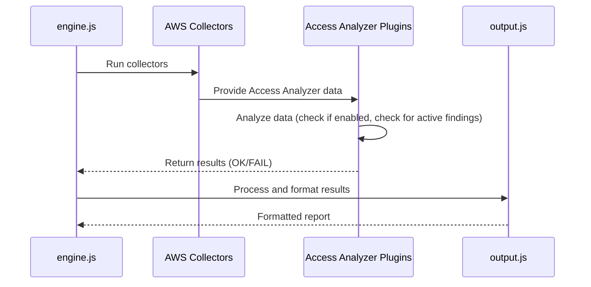
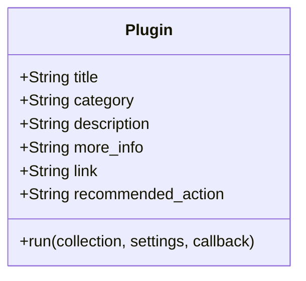
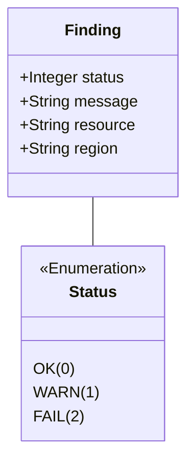

# AWS Access Analyzer Plugins Documentation

This document provides a comprehensive overview of the AWS Access Analyzer plugins within the CloudSploit system.

## Architecture Overview

The Access Analyzer plugins are part of the AWS plugin suite for CloudSploit. They are designed to integrate with the core scanning engine (`engine.js`) to assess the configuration and findings of AWS Access Analyzer. The architecture follows the standard CloudSploit plugin pattern, where collectors gather data from AWS, and plugins analyze that data to identify potential security risks.

The two primary plugins for Access Analyzer are:
1.  **`accessAnalyzerEnabled.js`**: This plugin checks whether AWS Access Analyzer is enabled for the account in the scanned region.
2.  **`accessAnalyzerActiveFindings.js`**: This plugin retrieves findings from Access Analyzer and flags any that are "ACTIVE".

These plugins are executed by the `engine.js` after the relevant data has been collected by the AWS collectors. The results are then passed to the post-processing modules for suppression and output formatting.



## Use Cases

### Use Case 1: Ensure Access Analyzer is Enabled

-   **User Interaction:** The user runs a scan on their AWS account.
-   **System Process:**
    -   The `accessAnalyzerEnabled.js` plugin is executed.
    -   It checks the collected data to see if an Access Analyzer has been configured for the region.
    -   If no analyzer is found, it generates a "FAIL" result.
    -   If an analyzer is found, it generates an "OK" result.
-   **Expected Outcome:** The user is alerted if AWS Access Analyzer is not enabled, which is a security best practice.

### Use Case 2: Identify Active Access Analyzer Findings

-   **User Interaction:** The user runs a scan on their AWS account.
-   **System Process:**
    -   The `accessAnalyzerActiveFindings.js` plugin is executed.
    -   It iterates through the list of findings from Access Analyzer.
    -   For each finding with a status of "ACTIVE", it generates a "FAIL" result, indicating an unresolved external access issue.
    -   If there are no active findings, it generates an "OK" result.
-   **Expected Outcome:** The user is notified of any active Access Analyzer findings that require review and remediation.

## System Diagrams

### Sequence Diagram: Access Analyzer Scan



## Technology Stack

-   **Programming Language:** Node.js
-   **Framework:** CloudSploit (custom plugin architecture)
-   **AWS SDK:** Used by the collectors to interact with the AWS API and retrieve Access Analyzer data.

## Key Design Decisions

-   **Separation of Concerns:** The logic for checking if the analyzer is enabled is separate from the logic for checking for active findings. This makes the plugins more modular and easier to maintain.
-   **Region-Specific Checks:** The plugins operate on a per-region basis, which aligns with how Access Analyzer is configured in AWS.
-   **Focus on Actionable Findings:** The `accessAnalyzerActiveFindings.js` plugin specifically targets "ACTIVE" findings, as these are the ones that represent a current potential security risk. Other statuses (like "ARCHIVED" or "RESOLVED") are ignored to reduce noise.

## Plugin Interface and Finding Structure

This section details the standard interface for all CloudSploit plugins and the structure of the findings they generate. This common interface allows the scanning engine to dynamically execute plugins and process their results in a uniform way.

### Plugin Module Exports

Each plugin is a Node.js module that must export a specific set of properties and a `run` function. These exports provide metadata that the engine uses for reporting and organization.



-   `title` (string): A user-friendly title for the plugin (e.g., "Access Analyzer Enabled").
-   `category` (string): The cloud service category the plugin belongs to (e.g., "Access Analyzer").
-   `description` (string): A brief explanation of what the plugin checks for.
-   `more_info` (string): A more detailed description of the potential security risk.
-   `link` (string): A URL to the official AWS documentation or a relevant security guide.
-   `recommended_action` (string): A description of the steps to mitigate the identified risk.
-   `run` (function): The core logic of the plugin.

### The `run` Function

The `run` function is the entry point for the plugin's execution.

`run(collection, settings, callback)`

-   **Parameters:**
    -   `collection` (object): An object containing all the data gathered by the collectors. The plugin uses this data to perform its analysis. For example, `collection.accessanalyzer.listAnalyzers['us-east-1'].data` would contain the list of analyzers in the `us-east-1` region.
    -   `settings` (object): An object containing global settings for the scan, such as custom plugin configurations.
    -   `callback` (function): A standard Node.js callback function `(err, results)` that the plugin must call when it has finished its analysis.

### Finding (Result) Structure

The `run` function passes an array of "finding" objects to its callback. Each object represents the outcome of a single check on a single resource.



-   **`status` (integer):** The outcome of the check.
    -   `0` (OK): The resource is compliant.
    -   `1` (WARN): The resource is in a potentially problematic state but may not be an immediate risk.
    -   `2` (FAIL): The resource is non-compliant and represents a security risk.
-   **`message` (string):** A human-readable message describing the finding. For example, "Access Analyzer is not enabled for the region" or "Access Analyzer has an active finding for S3 bucket my-public-bucket".
-   **`resource` (string):** The Amazon Resource Name (ARN) or another unique identifier of the resource that was checked.
-   **`region` (string):** The AWS region where the resource is located.

### Example Plugin Flow

1.  **`accessAnalyzerEnabled.js` ("Enable Feature" type):**
    -   **`run` function:**
        1.  Accesses the collected data: `collection.accessanalyzer.listAnalyzers`.
        2.  Checks if any analyzers exist for each region.
        3.  If a region has no analyzers, it creates a **FAIL** finding:
            ```json
            {
              "status": 2,
              "message": "Access Analyzer is not enabled for the region",
              "resource": "N/A",
              "region": "us-west-2"
            }
            ```
        4.  If a region has an analyzer, it creates an **OK** finding.
        5.  Calls `callback(null, findingsArray)`.

2.  **`accessAnalyzerActiveFindings.js` ("Findings" type):**
    -   **`run` function:**
        1.  Accesses the collected findings: `collection.accessanalyzer.listFindings`.
        2.  Iterates through each finding in each region.
        3.  If a finding has `status: 'ACTIVE'`, it creates a **FAIL** finding:
            ```json
            {
              "status": 2,
              "message": "Access Analyzer has an active finding with type: 'External Access'",
              "resource": "arn:aws:s3:::my-public-bucket",
              "region": "us-east-1"
            }
            ```
        4.  If there are no active findings, it creates a single **OK** finding for the analyzer.
        5.  Calls `callback(null, findingsArray)`.