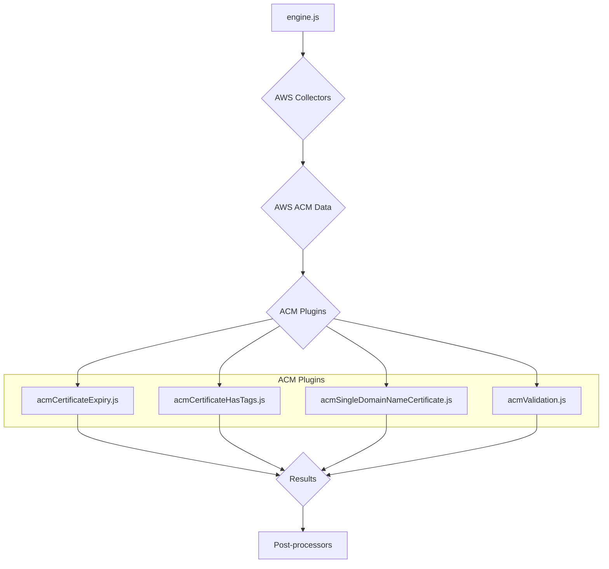
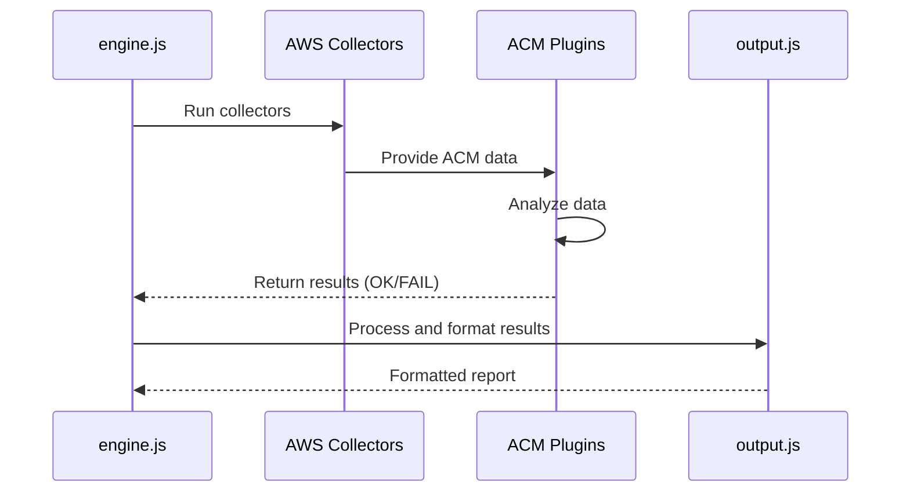
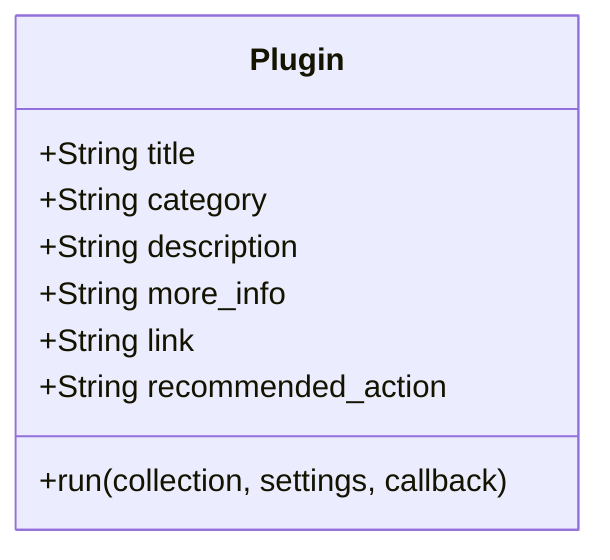
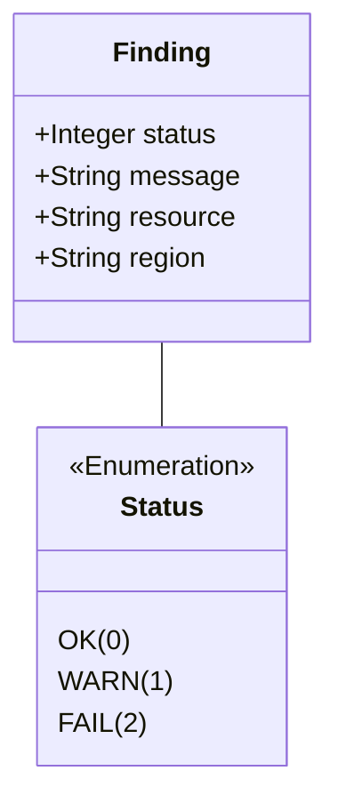

# AWS ACM Plugins Documentation

This document provides a comprehensive overview of the AWS Certificate Manager (ACM) plugins within the CloudSploit system.

## Architecture Overview

The ACM plugins are part of the AWS plugin suite for CloudSploit. They are designed to integrate with the core scanning engine (`engine.js`) to assess the configuration and status of ACM certificates. The architecture follows the standard CloudSploit plugin pattern, where collectors gather data from AWS, and plugins analyze that data to identify potential security risks.

The primary plugins for ACM are:
1.  **`acmCertificateExpiry.js`**: This plugin checks for ACM certificates that are expiring soon.
2.  **`acmCertificateHasTags.js`**: This plugin ensures that all ACM certificates are properly tagged.
3.  **`acmSingleDomainNameCertificate.js`**: This plugin checks for certificates that cover only a single domain name, which may indicate a lack of proper SAN certificates.
4.  **`acmValidation.js`**: This plugin checks the validation status of ACM certificates.

These plugins are executed by the `engine.js` after the relevant data has been collected by the AWS collectors. The results are then passed to the post-processing modules for suppression and output formatting.

## Use Cases

### Use Case 1: Detect Expiring Certificates
- **User Interaction:** The user runs a scan on their AWS account.
- **System Process:**
    - The `acmCertificateExpiry.js` plugin is executed.
    - It checks the expiration date of each ACM certificate.
    - If a certificate is expiring within a configured threshold, it generates a "FAIL" result.
- **Expected Outcome:** The user is alerted to expiring certificates, allowing them to renew them before they cause an outage.

### Use Case 2: Ensure Certificate Tagging
- **User Interaction:** The user runs a scan on their AWS account.
- **System Process:**
    - The `acmCertificateHasTags.js` plugin is executed.
    - It checks if each ACM certificate has tags.
    - If a certificate is missing tags, it generates a "FAIL" result.
- **Expected Outcome:** The user can enforce a consistent tagging policy for all ACM certificates.

## System Diagrams

### Sequence Diagram: ACM Scan

## Technology Stack

-   **Programming Language:** Node.js
-   **Framework:** CloudSploit (custom plugin architecture)
-   **AWS SDK:** Used by the collectors to interact with the AWS API and retrieve ACM data.

## Plugin Interface and Finding Structure

This section details the standard interface for all CloudSploit plugins and the structure of the findings they generate. This common interface allows the scanning engine to dynamically execute plugins and process their results in a uniform way.

### Plugin Module Exports

Each plugin is a Node.js module that must export a specific set of properties and a `run` function. These exports provide metadata that the engine uses for reporting and organization.

### The `run` Function

The `run` function is the entry point for the plugin's execution.

`run(collection, settings, callback)`

-   **Parameters:**
    -   `collection` (object): An object containing all the data gathered by the collectors.
    -   `settings` (object): An object containing global settings for the scan.
    -   `callback` (function): A standard Node.js callback function `(err, results)`.

### Finding (Result) Structure

The `run` function passes an array of "finding" objects to its callback. Each object represents the outcome of a single check on a single resource.

