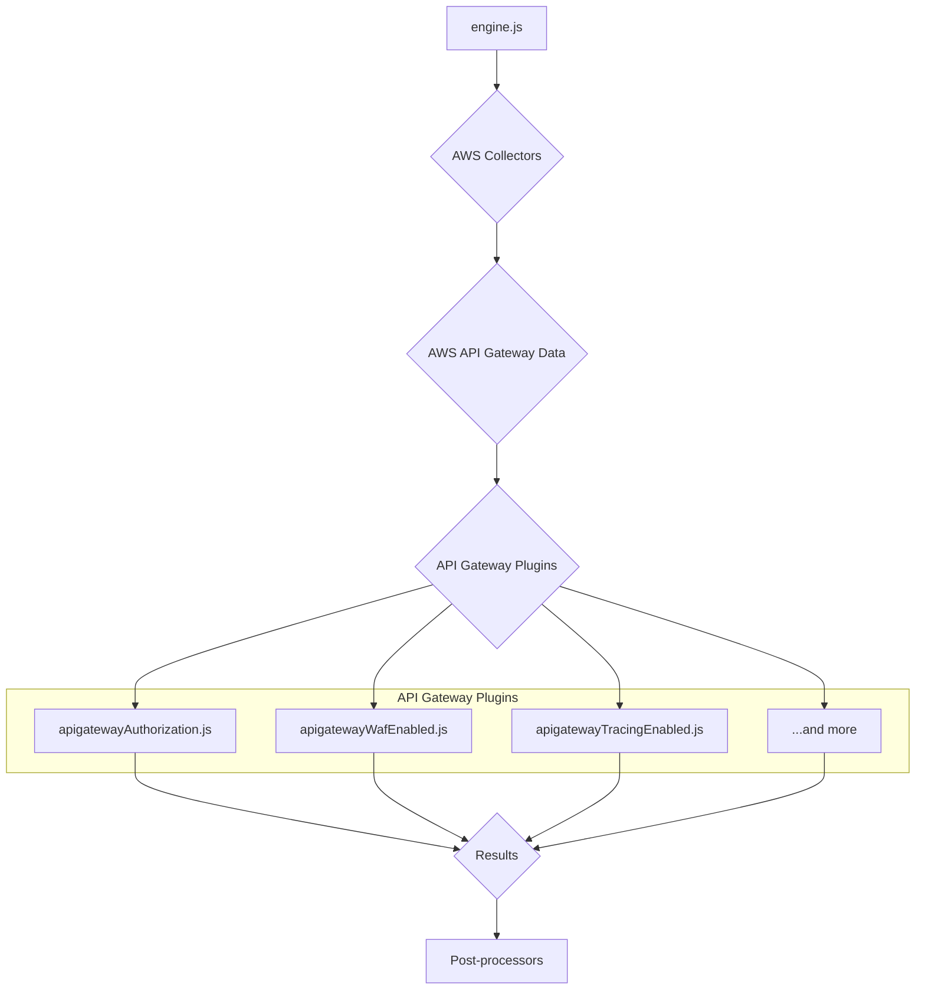
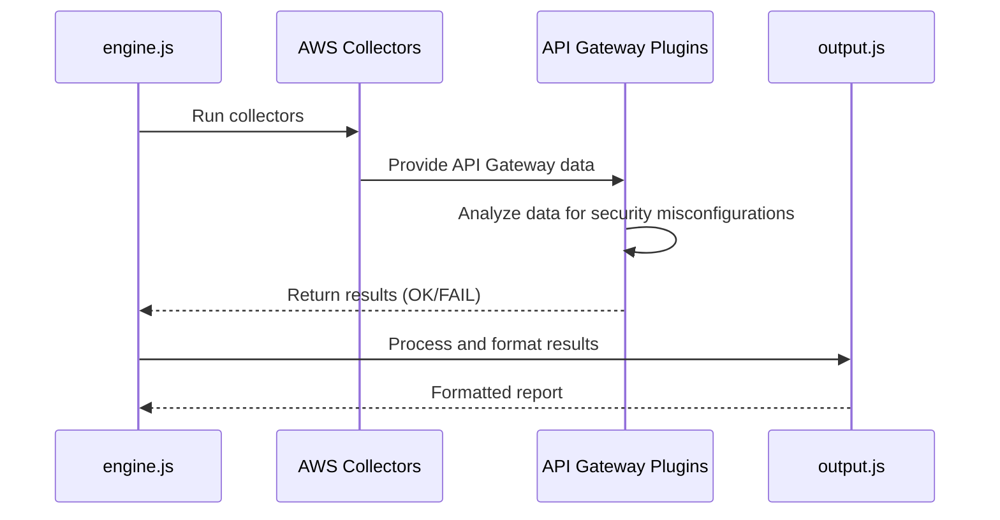
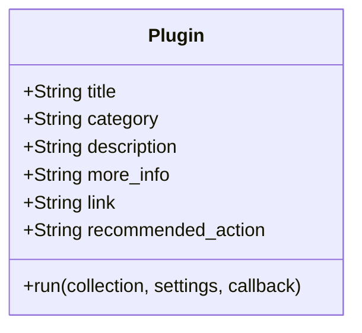
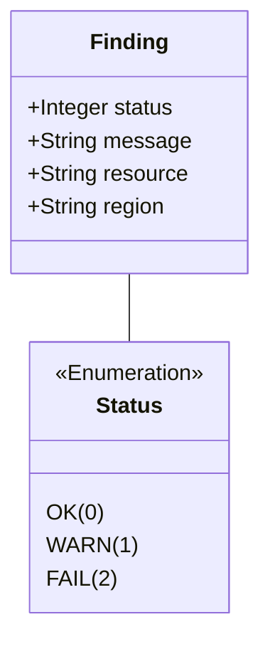

# AWS API Gateway Plugins Documentation

This document provides a comprehensive overview of the AWS API Gateway plugins within the CloudSploit system.

## Architecture Overview

The API Gateway plugins are part of the AWS plugin suite for CloudSploit. They are designed to integrate with the core scanning engine (`engine.js`) to assess the configuration and security of API Gateway deployments. The architecture follows the standard CloudSploit plugin pattern, where collectors gather data from AWS, and plugins analyze that data to identify potential security risks.

The primary plugins for API Gateway cover a wide range of security checks, including:
1.  **`apigatewayAuthorization.js`**: Checks if API methods have authorization configured.
2.  **`apigatewayWafEnabled.js`**: Ensures that a Web Application Firewall (WAF) is associated with API Gateway stages.
3.  **`apigatewayTracingEnabled.js`**: Verifies that X-Ray tracing is enabled for detailed request monitoring.
4.  **`apigatewayCloudwatchLogs.js`**: Confirms that API execution logs are being sent to CloudWatch.
5.  **`customDomainTlsVersion.js`**: Checks the TLS version used by custom domain names.
6.  **`apigatewayV2AccessLogging.js`**: Verifies access logging for API Gateway V2.

These plugins are executed by the `engine.js` after the relevant data has been collected by the AWS collectors. The results are then passed to the post-processing modules for suppression and output formatting.

## Use Cases

### Use Case 1: Enforce WAF Protection
- **User Interaction:** The user runs a scan on their AWS account.
- **System Process:**
    - The `apigatewayWafEnabled.js` plugin is executed.
    - It checks each API Gateway stage to see if a WAF web ACL is associated.
    - If a stage is not protected by WAF, it generates a "FAIL" result.
- **Expected Outcome:** The user is alerted to public-facing API stages that are not protected by a Web Application Firewall.

### Use Case 2: Ensure Detailed Tracing is Enabled
- **User Interaction:** The user runs a scan on their AWS account.
- **System Process:**
    - The `apigatewayTracingEnabled.js` plugin is executed.
    - It inspects the settings for each API Gateway stage.
    - If X-Ray tracing is disabled for a stage, it generates a "FAIL" result.
- **Expected Outcome:** The user can ensure that all API stages have distributed tracing enabled, which is critical for debugging and security analysis.

## System Diagrams

### Sequence Diagram: API Gateway Scan

## Technology Stack

-   **Programming Language:** Node.js
-   **Framework:** CloudSploit (custom plugin architecture)
-   **AWS SDK:** Used by the collectors to interact with the AWS API and retrieve API Gateway data.

## Plugin Interface and Finding Structure

This section details the standard interface for all CloudSploit plugins and the structure of the findings they generate.

### Plugin Module Exports

Each plugin is a Node.js module that exports a standard set of properties and a `run` function.

### The `run` Function

The `run` function is the entry point for the plugin's execution.

`run(collection, settings, callback)`

-   **Parameters:**
    -   `collection` (object): An object containing all the data gathered by the collectors.
    -   `settings` (object): An object containing global settings for the scan.
    -   `callback` (function): A standard Node.js callback function `(err, results)`.

### Finding (Result) Structure

The `run` function passes an array of "finding" objects to its callback.

