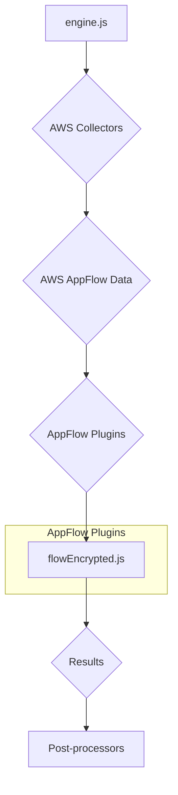
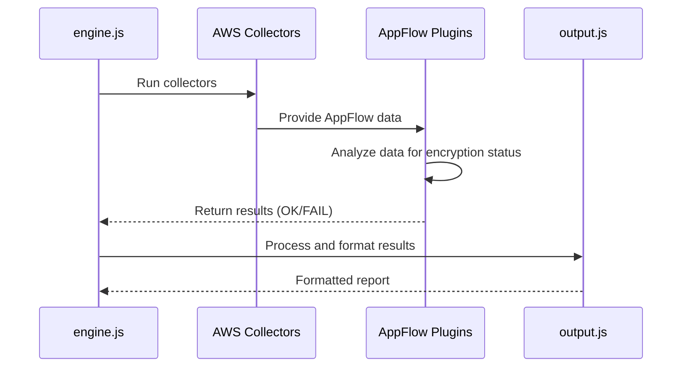
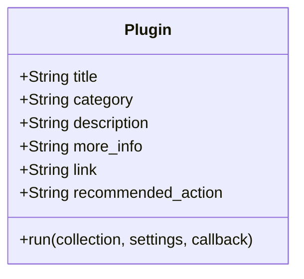
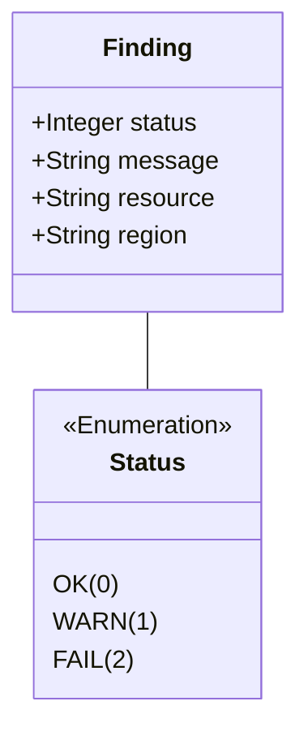

# AWS AppFlow Plugins Documentation

This document provides a comprehensive overview of the AWS AppFlow plugins within the CloudSploit system.

## Architecture Overview

The AppFlow plugins are part of the AWS plugin suite for CloudSploit. They are designed to integrate with the core scanning engine (`engine.js`) to assess the configuration and security of AppFlow flows. The architecture follows the standard CloudSploit plugin pattern, where collectors gather data from AWS, and plugins analyze that data to identify potential security risks.

The primary plugin for AppFlow is:
1.  **`flowEncrypted.js`**: This plugin checks whether AppFlow flows are encrypted using a customer-managed KMS key.

This plugin is executed by the `engine.js` after the relevant data has been collected by the AWS collectors. The results are then passed to the post-processing modules for suppression and output formatting.

## Use Cases

### Use Case 1: Ensure AppFlow Flows are Encrypted
- **User Interaction:** The user runs a scan on their AWS account.
- **System Process:**
    - The `flowEncrypted.js` plugin is executed.
    - It inspects each AppFlow flow to determine if it's configured with a customer-managed KMS key for encryption.
    - If a flow is not encrypted with a KMS CMK, it generates a "FAIL" result.
- **Expected Outcome:** The user is alerted to any AppFlow flows that are not using customer-managed keys for encryption, allowing them to enhance their data protection posture.

## System Diagrams

### Sequence Diagram: AppFlow Scan

## Technology Stack

-   **Programming Language:** Node.js
-   **Framework:** CloudSploit (custom plugin architecture)
-   **AWS SDK:** Used by the collectors to interact with the AWS API and retrieve AppFlow data.

## Plugin Interface and Finding Structure

This section details the standard interface for all CloudSploit plugins and the structure of the findings they generate.

### Plugin Module Exports

Each plugin is a Node.js module that exports a standard set of properties and a `run` function.

### The `run` Function

The `run` function is the entry point for the plugin's execution.

`run(collection, settings, callback)`

-   **Parameters:**
    -   `collection` (object): An object containing all the data gathered by the collectors.
    -   `settings` (object): An object containing global settings for the scan.
    -   `callback` (function): A standard Node.js callback function `(err, results)`.

### Finding (Result) Structure

The `run` function passes an array of "finding" objects to its callback.

