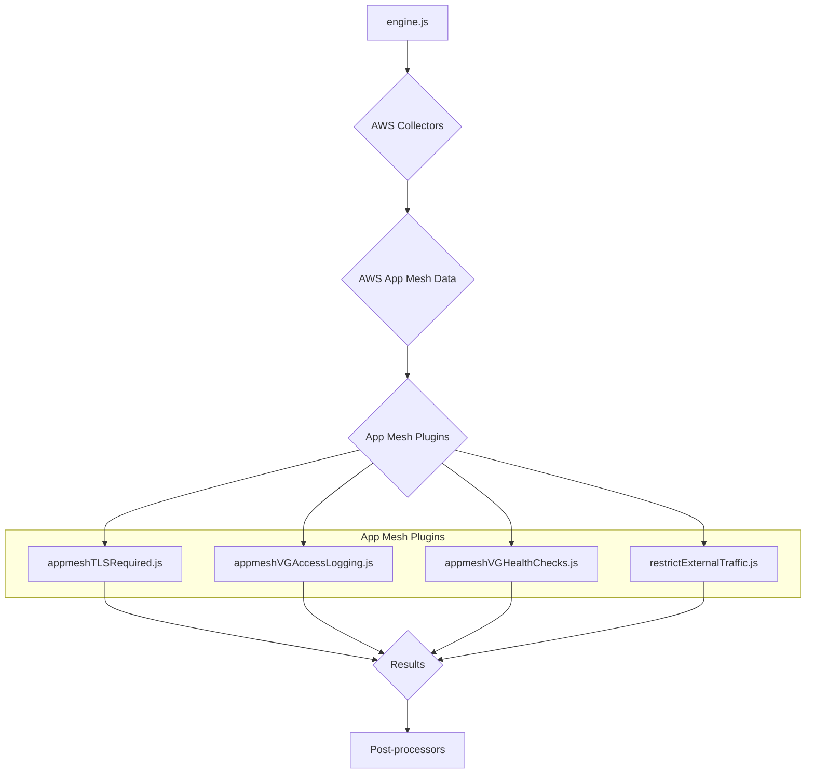
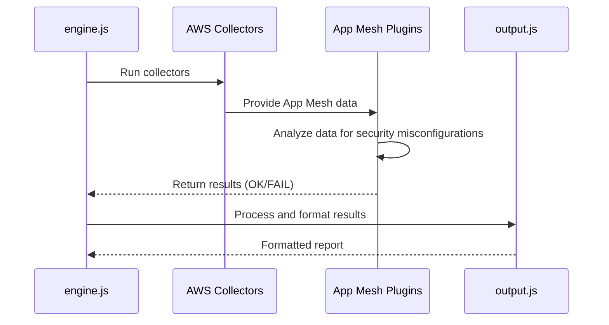
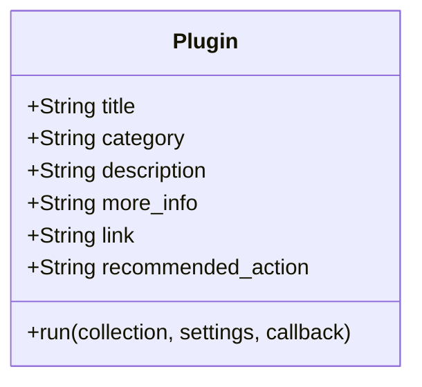
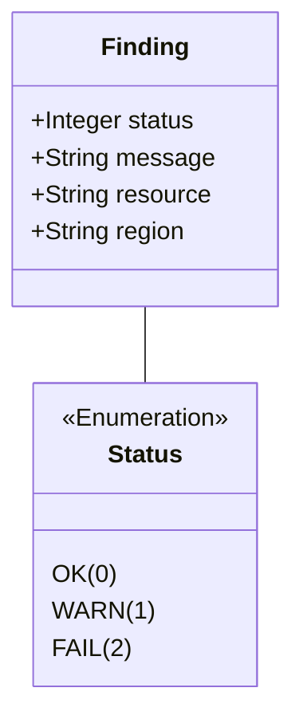

# AWS App Mesh Plugins Documentation

This document provides a comprehensive overview of the AWS App Mesh plugins within the CloudSploit system.

## Architecture Overview

The App Mesh plugins are part of the AWS plugin suite for CloudSploit. They are designed to integrate with the core scanning engine (`engine.js`) to assess the configuration and security of AWS App Mesh. The architecture follows the standard CloudSploit plugin pattern, where collectors gather data from AWS, and plugins analyze that data to identify potential security risks.

The primary plugins for App Mesh are:
1.  **`appmeshTLSRequired.js`**: Checks if App Mesh virtual gateways enforce TLS.
2.  **`appmeshVGAccessLogging.js`**: Verifies that virtual gateway access logging is enabled.
3.  **`appmeshVGHealthChecks.js`**: Ensures that virtual gateway listeners have health checks configured.
4.  **`restrictExternalTraffic.js`**: Checks if the mesh is configured to restrict external traffic.

These plugins are executed by the `engine.js` after the relevant data has been collected by the AWS collectors. The results are then passed to the post-processing modules for suppression and output formatting.

## Use Cases

### Use Case 1: Enforce TLS on Virtual Gateways
- **User Interaction:** The user runs a scan on their AWS account.
- **System Process:**
    - The `appmeshTLSRequired.js` plugin is executed.
    - It checks the configuration of each App Mesh virtual gateway.
    - If a virtual gateway does not enforce TLS, it generates a "FAIL" result.
- **Expected Outcome:** The user is alerted to virtual gateways that are not enforcing TLS, which is a security risk.

### Use Case 2: Ensure Access Logging is Enabled
- **User Interaction:** The user runs a scan on their AWS account.
- **System Process:**
    - The `appmeshVGAccessLogging.js` plugin is executed.
    - It inspects the settings for each App Mesh virtual gateway.
    - If access logging is not enabled for a virtual gateway, it generates a "FAIL" result.
- **Expected Outcome:** The user can ensure that all virtual gateways have access logging enabled for security and operational monitoring.

## System Diagrams

### Sequence Diagram: App Mesh Scan

## Technology Stack

-   **Programming Language:** Node.js
-   **Framework:** CloudSploit (custom plugin architecture)
-   **AWS SDK:** Used by the collectors to interact with the AWS API and retrieve App Mesh data.

## Plugin Interface and Finding Structure

This section details the standard interface for all CloudSploit plugins and the structure of the findings they generate.

### Plugin Module Exports

Each plugin is a Node.js module that exports a standard set of properties and a `run` function.

### The `run` Function

The `run` function is the entry point for the plugin's execution.

`run(collection, settings, callback)`

-   **Parameters:**
    -   `collection` (object): An object containing all the data gathered by the collectors.
    -   `settings` (object): An object containing global settings for the scan.
    -   `callback` (function): A standard Node.js callback function `(err, results)`.

### Finding (Result) Structure

The `run` function passes an array of "finding" objects to its callback.

