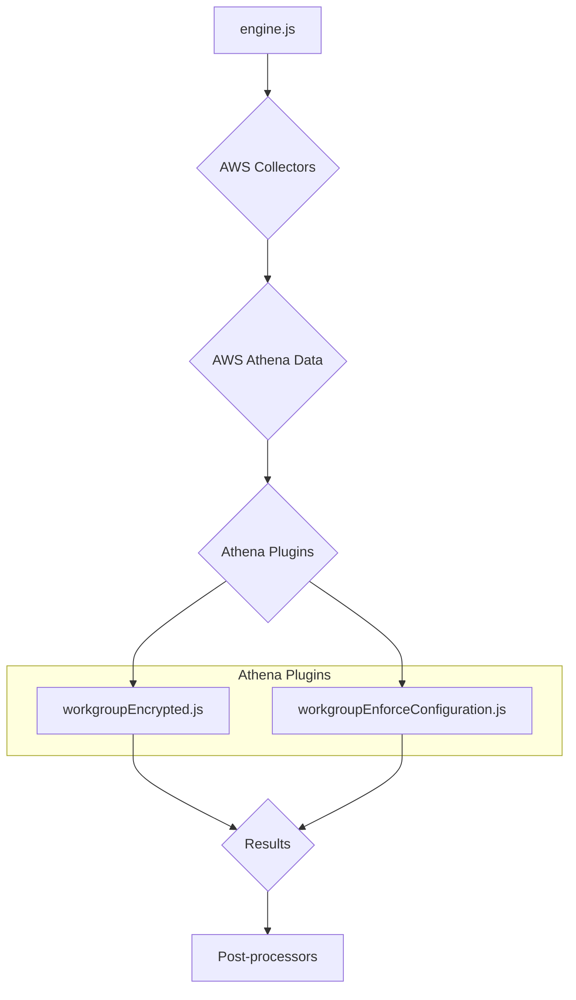
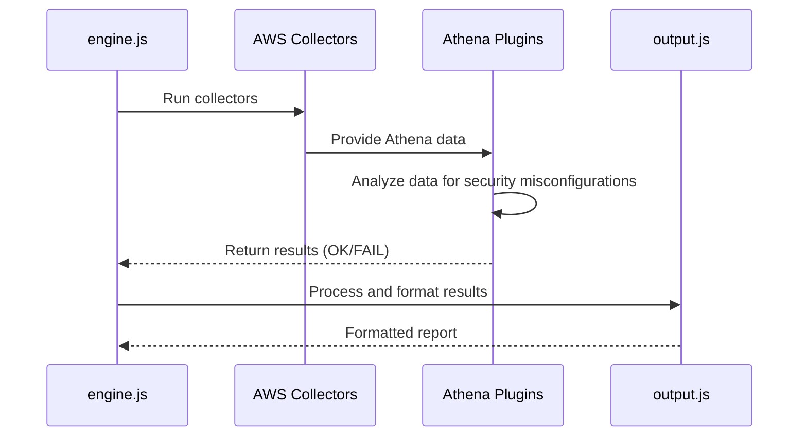
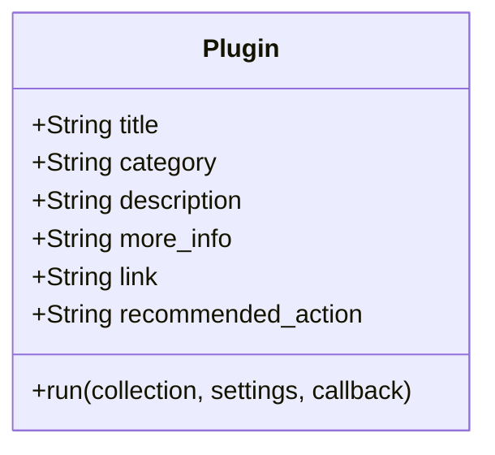
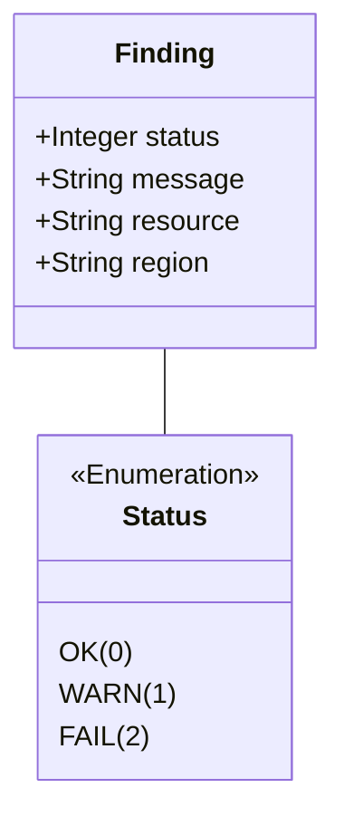

# AWS Athena Plugins Documentation

This document provides a comprehensive overview of the AWS Athena plugins within the CloudSploit system.

## Architecture Overview

The Athena plugins are part of the AWS plugin suite for CloudSploit. They are designed to integrate with the core scanning engine (`engine.js`) to assess the configuration and security of AWS Athena workgroups. The architecture follows the standard CloudSploit plugin pattern, where collectors gather data from AWS, and plugins analyze that data to identify potential security risks.

The primary plugins for Athena are:
1.  **`workgroupEncrypted.js`**: This plugin checks if Athena workgroups have encryption enabled for query results.
2.  **`workgroupEnforceConfiguration.js`**: This plugin ensures that Athena workgroups enforce the workgroup configuration, preventing clients from overriding query result locations.

These plugins are executed by the `engine.js` after the relevant data has been collected by the AWS collectors. The results are then passed to the post-processing modules for suppression and output formatting.

## Use Cases

### Use Case 1: Ensure Athena Workgroup Encryption
- **User Interaction:** The user runs a scan on their AWS account.
- **System Process:**
    - The `workgroupEncrypted.js` plugin is executed.
    - It checks the configuration of each Athena workgroup.
    - If a workgroup does not have encryption enabled for query results, it generates a "FAIL" result.
- **Expected Outcome:** The user is alerted to Athena workgroups that are not encrypting query results at rest.

### Use Case 2: Enforce Workgroup Query Configuration
- **User Interaction:** The user runs a scan on their AWS account.
- **System Process:**
    - The `workgroupEnforceConfiguration.js` plugin is executed.
    - It inspects the settings for each Athena workgroup.
    - If a workgroup does not enforce its configuration, it generates a "FAIL" result.
- **Expected Outcome:** The user can ensure that all Athena workgroups enforce their query result location and other settings, preventing users from writing results to unapproved S3 buckets.

## System Diagrams

### Sequence Diagram: Athena Scan

## Technology Stack

-   **Programming Language:** Node.js
-   **Framework:** CloudSploit (custom plugin architecture)
-   **AWS SDK:** Used by the collectors to interact with the AWS API and retrieve Athena data.

## Plugin Interface and Finding Structure

This section details the standard interface for all CloudSploit plugins and the structure of the findings they generate.

### Plugin Module Exports

Each plugin is a Node.js module that exports a standard set of properties and a `run` function.

### The `run` Function

The `run` function is the entry point for the plugin's execution.

`run(collection, settings, callback)`

-   **Parameters:**
    -   `collection` (object): An object containing all the data gathered by the collectors.
    -   `settings` (object): An object containing global settings for the scan.
    -   `callback` (function): A standard Node.js callback function `(err, results)`.

### Finding (Result) Structure

The `run` function passes an array of "finding" objects to its callback.

