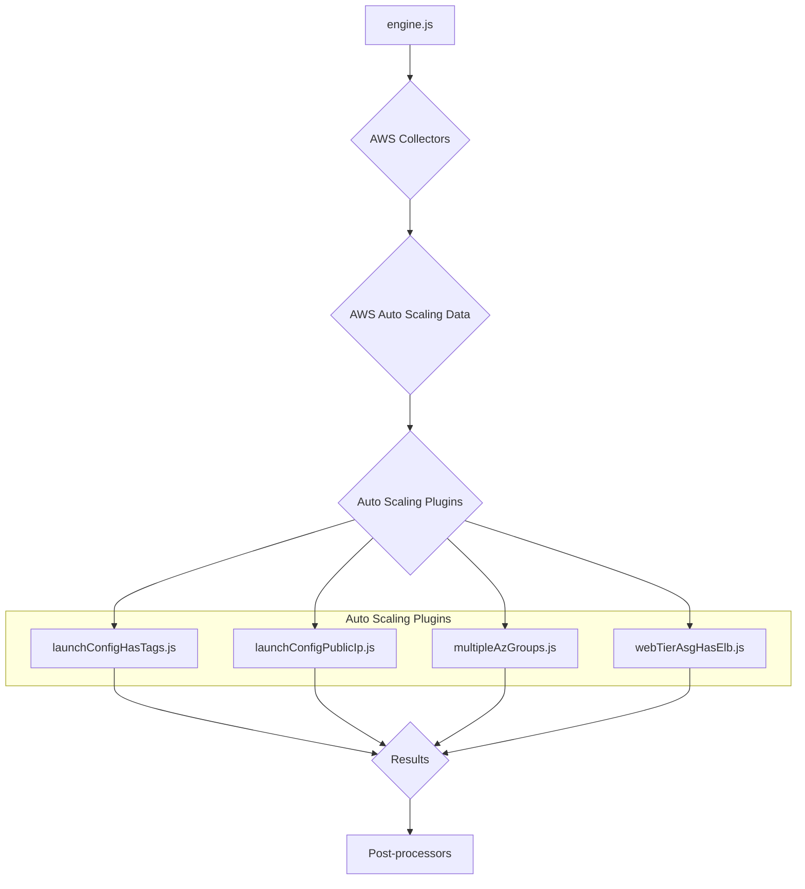
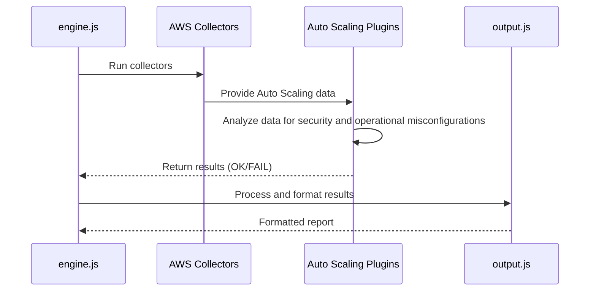
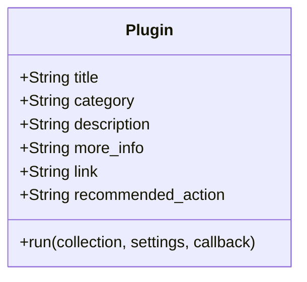
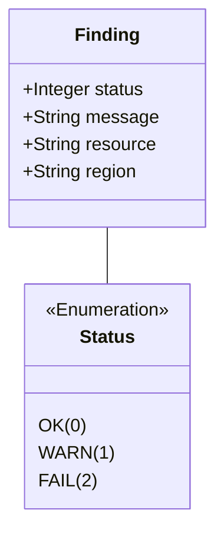

# AWS Auto Scaling Plugins Documentation

This document provides a comprehensive overview of the AWS Auto Scaling plugins within the CloudSploit system.

## Architecture Overview

The Auto Scaling plugins are part of the AWS plugin suite for CloudSploit. They are designed to integrate with the core scanning engine (`engine.js`) to assess the configuration and security of AWS Auto Scaling groups and launch configurations. The architecture follows the standard CloudSploit plugin pattern, where collectors gather data from AWS, and plugins analyze that data to identify potential security risks.

The primary plugins for Auto Scaling are:
1.  **`launchConfigHasTags.js`**: Checks if Auto Scaling launch configurations have tags.
2.  **`launchConfigPublicIp.js`**: Ensures that launch configurations do not assign public IP addresses to instances.
3.  **`multipleAzGroups.js`**: Verifies that Auto Scaling groups are configured to launch instances in multiple Availability Zones.
4.  **`webTierAsgHasElb.js`**: Checks if Auto Scaling groups associated with web-tier applications are attached to an Elastic Load Balancer.

These plugins are executed by the `engine.js` after the relevant data has been collected by the AWS collectors. The results are then passed to the post-processing modules for suppression and output formatting.

## Use Cases

### Use Case 1: Ensure High Availability
- **User Interaction:** The user runs a scan on their AWS account.
- **System Process:**
    - The `multipleAzGroups.js` plugin is executed.
    - It checks the configuration of each Auto Scaling group.
    - If a group is only configured for a single Availability Zone, it generates a "FAIL" result.
- **Expected Outcome:** The user is alerted to Auto Scaling groups that are not configured for high availability across multiple AZs.

### Use Case 2: Prevent Unintended Public Exposure
- **User Interaction:** The user runs a scan on their AWS account.
- **System Process:**
    - The `launchConfigPublicIp.js` plugin is executed.
    - It inspects the settings for each Auto Scaling launch configuration.
    - If a launch configuration is set to assign public IP addresses, it generates a "FAIL" result.
- **Expected Outcome:** The user can identify and remediate launch configurations that might unintentionally expose instances to the public internet.

## System Diagrams

### Sequence Diagram: Auto Scaling Scan

## Technology Stack

-   **Programming Language:** Node.js
-   **Framework:** CloudSploit (custom plugin architecture)
-   **AWS SDK:** Used by the collectors to interact with the AWS API and retrieve Auto Scaling data.

## Plugin Interface and Finding Structure

This section details the standard interface for all CloudSploit plugins and the structure of the findings they generate.

### Plugin Module Exports

Each plugin is a Node.js module that exports a standard set of properties and a `run` function.

### The `run` Function

The `run` function is the entry point for the plugin's execution.

`run(collection, settings, callback)`

-   **Parameters:**
    -   `collection` (object): An object containing all the data gathered by the collectors.
    -   `settings` (object): An object containing global settings for the scan.
    -   `callback` (function): A standard Node.js callback function `(err, results)`.

### Finding (Result) Structure

The `run` function passes an array of "finding" objects to its callback.

