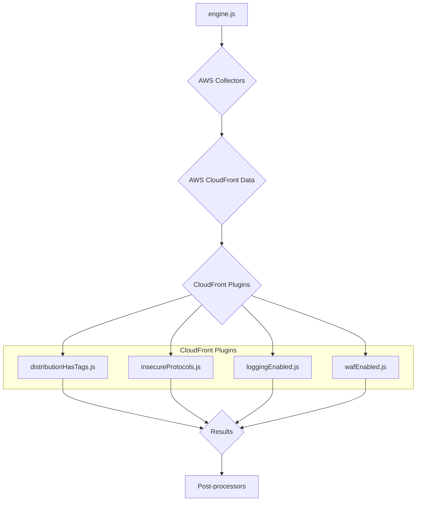
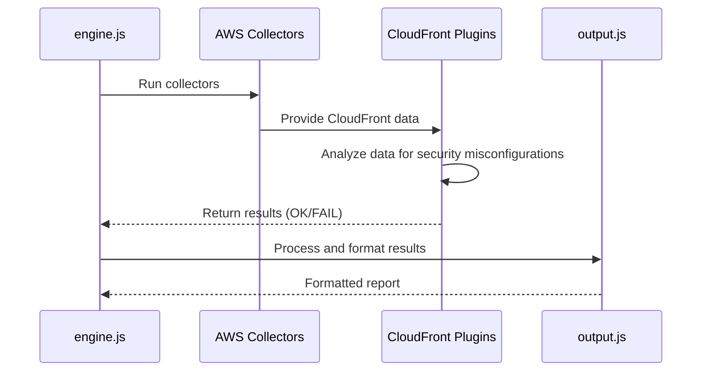
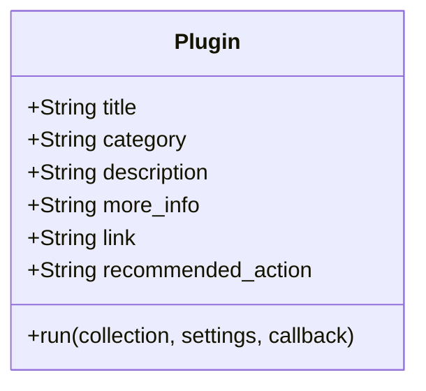
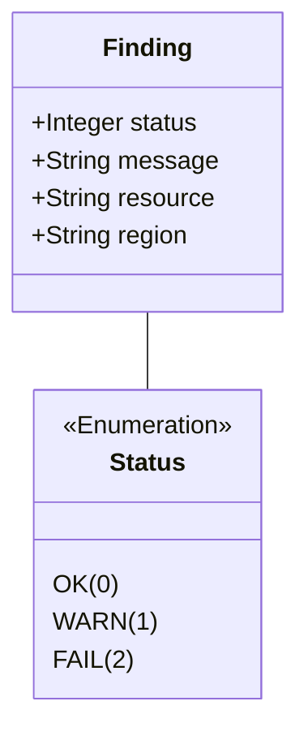

# AWS CloudFront Plugins Documentation

This document provides a comprehensive overview of the AWS CloudFront plugins within the CloudSploit system.

## Architecture Overview

The CloudFront plugins are part of the AWS plugin suite for CloudSploit. They are designed to integrate with the core scanning engine (`engine.js`) to assess the configuration and security of AWS CloudFront distributions. The architecture follows the standard CloudSploit plugin pattern, where collectors gather data from AWS, and plugins analyze that data to identify potential security risks.

The primary plugins for CloudFront are:
1.  **`distributionHasTags.js`**: Checks if CloudFront distributions have tags.
2.  **`insecureProtocols.js`**: Ensures that CloudFront distributions are not using insecure SSL/TLS protocols.
3.  **`loggingEnabled.js`**: Verifies that CloudFront distributions have access logging enabled.
4.  **`wafEnabled.js`**: Checks if CloudFront distributions are protected by AWS WAF.

These plugins are executed by the `engine.js` after the relevant data has been collected by the AWS collectors. The results are then passed to the post-processing modules for suppression and output formatting.

## Use Cases

### Use Case 1: Ensure WAF Protection
- **User Interaction:** The user runs a scan on their AWS account.
- **System Process:**
    - The `wafEnabled.js` plugin is executed.
    - It checks the configuration of each CloudFront distribution.
    - If a distribution is not associated with a WAF ACL, it generates a "FAIL" result.
- **Expected Outcome:** The user is alerted to CloudFront distributions that are not protected by AWS WAF.

### Use Case 2: Enforce Secure Protocols
- **User Interaction:** The user runs a scan on their AWS account.
- **System Process:**
    - The `insecureProtocols.js` plugin is executed.
    - It inspects the viewer certificate settings for each CloudFront distribution.
    - If a distribution is configured to use an insecure SSL/TLS protocol, it generates a "FAIL" result.
- **Expected Outcome:** The user can identify and remediate CloudFront distributions that are using outdated and insecure protocols.

## System Diagrams

### Sequence Diagram: CloudFront Scan

## Technology Stack

-   **Programming Language:** Node.js
-   **Framework:** CloudSploit (custom plugin architecture)
-   **AWS SDK:** Used by the collectors to interact with the AWS API and retrieve CloudFront data.

## Plugin Interface and Finding Structure

This section details the standard interface for all CloudSploit plugins and the structure of the findings they generate.

### Plugin Module Exports

Each plugin is a Node.js module that exports a standard set of properties and a `run` function.

### The `run` Function

The `run` function is the entry point for the plugin's execution.

`run(collection, settings, callback)`

-   **Parameters:**
    -   `collection` (object): An object containing all the data gathered by the collectors.
    -   `settings` (object): An object containing global settings for the scan.
    -   `callback` (function): A standard Node.js callback function `(err, results)`.

### Finding (Result) Structure

The `run` function passes an array of "finding" objects to its callback.

