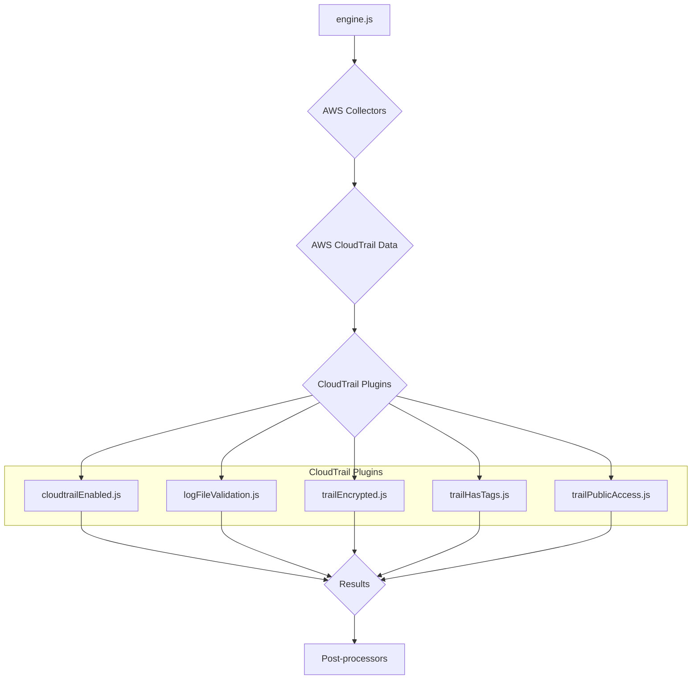
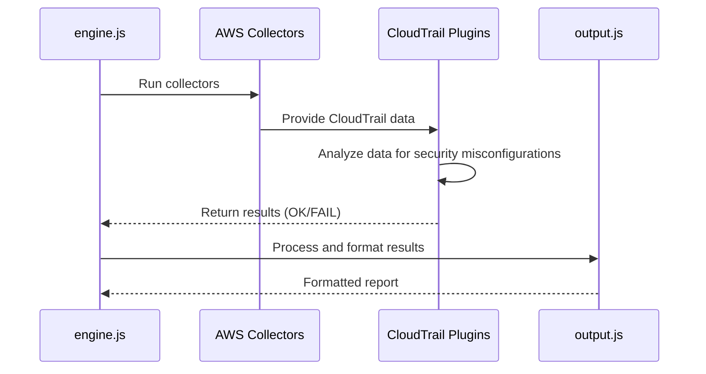
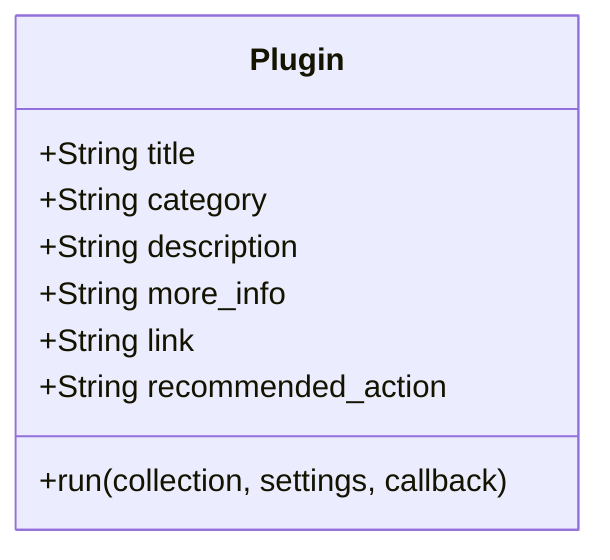
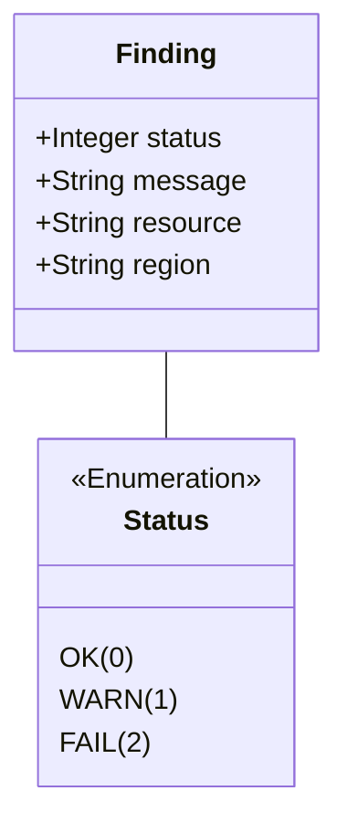

# AWS CloudTrail Plugins Documentation

This document provides a comprehensive overview of the AWS CloudTrail plugins within the CloudSploit system.

## Architecture Overview

The CloudTrail plugins are part of the AWS plugin suite for CloudSploit. They are designed to integrate with the core scanning engine (`engine.js`) to assess the configuration and security of AWS CloudTrail. The architecture follows the standard CloudSploit plugin pattern, where collectors gather data from AWS, and plugins analyze that data to identify potential security risks.

The primary plugins for CloudTrail are:
1.  **`cloudtrailEnabled.js`**: Checks if CloudTrail is enabled for all regions.
2.  **`logFileValidation.js`**: Ensures that log file validation is enabled for CloudTrail trails.
3.  **`trailEncrypted.js`**: Verifies that CloudTrail trails are encrypted with a customer-managed KMS key.
4.  **`trailHasTags.js`**: Checks if CloudTrail trails have tags.
5.  **`trailPublicAccess.js`**: Ensures that the S3 buckets for CloudTrail trails are not publicly accessible.

These plugins are executed by the `engine.js` after the relevant data has been collected by the AWS collectors. The results are then passed to the post-processing modules for suppression and output formatting.

## Use Cases

### Use Case 1: Ensure Audit Trail Integrity
- **User Interaction:** The user runs a scan on their AWS account.
- **System Process:**
    - The `logFileValidation.js` plugin is executed.
    - It checks the configuration of each CloudTrail trail.
    - If log file validation is disabled, it generates a "FAIL" result.
- **Expected Outcome:** The user is alerted to CloudTrail trails where the integrity of the log files is not being verified.

### Use Case 2: Prevent Unauthorized Access to Logs
- **User Interaction:** The user runs a scan on their AWS account.
- **System Process:**
    - The `trailPublicAccess.js` plugin is executed.
    - It inspects the S3 bucket policies for the buckets associated with CloudTrail trails.
    - If a bucket is found to be publicly accessible, it generates a "FAIL" result.
- **Expected Outcome:** The user can identify and remediate publicly accessible S3 buckets containing sensitive CloudTrail logs.

## System Diagrams

### Sequence Diagram: CloudTrail Scan

## Technology Stack

-   **Programming Language:** Node.js
-   **Framework:** CloudSploit (custom plugin architecture)
-   **AWS SDK:** Used by the collectors to interact with the AWS API and retrieve CloudTrail data.

## Plugin Interface and Finding Structure

This section details the standard interface for all CloudSploit plugins and the structure of the findings they generate.

### Plugin Module Exports

Each plugin is a Node.js module that exports a standard set of properties and a `run` function.

### The `run` Function

The `run` function is the entry point for the plugin's execution.

`run(collection, settings, callback)`

-   **Parameters:**
    -   `collection` (object): An object containing all the data gathered by the collectors.
    -   `settings` (object): An object containing global settings for the scan.
    -   `callback` (function): A standard Node.js callback function `(err, results)`.

### Finding (Result) Structure

The `run` function passes an array of "finding" objects to its callback.

