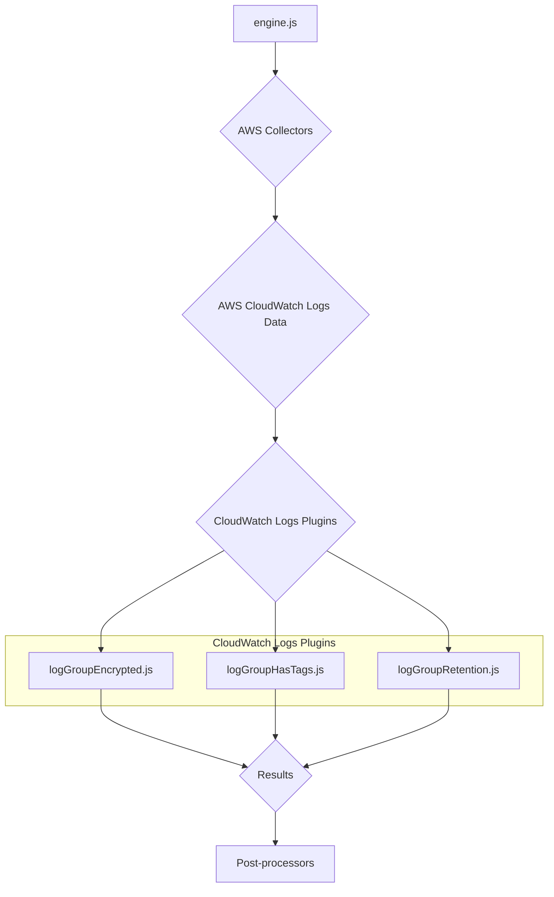
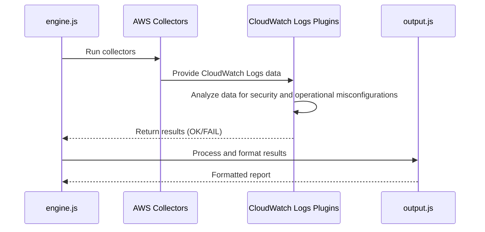
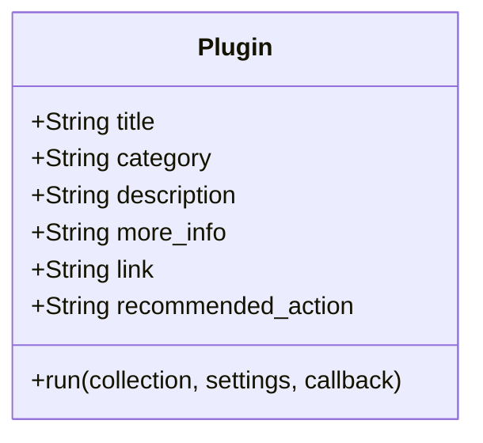
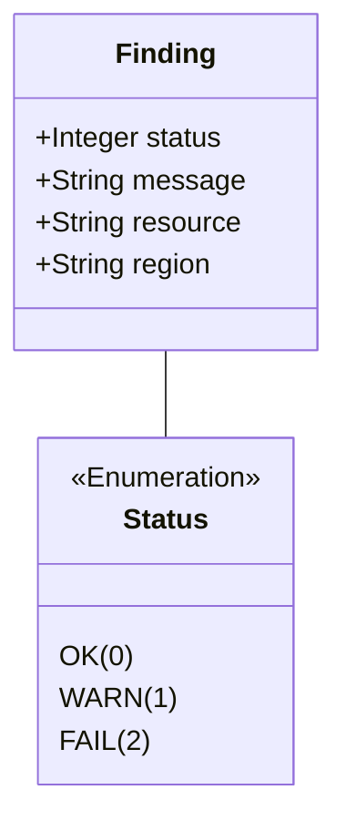

# AWS CloudWatch Logs Plugins Documentation

This document provides a comprehensive overview of the AWS CloudWatch Logs plugins within the CloudSploit system.

## Architecture Overview

The CloudWatch Logs plugins are part of the AWS plugin suite for CloudSploit. They are designed to integrate with the core scanning engine (`engine.js`) to assess the configuration and security of AWS CloudWatch Logs. The architecture follows the standard CloudSploit plugin pattern, where collectors gather data from AWS, and plugins analyze that data to identify potential security risks.

The primary plugins for CloudWatch Logs are:
1.  **`logGroupEncrypted.js`**: Checks if CloudWatch log groups are encrypted with a customer-managed KMS key.
2.  **`logGroupHasTags.js`**: Checks if CloudWatch log groups have tags.
3.  **`logGroupRetention.js`**: Ensures that CloudWatch log groups have a retention policy configured.

These plugins are executed by the `engine.js` after the relevant data has been collected by the AWS collectors. The results are then passed to the post-processing modules for suppression and output formatting.

## Use Cases

### Use Case 1: Ensure Log Retention Policies are in Place
- **User Interaction:** The user runs a scan on their AWS account.
- **System Process:**
    - The `logGroupRetention.js` plugin is executed.
    - It checks the configuration of each CloudWatch log group.
    - If a log group does not have a retention policy configured, it generates a "FAIL" result.
- **Expected Outcome:** The user is alerted to log groups that do not have a retention policy, which could lead to unbounded log growth and increased costs.

### Use Case 2: Enforce Encryption of Log Data
- **User Interaction:** The user runs a scan on their AWS account.
- **System Process:**
    - The `logGroupEncrypted.js` plugin is executed.
    - It inspects the settings for each CloudWatch log group.
    - If a log group is not encrypted with a customer-managed KMS key, it generates a "FAIL" result.
- **Expected Outcome:** The user can ensure that all CloudWatch log data is encrypted at rest, enhancing security and compliance.

## System Diagrams

### Sequence Diagram: CloudWatch Logs Scan

## Technology Stack

-   **Programming Language:** Node.js
-   **Framework:** CloudSploit (custom plugin architecture)
-   **AWS SDK:** Used by the collectors to interact with the AWS API and retrieve CloudWatch Logs data.

## Plugin Interface and Finding Structure

This section details the standard interface for all CloudSploit plugins and the structure of the findings they generate.

### Plugin Module Exports

Each plugin is a Node.js module that exports a standard set of properties and a `run` function.

### The `run` Function

The `run` function is the entry point for the plugin's execution.

`run(collection, settings, callback)`

-   **Parameters:**
    -   `collection` (object): An object containing all the data gathered by the collectors.
    -   `settings` (object): An object containing global settings for the scan.
    -   `callback` (function): A standard Node.js callback function `(err, results)`.

### Finding (Result) Structure

The `run` function passes an array of "finding" objects to its callback.

