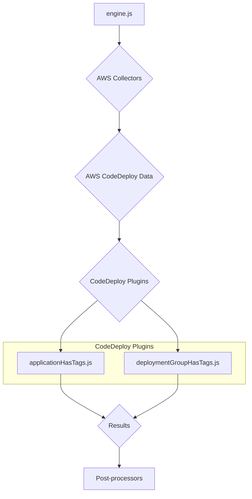
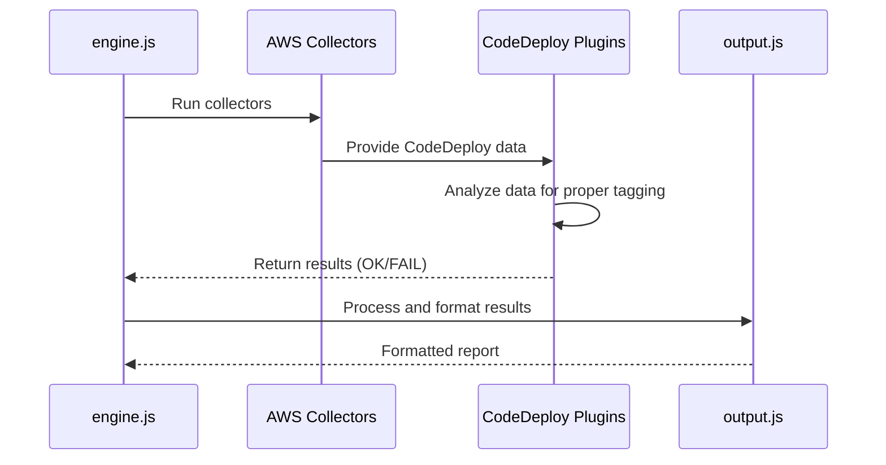
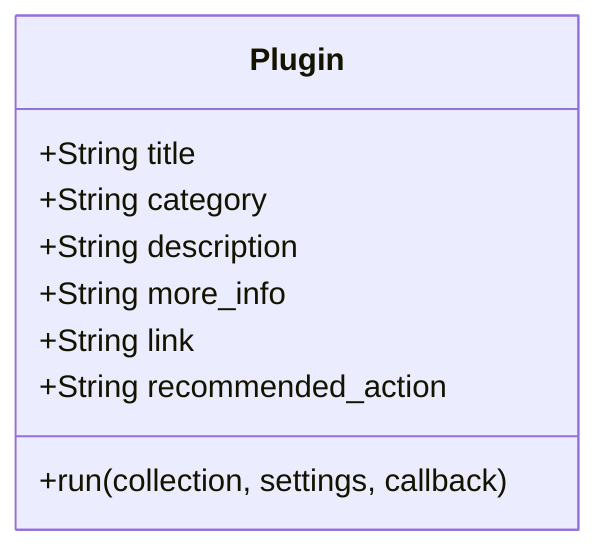
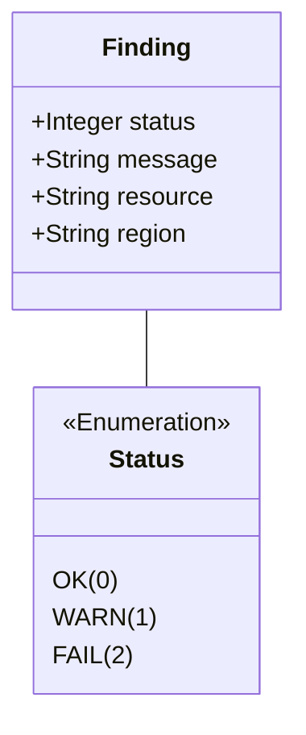

# AWS CodeDeploy Plugins Documentation

This document provides a comprehensive overview of the AWS CodeDeploy plugins within the CloudSploit system.

## Architecture Overview

The CodeDeploy plugins are part of the AWS plugin suite for CloudSploit. They are designed to integrate with the core scanning engine (`engine.js`) to assess the configuration and security of AWS CodeDeploy applications and deployment groups. The architecture follows the standard CloudSploit plugin pattern, where collectors gather data from AWS, and plugins analyze that data to identify potential security risks.

The primary plugins for CodeDeploy are:
1.  **`applicationHasTags.js`**: Checks if CodeDeploy applications have tags.
2.  **`deploymentGroupHasTags.js`**: Checks if CodeDeploy deployment groups have tags.

These plugins are executed by the `engine.js` after the relevant data has been collected by the AWS collectors. The results are then passed to the post-processing modules for suppression and output formatting.

## Use Cases

### Use Case 1: Ensure Proper Tagging for CodeDeploy Resources
- **User Interaction:** The user runs a scan on their AWS account.
- **System Process:**
    - The `applicationHasTags.js` and `deploymentGroupHasTags.js` plugins are executed.
    - They check the tags of each CodeDeploy application and deployment group.
    - If a resource is missing tags, it generates a "FAIL" result.
- **Expected Outcome:** The user is alerted to any CodeDeploy resources that are not properly tagged, which is important for cost allocation, automation, and access control.

## System Diagrams

### Sequence Diagram: CodeDeploy Scan

## Technology Stack

-   **Programming Language:** Node.js
-   **Framework:** CloudSploit (custom plugin architecture)
-   **AWS SDK:** Used by the collectors to interact with the AWS API and retrieve CodeDeploy data.

## Plugin Interface and Finding Structure

This section details the standard interface for all CloudSploit plugins and the structure of the findings they generate.

### Plugin Module Exports

Each plugin is a Node.js module that exports a standard set of properties and a `run` function.

### The `run` Function

The `run` function is the entry point for the plugin's execution.

`run(collection, settings, callback)`

-   **Parameters:**
    -   `collection` (object): An object containing all the data gathered by the collectors.
    -   `settings` (object): An object containing global settings for the scan.
    -   `callback` (function): A standard Node.js callback function `(err, results)`.

### Finding (Result) Structure

The `run` function passes an array of "finding" objects to its callback.

