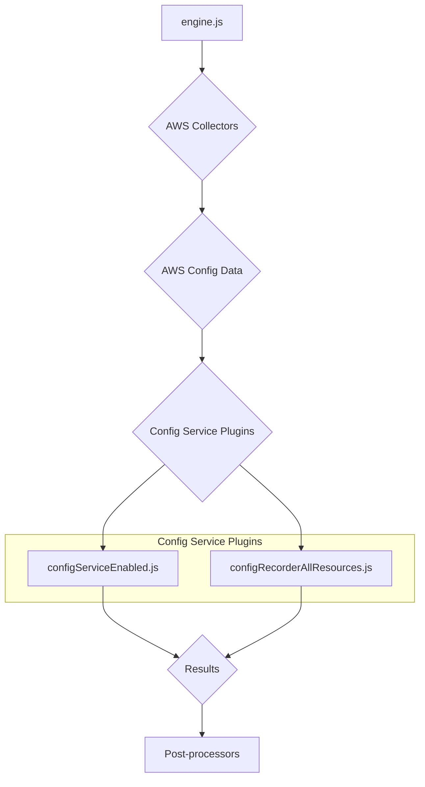
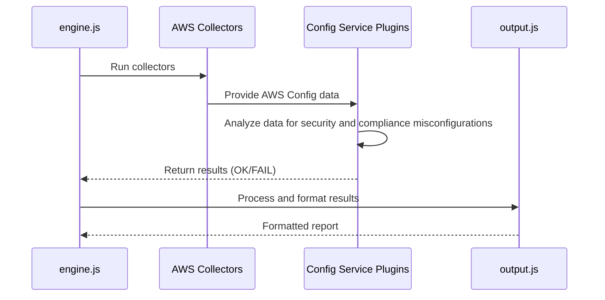
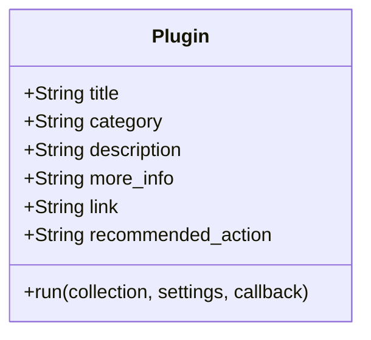
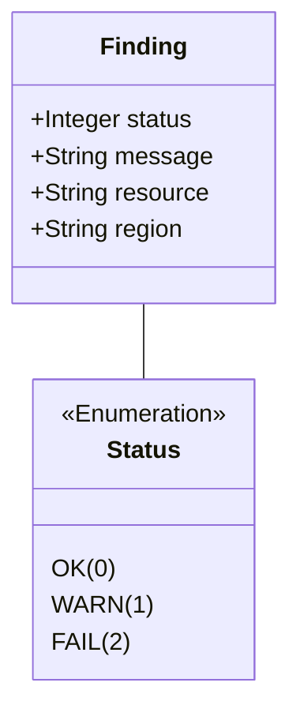

# AWS Config Service Plugins Documentation

This document provides a comprehensive overview of the AWS Config Service plugins within the CloudSploit system.

## Architecture Overview

The Config Service plugins are part of the AWS plugin suite for CloudSploit. They are designed to integrate with the core scanning engine (`engine.js`) to assess the configuration and security of AWS Config. The architecture follows the standard CloudSploit plugin pattern, where collectors gather data from AWS, and plugins analyze that data to identify potential security risks.

The primary plugins for Config Service are:
1.  **`configServiceEnabled.js`**: Checks if AWS Config is enabled in all regions.
2.  **`configRecorderAllResources.js`**: Ensures that the AWS Config recorder is configured to record all resource types.

These plugins are executed by the `engine.js` after the relevant data has been collected by the AWS collectors. The results are then passed to the post-processing modules for suppression and output formatting.

## Use Cases

### Use Case 1: Ensure AWS Config is Enabled
- **User Interaction:** The user runs a scan on their AWS account.
- **System Process:**
    - The `configServiceEnabled.js` plugin is executed.
    - It checks if AWS Config is enabled in all regions.
    - If Config is not enabled in a region, it generates a "FAIL" result.
- **Expected Outcome:** The user is alerted to regions where AWS Config is not enabled, which is a critical security and compliance gap.

### Use Case 2: Verify Comprehensive Resource Recording
- **User Interaction:** The user runs a scan on their AWS account.
- **System Process:**
    - The `configRecorderAllResources.js` plugin is executed.
    - It inspects the settings of the AWS Config recorder.
    - If the recorder is not configured to record all resource types, it generates a "FAIL" result.
- **Expected Outcome:** The user can ensure that AWS Config is comprehensively tracking all resource changes in their account.

## System Diagrams

### Sequence Diagram: Config Service Scan

## Technology Stack

-   **Programming Language:** Node.js
-   **Framework:** CloudSploit (custom plugin architecture)
-   **AWS SDK:** Used by the collectors to interact with the AWS API and retrieve AWS Config data.

## Plugin Interface and Finding Structure

This section details the standard interface for all CloudSploit plugins and the structure of the findings they generate.

### Plugin Module Exports

Each plugin is a Node.js module that exports a standard set of properties and a `run` function.

### The `run` Function

The `run` function is the entry point for the plugin's execution.

`run(collection, settings, callback)`

-   **Parameters:**
    -   `collection` (object): An object containing all the data gathered by the collectors.
    -   `settings` (object): An object containing global settings for the scan.
    -   `callback` (function): A standard Node.js callback function `(err, results)`.

### Finding (Result) Structure

The `run` function passes an array of "finding" objects to its callback.

