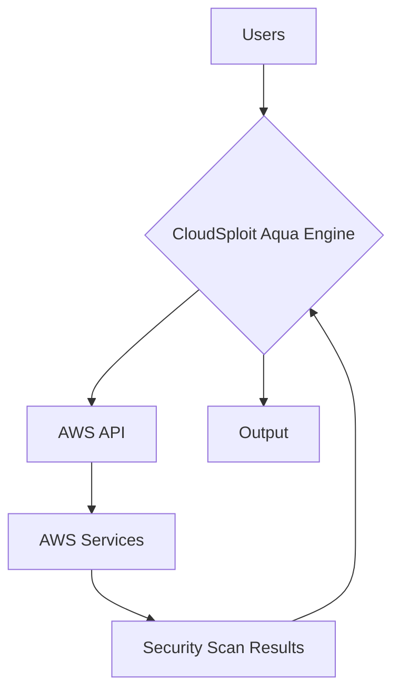
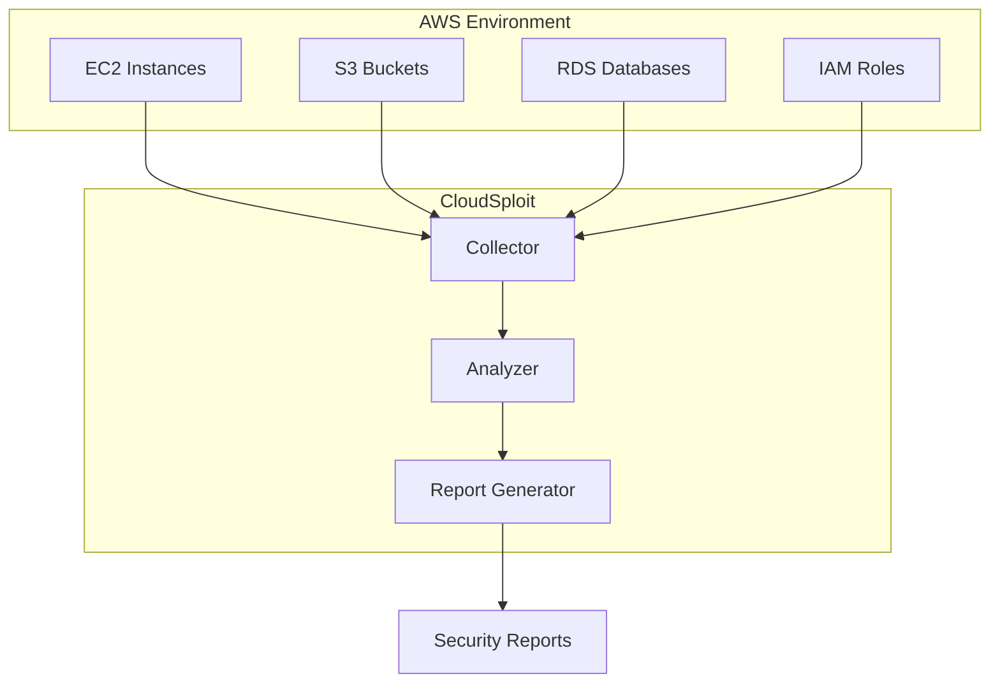

# AWS Architecture Documentation

This document provides a comprehensive overview of the AWS resources used in this project, including their metadata and architecture diagrams.

## High-Level System Overview

The system is designed to scan and monitor AWS environments for security misconfigurations. It leverages various AWS services to collect data, analyze it, and provide actionable insights.

## Use Cases

*   **Continuous Security Monitoring:** Regularly scan AWS accounts to identify and remediate security vulnerabilities.
*   **Compliance Auditing:** Ensure that the AWS environment complies with industry standards and best practices.
*   **On-Demand Security Scans:** Perform security scans on-demand to assess the security posture of specific resources.

## Data Flow Diagram



## Mermaid Diagram



## AWS Plugin Metadata

### `accessAnalyzerActiveFindings.js`

```json
{
  "apis": ["AccessAnalyzer:listAnalyzers", "AccessAnalyzer:listFindings", "AccessAnalyzer:listFindingsV2"],
  "rules": ["accessanalyzer:CreateAnalyzer","accessanalyzer:DeleteAnalyzer","accessanalyzer:CreateArchiveRule","accessanalyzer:StartResourceScan"]
}
```

### `accessAnalyzerEnabled.js`

```json
{
  "apis": ["AccessAnalyzer:listAnalyzers"],
  "rules": ["accessanalyzer:CreateAnalyzer","accessanalyzer:DeleteAnalyzer"]
}
```

### `acmCertificateExpiry.js`

```json
{
  "apis": ["ACM:listCertificates", "ACM:describeCertificate"],
  "rules": ["acm:RequestCertificate","acm:ImportCertificate","acm:DeleteCertificate"]
}
```

### `acmCertificateHasTags.js`

```json
{
  "apis": ["ACM:listCertificates", "ResourceGroupsTaggingAPI:getResources"],
  "rules": ["acm:RequestCertificate","acm:ImportCertificate","acm:DeleteCertificate","acm:AddTagsToCertificate", "acm:RemoveTagsFromCertificate"]
}
```

### `acmSingleDomainNameCertificate.js`

```json
{
  "apis": ["ACM:listCertificates", "ACM:describeCertificate"],
  "rules": ["acm:RequestCertificate","acm:ImportCertificate","acm:DeleteCertificate"]
}
```

### `acmValidation.js`

```json
{
  "apis": ["ACM:listCertificates", "ACM:describeCertificate"],
  "rules": ["acm:RequestCertificate","acm:ImportCertificate","acm:DeleteCertificate"]
}
```

### `apigatewayAuthorization.js`

```json
{
  "apis": ["APIGateway:getRestApis", "APIGateway:getAuthorizers"],
  "rules": ["apigateway:CreateRestApi","apigateway:DeleteRestApi","apigateway:ImportRestApi","apigateway:CreateAuthorizer","apigateway:DeleteAuthorizer"]
}
```

### `apigatewayCertificateRotation.js`

```json
{
  "apis": ["APIGateway:getRestApis", "APIGateway:getStages", "APIGateway:getClientCertificate"],
  "rules": ["apigateway:CreateRestApi","apigateway:DeleteRestApi","apigateway:ImportRestApi","apigateway:CreateStage","apigateway:DeleteStage","apigateway:GenerateClientCertificate","apigateway:DeleteClientCertificate"]
}
```

### `apigatewayClientCertificate.js`

```json
{
  "apis": ["APIGateway:getRestApis", "APIGateway:getStages"],
  "rules": ["apigateway:CreateRestApi","apigateway:DeleteRestApi","apigateway:ImportRestApi","apigateway:CreateStage","apigateway:DeleteStage","apigateway:UpdateStage"]
}
```

### `apigatewayCloudwatchLogs.js`

```json
{
  "apis": ["APIGateway:getRestApis", "APIGateway:getStages"],
  "rules": ["apigateway:CreateStage","apigateway:UpdateStage","apigateway:DeleteStage"]
}
```

### `apigatewayContentEncoding.js`

```json
{
  "apis": ["APIGateway:getRestApis"],
  "rules": ["apigateway:CreateRestApi","apigateway:ImportRestApi","apigateway:UpdateRestApi","apigateway:DeleteRestApi"]
}
```

### `apigatewayDefaultEndpointDisabled.js`

```json
{
  "apis": ["APIGateway:getRestApis"],
  "rules": ["apigateway:CreateRestApi","apigateway:ImportRestApi","apigateway:UpdateRestApi","apigateway:DeleteRestApi"]
}
```

### `apigatewayPrivateEndpoints.js`

```json
{
  "apis": ["APIGateway:getRestApis"],
  "rules": ["apigateway:CreateRestApi","apigateway:ImportRestApi","apigateway:UpdateRestApi","apigateway:DeleteRestApi"]
}
```

### `apigatewayRequestValidation.js`

```json
{
  "apis": ["APIGateway:getRestApis", "APIGateway:getRequestValidators"],
  "rules": ["apigateway:CreateRestApi","apigateway:DeleteRestApi","apigateway:ImportRestApi","apigateway:CreateRequestValidator","apigateway:UpdateRequestValidator","apigateway:DeleteRequestValidator"]
}
```

### `apigatewayResponseCaching.js`

```json
{
  "apis": ["APIGateway:getRestApis", "APIGateway:getStages"],
  "rules": ["apigateway:CreateRestApi","apigateway:ImportRestApi","apigateway:DeleteRestApi","apigateway:CreateStage","apigateway:UpdateStage","apigateway:DeleteStage"]
}
```

### `apigatewayTracingEnabled.js`

```json
{
  "apis": ["APIGateway:getRestApis", "APIGateway:getStages"],
  "rules": ["apigateway:CreateRestApi","apigateway:ImportRestApi","apigateway:DeleteRestApi","apigateway:CreateStage","apigateway:UpdateStage","apigateway:DeleteStage"]
}
```

### `apigatewayV2AccessLogging.js`

```json
{
  "apis": ["ApiGatewayV2:getApis","ApiGatewayV2:getStages"],
  "rules": ["ApiGatewayV2:createApi","ApiGatewayV2:deleteApi","ApiGatewayV2:importApi","ApiGatewayv2:CreateStage","ApiGatewayv2:UpdateStage","ApiGatewayv2:DeleteStage"]
}
```

### `apigatewayV2Authorization.js`

```json
{
  "apis": ["ApiGatewayV2:getApis","ApiGatewayV2:getAuthorizers"],
  "rules": ["ApiGatewayV2:createApi","ApiGatewayV2:deleteApi","ApiGatewayV2:importApi","ApiGatewayV2:createAuthorizer","ApiGatewayV2:deleteAuthorizer"]
}
```

### `apigatewayWafEnabled.js`

```json
{
  "apis": ["APIGateway:getRestApis", "APIGateway:getStages"],
  "rules": ["apigateway:CreateRestApi","apigateway:ImportRestApi","apigateway:DeleteRestApi","apigateway:CreateStage","apigateway:DeleteStage","wafregional:AssociateWebACL"]
}
```

### `apiStageLevelCacheEncryption.js`

```json
{
  "apis": ["APIGateway:getRestApis", "APIGateway:getStages"],
  "rules": ["apigateway:CreateRestApi","apigateway:ImportRestApi","apigateway:DeleteRestApi","apigateway:CreateStage","apigateway:UpdateStage","apigateway:DeleteStage"]
}
```

### `customDomainTlsVersion.js`

```json
{
  "apis": ["APIGateway:getDomainNames"],
  "rules": ["apigateway:CreateDomainName","apigateway:UpdateDomainName","apigateway:DeleteDomainName"]
}
```

### `detailedCloudWatchMetrics.js`

```json
{
  "apis": ["APIGateway:getRestApis", "APIGateway:getStages"],
  "rules": ["apigateway:CreateRestApi","apigateway:ImportRestApi","apigateway:DeleteRestApi","apigateway:CreateStage","apigateway:UpdateStage","apigateway:DeleteStage"]
}
```

### `flowEncrypted.js`

```json
{
  "apis": ["Appflow:listFlows", "Appflow:describeFlow", "KMS:listKeys", "KMS:describeKey"],
  "rules": ["appflow:CreateFlow","appflow:DeleteFlow"]
}
```

### `appmeshTLSRequired.js`

```json
{
  "apis": ["AppMesh:listMeshes", "AppMesh:listVirtualGateways", "AppMesh:describeVirtualGateway"],
  "rules": ["appmesh:CreateMesh","appmesh:DeleteMesh","appmesh:CreateVirtualGateway","appmesh:UpdateVirtualGateway","appmesh:DeleteVirtualGateway"]
}
```

### `appmeshVGAccessLogging.js`

```json
{
  "apis": ["AppMesh:listMeshes", "AppMesh:listVirtualGateways", "AppMesh:describeVirtualGateway"],
  "rules": ["appmesh:CreateMesh","appmesh:DeleteMesh","appmesh:CreateVirtualGateway","appmesh:UpdateVirtualGateway","appmesh:DeleteVirtualGateway"]
}
```

### `appmeshVGHealthChecks.js`

```json
{
  "apis": ["AppMesh:listMeshes", "AppMesh:listVirtualGateways", "AppMesh:describeVirtualGateway"],
  "rules": ["appmesh:CreateMesh","appmesh:DeleteMesh","appmesh:CreateVirtualGateway","appmesh:UpdateVirtualGateway","appmesh:DeleteVirtualGateway"]
}
```

### `restrictExternalTraffic.js`

```json
{
  "apis": ["AppMesh:listMeshes", "AppMesh:describeMesh"],
  "rules": ["appmesh:CreateMesh","appmesh:DeleteMesh","appmesh:UpdateMesh"]
}
```

### `serviceEncrypted.js`

```json
{
  "apis": ["AppRunner:listServices","AppRunner:describeService", "KMS:describeKey", "KMS:listKeys"],
  "rules": ["apprunner:CreateService","apprunner:DeleteService"]
}
```

### `workgroupEncrypted.js`

```json
{
  "apis": ["Athena:listWorkGroups", "Athena:getWorkGroup", "STS:getCallerIdentity"],
  "rules": ["athena:CreateWorkGroup", "athena:UpdateWorkGroup", "athena:DeleteWorkGroup"]
}
```

### `workgroupEnforceConfiguration.js`

```json
{
  "apis": ["Athena:listWorkGroups", "Athena:getWorkGroup", "STS:getCallerIdentity"],
  "rules": ["athena:CreateWorkGroup", "athena:UpdateWorkGroup", "athena:DeleteWorkGroup"]
}
```

### `auditmanagerDataEncrypted.js`

```json
{
  "apis": ["AuditManager:getSettings", "KMS:listKeys", "KMS:describeKey"],
  "rules": ["auditmanager:registerAccount","auditmanager:UpdateSettings","auditmanager:DeregisterAccount"]
}
```

### `appTierAsgApprovedAmi.js`

```json
{
  "apis": ["AutoScaling:describeAutoScalingGroups", "AutoScaling:describeLaunchConfigurations"],
  "rules": ["autoscaling:CreateAutoScalingGroup","autoscaling:DeleteAutoScalingGroup","autoscaling:UpdateAutoScalingGroup","autoscaling:createLaunchConfiguration","autoscaling:DeleteLaunchConfiguration"]
}
```

### `appTierAsgCloudwatchLogs.js`

```json
{
  "apis": ["AutoScaling:describeAutoScalingGroups", "AutoScaling:describeLaunchConfigurations", "STS:getCallerIdentity"],
  "rules": ["autoscaling:CreateAutoScalingGroup","autoscaling:DeleteAutoScalingGroup","autoscaling:UpdateAutoScalingGroup","autoscaling:createLaunchConfiguration","autoscaling:DeleteLaunchConfiguration"]
}
```

### `appTierIamRole.js`

```json
{
  "apis": ["AutoScaling:describeAutoScalingGroups", "AutoScaling:describeLaunchConfigurations"],
  "rules": ["autoscaling:CreateAutoScalingGroup","autoscaling:DeleteAutoScalingGroup","autoscaling:UpdateAutoScalingGroup","autoscaling:CreateLaunchConfiguration","autoscaling:DeleteLaunchConfiguration"]
}
```

### `asgActiveNotifications.js`

```json
{
  "apis": ["AutoScaling:describeAutoScalingGroups", "AutoScaling:describeNotificationConfigurations"],
  "rules": ["autoscaling:CreateAutoScalingGroup","autoscaling:DeleteAutoScalingGroup","autoscaling:PutNotificationConfiguration"]
}
```

### `asgCooldownPeriod.js`

```json
{
  "apis": ["AutoScaling:describeAutoScalingGroups"],
  "rules": ["autoscaling:CreateAutoScalingGroup","autoscaling:UpdateAutoScalingGroup","autoscaling:DeleteAutoScalingGroup"]
}
```

### `asgMissingELB.js`

```json
{
  "apis": ["AutoScaling:describeAutoScalingGroups", "ELB:describeLoadBalancers", "ELBv2:describeLoadBalancers"],
  "rules": ["autoscaling:CreateAutoScalingGroup","autoscaling:DeleteAutoScalingGroup","autoscaling:AttachLoadBalancers","autoscaling:DetachLoadBalancers","elasticloadbalancing:CreateLoadBalancer","elasticloadbalancing:CreateLoadBalancer","elasticloadbalancing:DeleteLoadBalancer","elasticloadbalancing:DeleteLoadBalancer"]
}
```

### `asgMissingSecurityGroups.js`

```json
{
  "apis": ["AutoScaling:describeLaunchConfigurations", "EC2:describeSecurityGroups"],
  "rules": ["autoscaling:CreateLaunchConfiguration","autoscaling:DeleteLaunchConfiguration","ec2:CreateSecurityGroup","ec2:DeleteSecurityGroup"]
}
```

### `asgMultiAz.js`

```json
{
  "apis": ["AutoScaling:describeAutoScalingGroups"],
  "rules": ["autoscaling:CreateAutoScalingGroup","autoscaling:UpdateAutoScalingGroup","autoscaling:DeleteAutoScalingGroup"]
}
```

### `asgSuspendedProcesses.js`

```json
{
  "apis": ["AutoScaling:describeAutoScalingGroups"],
  "rules": ["autoscaling:CreateAutoScalingGroup","autoscaling:ResumeProcesses","autoscaling:DeleteAutoScalingGroup"]
}
```

### `asgUnusedLaunchConfiguration.js`

```json
{
  "apis": ["AutoScaling:describeAutoScalingGroups", "AutoScaling:describeLaunchConfigurations"],
  "rules": ["autoscaling:CreateAutoScalingGroup","autoscaling:DeleteAutoScalingGroup","autoscaling:CreateLaunchConfiguration","autoscaling:DeleteLaunchConfiguration"]
}
```

### `elbHealthCheckActive.js`

```json
{
  "apis": ["AutoScaling:describeAutoScalingGroups"],
  "rules": ["autoscaling:CreateAutoScalingGroup","autoscaling:UpdateAutoScalingGroup","autoscaling:DeleteAutoScalingGroup"]
}
```

### `emptyASG.js`

```json
{
  "apis": ["AutoScaling:describeAutoScalingGroups"],
  "rules": ["autoscaling:CreateAutoScalingGroup","autoscaling:DeleteAutoScalingGroup"]
}
```

### `sameAzElb.js`

```json
{
  "apis": ["AutoScaling:describeAutoScalingGroups", "ELB:describeLoadBalancers", "ELBv2:describeLoadBalancers"],
  "rules": ["autoscaling:CreateAutoScalingGroup","autoscaling:UpdateAutoScalingGroup","autoscaling:DeleteAutoScalingGroup","elasticloadbalancing:CreateLoadBalancer","elasticloadbalancing:CreateLoadBalancer","elasticloadbalancing:DeleteLoadBalancer","elasticloadbalancing:DeleteLoadBalancer"]
}
```

### `webTierAsgApprovedAmi.js`

```json
{
  "apis": ["AutoScaling:describeAutoScalingGroups", "AutoScaling:describeLaunchConfigurations", "STS:getCallerIdentity"],
  "rules": ["autoscaling:CreateAutoScalingGroup","autoscaling:DeleteAutoScalingGroup","autoscaling:UpdateAutoScalingGroup","autoscaling:createLaunchConfiguration","autoscaling:DeleteLaunchConfiguration"]
}
```

### `webTierAsgAssociatedElb.js`

```json
{
  "apis": ["AutoScaling:describeAutoScalingGroups"],
  "rules": ["autoscaling:CreateAutoScalingGroup","autoscaling:DeleteAutoScalingGroup","autoscaling:AttachLoadBalancers","autoscaling:DetachLoadBalancers"]
}
```

### `webTierAsgCloudwatchLogs.js`

```json
{
  "apis": ["AutoScaling:describeAutoScalingGroups", "AutoScaling:describeLaunchConfigurations", "STS:getCallerIdentity"],
  "rules": ["autoscaling:CreateAutoScalingGroup","autoscaling:DeleteAutoScalingGroup","autoscaling:UpdateAutoScalingGroup","autoscaling:createLaunchConfiguration","autoscaling:DeleteLaunchConfiguration"]
}
```

### `webTierIamRole.js`

```json
{
  "apis": ["AutoScaling:describeAutoScalingGroups", "AutoScaling:describeLaunchConfigurations"],
  "rules": ["autoscaling:CreateAutoScalingGroup","autoscaling:DeleteAutoScalingGroup","autoscaling:UpdateAutoScalingGroup","autoscaling:createLaunchConfiguration","autoscaling:DeleteLaunchConfiguration"]
}
```

### `backupDeletionProtection.js`

```json
{
  "apis": ["Backup:listBackupVaults", "Backup:getBackupVaultAccessPolicy"],
  "rules": ["backup:CreateBackupVault","backup:DeleteBackupVault","backup:PutBackupVaultAccessPolicy","backup:DeleteBackupVaultAccessPolicy"]
}
```

### `backupInUseForRDSSnapshots.js`

```json
{
  "apis": ["RDS:describeDBSnapshots"],
  "rules": ["backup:CreateBackupSelection","backup:DeleteBackupSelection"]
}
```

### `backupNotificationEnabled.js`

```json
{
  "apis": ["Backup:listBackupVaults", "Backup:getBackupVaultNotifications"],
  "rules": ["backup:CreateBackupVault","backup:PutBackupVaultNotifications","backup:DeleteBackupVault"]
}
```

### `backupResourceProtection.js`

```json
{
  "apis": ["Backup:describeRegionSettings"],
  "rules": ["backup:UpdateRegionSettings"]
}
```

### `backupVaultEncrypted.js`

```json
{
  "apis": ["Backup:listBackupVaults", "KMS:listKeys", "KMS:describeKey"],
  "rules": ["backup:CreateBackupVault","backup:DeleteBackupVault"]
}
```

### `backupVaultHasTags.js`

```json
{
  "apis": ["Backup:listBackupVaults", "ResourceGroupsTaggingAPI:getResources"],
  "rules": ["backup:CreateBackupVault","backup:DeleteBackupVault","backup:TagResource","backup:UntagResource"]
}
```

### `backupVaultPolicies.js`

```json
{
  "apis": ["Backup:listBackupVaults", "Backup:getBackupVaultAccessPolicy", "STS:getCallerIdentity"],
  "rules": ["backup:CreateBackupVault","backup:DeleteBackupVault","backup:PutBackupVaultAccessPolicy","backup:DeleteBackupVaultAccessPolicy"]
}
```

### `compliantLifecycleConfigured.js`

```json
{
  "apis": ["Backup:listBackupPlans", "Backup:getBackupPlan"],
  "rules": ["backup:CreateBackupPlan","backup:UpdateBackupPlan","backup:DeleteBackupPlan"]
}
```

### `bedrockInUse.js`

```json
{
  "apis": ["Bedrock:listCustomModels"],
  "rules": ["bedrock:DeleteCustomModel"]
}
```

### `customModelEncryptionEnabled.js`

```json
{
  "apis": ["Bedrock:listCustomModels", "Bedrock:getCustomModel", "KMS:listKeys", "KMS:describeKey"]
}
```

### `customModelHasTags.js`

```json
{
  "apis": ["Bedrock:listCustomModels","ResourceGroupsTaggingAPI:getResources"],
  "rules": ["bedrock:TagResource","bedrock:UntagResource", "bedrock:DeleteCustomModel"]
}
```

### `customModelInVpc.js`

```json
{
  "apis": ["Bedrock:listCustomModels", "Bedrock:getCustomModel","Bedrock:listModelCustomizationJobs", "Bedrock:getModelCustomizationJob"]
}
```

### `modelInvocationLoggingEnabled.js`

```json
{
  "apis": ["Bedrock:getModelInvocationLoggingConfiguration"]
}
```

### `privateCustomModel.js`

```json
{
  "apis": ["Bedrock:listCustomModels", "Bedrock:getCustomModel","Bedrock:listModelCustomizationJobs", "Bedrock:getModelCustomizationJob","EC2:describeSubnets", "EC2:describeRouteTables"]
}
```

### `cloudformationAdminPriviliges.js`

```json
{
  "rules": ["cloudformation:CreateStack","cloudformation:DeleteStack","cloudformation:UpdateStack","iam:DeleteRole","iam:AttachRolePolicy","iam:DetachRolePolicy","iam:DeleteRolePolicy","iam:PutRolePolicy"]
}
```

### `cloudformationDeletionPolicy.js`

```json
{
  "apis": ["CloudFormation:listStacks", "CloudFormation:getTemplate"],
  "rules": ["cloudformation:CreateStack","cloudformation:UpdateStack","cloudformation:DeleteStack"]
}
```

### `cloudformationInUse.js`

```json
{
  "apis": ["CloudFormation:describeStacks"],
  "rules": ["cloudformation:CreateStack","cloudformation:DeleteStack"]
}
```

### `driftDetection.js`

```json
{
  "apis": ["CloudFormation:listStacks"],
  "rules": ["cloudformation:CreateStack","cloudformation:UpdateStack","cloudformation:DeleteStack"]
}
```

### `plainTextParameters.js`

```json
{
  "apis": ["CloudFormation:listStacks", "CloudFormation:describeStacks"],
  "rules": ["cloudformation:CreateStack","cloudformation:UpdateStack","cloudformation:DeleteStack"]
}
```

### `stackFailedStatus.js`

```json
{
  "apis": ["CloudFormation:listStacks", "CloudFormation:describeStackEvents"],
  "rules": ["cloudformation:CreateStack","cloudformation:UpdateStack","cloudformation:DeleteStack"]
}
```

### `stackNotifications.js`

```json
{
  "apis": ["CloudFormation:listStacks", "CloudFormation:describeStacks"],
  "rules": ["cloudformation:CreateStack","cloudformation:UpdateStack","cloudformation:DeleteStack"]
}
```

### `stackTerminationProtection.js`

```json
{
  "apis": ["CloudFormation:listStacks", "CloudFormation:describeStacks"],
  "rules": ["cloudformation:UpdateTerminationProtection", "cloudformation:CreateStack","cloudformation:DeleteStack"]
}
```

### `cloudfrontCustomOriginHttpsOnly.js`

```json
{
  "apis": ["CloudFront:listDistributions"],
  "rules": ["cloudfront:CreateDistribution","cloudfront:UpdateDistribution","cloudfront:DeleteDistribution"]
}
```

### `cloudfrontFieldLevelEncryption.js`

```json
{
  "apis": ["CloudFront:listDistributions"],
  "rules": ["cloudfront:CreateDistribution","cloudfront:UpdateDistribution","cloudfront:DeleteDistribution"]
}
```

### `cloudfrontGeoRestriction.js`

```json
{
  "apis": ["CloudFront:listDistributions"],
  "rules": ["cloudfront:CreateDistribution","cloudfront:UpdateDistribution","cloudfront:DeleteDistribution"]
}
```

### `cloudfrontHttpsOnly.js`

```json
{
  "apis": ["CloudFront:listDistributions", "CloudFront:getDistribution"],
  "rules": ["cloudfront:CreateDistribution","cloudfront:UpdateDistribution","cloudfront:DeleteDistribution"]
}
```

### `cloudfrontInUse.js`

```json
{
  "apis": ["CloudFront:listDistributions"],
  "rules": ["cloudfront:CreateDistribution","cloudfront:DeleteDistribution"]
}
```

### `cloudfrontLoggingEnabled.js`

```json
{
  "apis": ["CloudFront:listDistributions", "CloudFront:getDistribution"],
  "rules": ["cloudfront:CreateDistribution","cloudfront:UpdateDistribution","cloudfront:DeleteDistribution"]
}
```

### `cloudfrontOriginTlsVersion.js`

```json
{
  "apis": ["CloudFront:listDistributions"],
  "rules": ["cloudfront:CreateDistribution","cloudfront:UpdateDistribution","cloudfront:DeleteDistribution"]
}
```

### `cloudfrontTlsDeprecatedProtocols.js`

```json
{
  "apis": ["CloudFront:listDistributions"],
  "rules": ["cloudfront:CreateDistribution","cloudfront:UpdateDistribution","cloudfront:DeleteDistribution"]
}
```

### `cloudfrontTlsInsecureCipher.js`

```json
{
  "apis": ["CloudFront:listDistributions"],
  "rules": ["cloudfront:CreateDistribution","cloudfront:UpdateDistribution","cloudfront:DeleteDistribution"]
}
```

### `cloudfrontWafEnabled.js`

```json
{
  "apis": ["CloudFront:listDistributions"],
  "rules": ["cloudfront:CreateDistribution","cloudfront:UpdateDistribution","cloudfront:DeleteDistribution"]
}
```

### `compressObjectsAutomatically.js`

```json
{
  "apis": ["CloudFront:listDistributions"],
  "rules": ["cloudfront:CreateDistribution","cloudfront:UpdateDistribution","cloudfront:DeleteDistribution"]
}
```

### `enableOriginFailOver.js`

```json
{
  "apis": ["CloudFront:listDistributions"],
  "rules": ["cloudfront:CreateDistribution","cloudfront:UpdateDistribution","cloudfront:DeleteDistribution"]
}
```

### `insecureProtocols.js`

```json
{
  "apis": ["CloudFront:listDistributions"],
  "rules": ["cloudfront:CreateDistribution","cloudfront:UpdateDistribution","cloudfront:DeleteDistribution"]
}
```

### `publicS3Origin.js`

```json
{
  "apis": ["CloudFront:listDistributions"],
  "rules": ["cloudfront:CreateDistribution","cloudfront:UpdateDistribution","cloudfront:DeleteDistribution"]
}
```

### `secureOrigin.js`

```json
{
  "apis": ["CloudFront:listDistributions"],
  "rules": ["cloudfront:CreateDistribution","cloudfront:UpdateDistribution","cloudfront:DeleteDistribution"]
}
```

### `cloudtrailBucketAccessLogging.js`

```json
{
  "apis": ["CloudTrail:describeTrails", "S3:getBucketLogging", "S3:listBuckets"],
  "rules": ["cloudtrail:CreateTrail","cloudtrail:DeleteTrail","cloudtrail:UpdateTrail","s3:PutBucketLogging","s3:DeleteBucket"]
}
```

### `cloudtrailBucketDelete.js`

```json
{
  "apis": ["CloudTrail:describeTrails", "S3:getBucketVersioning", "S3:listBuckets"],
  "rules": ["cloudtrail:CreateTrail","cloudtrail:DeleteTrail","cloudtrail:UpdateTrail","s3:DeleteBucket"]
}
```

### `cloudtrailBucketPrivate.js`

```json
{
  "apis": ["CloudTrail:describeTrails", "S3:getBucketAcl", "S3:listBuckets"],
  "rules": ["cloudtrail:CreateTrail","cloudtrail:DeleteTrail","cloudtrail:UpdateTrail","s3:PutBucketPublicAccessBlock","s3:PutBucketAcl","s3:DeleteBucket"]
}
```

### `cloudtrailDataEvents.js`

```json
{
  "apis": ["CloudTrail:describeTrails", "CloudTrail:getEventSelectors"],
  "rules": ["cloudtrail:CreateTrail","cloudtrail:DeleteTrail","cloudtrail:PutEventSelectors"]
}
```

### `cloudtrailDeliveryFailing.js`

```json
{
  "apis": ["CloudTrail:describeTrails", "CloudTrail:getTrailStatus"],
  "rules": ["cloudtrail:CreateTrail", "cloudtrail:UpdateTrail","cloudtrail:DeleteTrail","s3:DeleteBucket"]
}
```

### `cloudtrailEnabled.js`

```json
{
  "apis": ["CloudTrail:describeTrails", "CloudTrail:getTrailStatus"],
  "rules": ["cloudtrail:CreateTrail","cloudtrail:StartLogging","cloudtrail:StopLogging","cloudtrail:DeleteTrail"]
}
```

### `cloudtrailEncryption.js`

```json
{
  "apis": ["CloudTrail:describeTrails"],
  "rules": ["cloudtrail:CreateTrail", "cloudtrail:UpdateTrail","cloudtrail:DeleteTrail"]
}
```

### `cloudtrailFileValidation.js`

```json
{
  "apis": ["CloudTrail:describeTrails"],
  "rules": ["cloudtrail:CreateTrail", "cloudtrail:UpdateTrail","cloudtrail:DeleteTrail"]
}
```

### `cloudtrailHasTags.js`

```json
{
  "apis": ["CloudTrail:describeTrails", "CloudTrail:listTags"],
  "rules": ["cloudtrail:CreateTrail", "cloudtrail:AddTags","cloudtrail:RemoveTags","cloudtrail:DeleteTrail"]
}
```

### `cloudtrailManagementEvents.js`

```json
{
  "apis": ["CloudTrail:describeTrails", "CloudTrail:getEventSelectors"],
  "rules": ["cloudtrail:CreateTrail", "cloudtrail:PutEventSelectors","cloudtrail:DeleteTrail"]
}
```

### `cloudtrailNotificationsEnabled.js`

```json
{
  "apis": ["CloudTrail:describeTrails", "SNS:listTopics", "SNS:getTopicAttributes"],
  "rules": ["cloudtrail:CreateTrail", "cloudtrail:UpdateTrail","cloudtrail:DeleteTrail"]
}
```

### `cloudtrailObjectLock.js`

```json
{
  "apis": ["CloudTrail:describeTrails", "S3:getObjectLockConfiguration", "S3:listBuckets"],
  "rules": ["cloudtrail:CreateTrail", "cloudtrail:UpdateTrail","cloudtrail:DeleteTrail","s3:DeleteBucket"]
}
```

### `cloudtrailS3Bucket.js`

```json
{
  "apis": ["CloudTrail:describeTrails"],
  "rules": ["cloudtrail:CreateTrail", "cloudtrail:UpdateTrail","cloudtrail:DeleteTrail","s3:DeleteBucket"]
}
```

### `cloudtrailToCloudwatch.js`

```json
{
  "apis": ["CloudTrail:describeTrails"],
  "rules": ["cloudtrail:CreateTrail", "cloudtrail:UpdateTrail","cloudtrail:DeleteTrail"]
}
```

### `globalLoggingDuplicated.js`

```json
{
  "apis": ["CloudTrail:describeTrails"],
  "rules": ["cloudtrail:CreateTrail","cloudtrail:DeleteTrail"]
}
```

### `logGroupsEncrypted.js`

```json
{
  "apis": ["CloudWatchLogs:describeLogGroups", "KMS:describeKey", "KMS:listKeys"],
  "rules": ["cloudwatchlogs:CreateLogGroup","cloudwatchlogs:DeleteLogGroup"]
}
```

### `logRetentionPeriod.js`

```json
{
  "apis": ["CloudWatchLogs:describeLogGroups"],
  "rules": ["cloudwatchlogs:CreateLogGroup", "cloudwatchlogs:PutRetentionPolicy","cloudwatchlogs:DeleteLogGroup"]
}
```

### `monitoringMetrics.js`

```json
{
  "apis": ["CloudTrail:describeTrails", "CloudWatchLogs:describeMetricFilters"],
  "rules": ["cloudtrail:CreateTrail","cloudtrail:UpdateTrail","cloudtrail:DeleteTrail", "cloudwatchlogs:PutMetricFilter","cloudwatchlogs:DeleteMetricFilter"]
}
```

### `vpcFlowLogsMetricAlarm.js`

```json
{
  "apis": ["CloudWatchLogs:describeMetricFilters", "CloudWatch:describeAlarms"],
  "rules": ["cloudwatchlogs:PutMetricFilter","cloudwatchlogs:DeleteMetricFilter", "cloudwatch:PutMetricAlarm","cloudwatch:DeleteAlarms"]
}
```

### `codeartifactDomainEncrypted.js`

```json
{
  "apis": ["CodeArtifact:listDomains", "KMS:listKeys", "KMS:describeKey"],
  "rules": ["codeartifact:CreateDomain", "codeartifact:DeleteDomain"]
}
```

### `buildProjectEnvPriviligedMode.js`

```json
{
  "apis": ["CodeBuild:listProjects", "CodeBuild:batchGetProjects","STS:GetCallerIdentity"],
  "rules": ["codebuild:CreateProject", "codebuild:UpdateProject","codebuild:DeleteProject"]
}
```

### `codebuildProjectLoggingEnabled.js`

```json
{
  "apis": ["CodeBuild:listProjects", "CodeBuild:batchGetProjects", "STS:GetCallerIdentity"],
  "rules": ["codebuild:CreateProject", "codebuild:UpdateProject", "codebuild:DeleteProject"]
}
```

### `codebuildValidSourceProviders.js`

```json
{
  "apis": ["CodeBuild:listProjects", "CodeBuild:batchGetProjects", "STS:getCallerIdentity"],
  "rules": ["codebuild:CreateProject", "codebuild:UpdateProject","codebuild:DeleteProject"]
}
```

### `projectArtifactsEncrypted.js`

```json
{
  "apis": ["CodeBuild:listProjects", "CodeBuild:batchGetProjects", "KMS:listKeys", "KMS:describeKey"],
  "rules": ["codebuild:CreateProject", "codebuild:UpdateProject","codebuild:DeleteProject"]
}
```

### `pipelineArtifactsEncrypted.js`

```json
{
  "rules": ["codepipeline:CreatePipeline","codepipeline:DeletePipeline"]
}
```

### `codestarHasTags.js`

```json
{
  "apis": ["CodeStar:listProjects","ResourceGroupsTaggingAPI:getResources"],
  "rules": ["codestar:CreateProject","codestar:DeleteProject", "codestar:tagresource", "codestar:untagresource"]
}
```

### `codestarValidRepoProviders.js`

```json
{
  "apis": ["CodeStar:listProjects", "CodeStar:describeProject"],
  "rules": ["codestar:CreateProject","codestar:DeleteProject"]
}
```

### `cognitoHasWafEnabled.js`

```json
{
  "apis": ["CognitoIdentityServiceProvider:listUserPools", "WAFV2:getWebACLForCognitoUserPool", "STS:getCallerIdentity"],
  "rules": ["cognitoidentityserviceprovider:CreateUserPool","cognitoidentityserviceprovider:DeleteUserPool","wafv2:AssociateWebACL","wafv2:DisassociateWebACL"]
}
```

### `cognitoMFAEnabled.js`

```json
{
  "apis": ["CognitoIdentityServiceProvider:listUserPools", "CognitoIdentityServiceProvider:describeUserPool", "STS:getCallerIdentity"],
  "rules": ["CognitoIdentityServiceProvider:CreateUserPool","CognitoIdentityServiceProvider:SetUserPoolMfaConfig","cognitoidentityserviceprovider:DeleteUserPool"]
}
```

### `flywheelInVpc.js`

```json
{
  "apis": ["Comprehend:listFlywheels", "Comprehend:describeFlywheel"],
  "rules": ["comprehend:CreateFlywheel","comprehend:UpdateFlywheel","comprehend:DeleteFlywheel"]
}
```

### `outputResultEncryption.js`

```json
{
  "rules": ["comprehend:StartEntitiesDetectionJob","comprehend:StartTopicsDetectionJob","comprehend:StartSentimentDetectionJob","comprehend:StartKeyPhrasesDetectionJob","comprehend:StartDominantLanguageDetectionJob"]
}
```

### `volumeEncryption.js`

```json
{
  "rules": ["comprehend:StartEntitiesDetectionJob","comprehend:StartTopicsDetectionJob","comprehend:StartSentimentDetectionJob","comprehend:StartKeyPhrasesDetectionJob","comprehend:StartDominantLanguageDetectionJob"]
}
```

### `asgOptimized.js`

```json
{
  "apis": ["ComputeOptimizer:getRecommendationSummaries"],
  "rules": ["ComputeOptimizer:UpdateEnrollmentStatus","autoscaling:CreateAutoScalingGroup","autoscaling:UpdateAutoScalingGroup","autoscaling:StartInstanceRefresh","autoscaling:DeleteAutoScalingGroup"]
}
```

### `ebsVolumesOptimized.js`

```json
{
  "apis": ["ComputeOptimizer:getRecommendationSummaries"],
  "rules": ["ComputeOptimizer:UpdateEnrollmentStatus","ec2:CreateVolume","ec2:ModifyVolume","ec2:DeleteVolume"]
}
```

### `ec2InstancesOptimized.js`

```json
{
  "apis": ["ComputeOptimizer:getRecommendationSummaries"],
  "rules": ["ComputeOptimizer:UpdateEnrollmentStatus","ec2:RunInstances","ec2:TerminateInstances","ec2:ModifyInstanceAttribute","ec2:StartInstances","ec2:StopInstances", "ec2:StartInstance", "ec2:StopInstance"]
}
```

### `lambdaFunctionsOptimized.js`

```json
{
  "apis": ["ComputeOptimizer:getRecommendationSummaries"],
  "rules": ["ComputeOptimizer:UpdateEnrollmentStatus","lambda:CreateFunction","lambda:UpdateFunctionConfiguration","lambda:DeleteFunction"]
}
```

### `optimizerRecommendationsEnabled.js`

```json
{
  "apis": ["ComputeOptimizer:getRecommendationSummaries"],
  "rules": ["computeoptimizer:UpdateEnrollmentStatus"]
}
```

### `configComplaintRules.js`

```json
{
  "apis": ["ConfigService:describeConfigRules", "ConfigService:getComplianceDetailsByConfigRule"],
  "rules": ["configservice:PutConfigurationRecorder","configservice:PutConfigRule","configservice:DeleteConfigRule"]
}
```

### `configDeliveryFailing.js`

```json
{
  "apis": ["ConfigService:describeConfigurationRecorderStatus"],
  "rules": ["configservice:PutConfigurationRecorder"]
}
```

### `configServiceEnabled.js`

```json
{
  "apis": ["ConfigService:describeConfigurationRecorders", "ConfigService:describeConfigurationRecorderStatus"],
  "rules": ["configservice:PutConfigurationRecorder","configservice:StartConfigurationRecorder","configservice:StopConfigurationRecorder"]
}
```

### `configServiceMissingBucket.js`

```json
{
  "apis": ["S3:listBuckets", "ConfigService:describeDeliveryChannels", "S3:headBucket"],
  "rules": ["configservice:PutConfigurationRecorder","s3:DeleteBucket"]
}
```

### `servicesInUse.js`

```json
{
  "apis": ["ConfigService:describeConfigurationRecorderStatus", "ConfigService:getDiscoveredResourceCounts"],
  "rules": ["configservice:PutConfigurationRecorder","configservice:StartConfigurationRecorder","configservice:StopConfigurationRecorder"]
}
```

### `customerProfilesDomainEncrypted.js`

```json
{
  "apis": ["CustomerProfiles:listDomains", "CustomerProfiles:getDomain", "KMS:describeKey", "KMS:listKeys", "STS:getCallerIdentity"],
  "rules": ["customerprofiles:CreateDomain", "customerprofiles:UpdateDomain", "customerprofile:DeleteDomain"]
}
```

### `instanceAttachmentsEncrypted.js`

```json
{
  "apis": ["Connect:listInstances", "Connect:instanceAttachmentStorageConfigs", "KMS:listKeys", "KMS:describeKey"],
  "rules": ["connect:CreateInstance", "connect:AssociateInstanceStorageConfig", "connect:UpdateInstanceStorageConfig", "connect:DeleteInstance", "connect:DisassociateInstanceStorageConfig"]
}
```

### `instanceCallRecordingEncrypted.js`

```json
{
  "apis": ["Connect:listInstances", "Connect:listInstanceCallRecordingStorageConfigs", "KMS:listKeys", "KMS:describeKey"],
  "rules": ["connect:CreateInstance", "connect:AssociateInstanceStorageConfig", "connect:UpdateInstanceStorageConfig","connect:DeleteInstance", "connect:DisassociateInstanceStorageConfig"]
}
```

### `instanceMediaStreamsEncrypted.js`

```json
{
  "apis": ["Connect:listInstances", "Connect:listInstanceMediaStreamStorageConfigs", "KMS:listKeys", "KMS:describeKey"],
  "rules": ["connect:CreateInstance", "connect:AssociateInstanceStorageConfig", "connect:UpdateInstanceStorageConfig","connect:DeleteInstance", "connect:DisassociateInstanceStorageConfig"]
}
```

### `instanceReportsEncrypted.js`

```json
{
  "apis": ["Connect:listInstances", "Connect:listInstanceExportedReportStorageConfigs", "KMS:listKeys", "KMS:describeKey"],
  "rules": ["connect:CreateInstance", "connect:AssociateInstanceStorageConfig", "connect:UpdateInstanceStorageConfig","connect:DeleteInstance", "connect:DisassociateInstanceStorageConfig"]
}
```

### `instanceTranscriptsEncrypted.js`

```json
{
  "apis": ["Connect:listInstances", "Connect:listInstanceChatTranscriptStorageConfigs", "KMS:listKeys", "KMS:describeKey"],
  "rules": ["connect:CreateInstance", "connect:AssociateInstanceStorageConfig", "connect:UpdateInstanceStorageConfig","connect:DeleteInstance", "connect:DisassociateInstanceStorageConfig"]
}
```

### `voiceIdDomainEncrypted.js`

```json
{
  "apis": ["VoiceID:listDomains", "KMS:listKeys", "KMS:describeKey"],
  "rules": ["voiceid:CreateDomain", "voiceid:UpdateDomain", "voiceid:DeleteDomain"]
}
```

### `wisdomDomainEncrypted.js`

```json
{
  "apis": ["Wisdom:listAssistants", "KMS:listKeys", "KMS:describeKey"],
  "rules": ["wisdom:CreateAssistant", "wisdom:DeleteAssistant"]
}
```

### `devOpsGuruNotificationEnabled.js`

```json
{
  "apis": ["DevOpsGuru:listNotificationChannels"],
  "rules": ["devopsguru:AddNotificationChannel","devopsguru:RemoveNotificationChannel"]
}
```

### `autoMinorVersionUpgrade.js`

```json
{
  "apis": ["DMS:describeReplicationInstances"],
  "rules": ["dms:CreateReplicationInstance","dms:ModifyReplicationInstance","dms:DeleteReplicationInstance"]
}
```

### `dmsEncryptionEnabled.js`

```json
{
  "apis": ["DMS:describeReplicationInstances", "KMS:listKeys", "KMS:describeKey", "KMS:listAliases"],
  "rules": ["dms:CreateReplicationInstance","dms:DeleteReplicationInstance"]
}
```

### `dmsMultiAZFeatureEnabled.js`

```json
{
  "apis": ["DMS:describeReplicationInstances"],
  "rules": ["dms:CreateReplicationInstance","dms:ModifyReplicationInstance","dms:DeleteReplicationInstance"]
}
```

### `dmsPubliclyAccessibleInstances.js`

```json
{
  "apis": ["DMS:describeReplicationInstances"],
  "rules": ["dms:CreateReplicationInstance","dms:DeleteReplicationInstance"]
}
```

### `docdbCertificateRotated.js`

```json
{
  "apis": ["RDS:describeDBInstances"],
  "rules": ["docdb:CreateDBInstance","docdb:DeleteDBInstance", "docdb:ModifyDBInstance"]
}
```

### `docdbClusterBackupRetention.js`

```json
{
  "apis": ["DocDB:describeDBClusters"],
  "rules": ["docdb:CreateDBCluster","docdb:ModifyDBCluster","docdb:DeleteDBCluster"]
}
```

### `docdbClusterEncrypted.js`

```json
{
  "apis": ["DocDB:describeDBClusters", "KMS:listKeys", "KMS:describeKey"],
  "rules": ["docdb:CreateDBCluster","docdb:CreateDBInstance","docdb:DeleteDBCluster"]
}
```

### `docdbClusterProfilerEnabled.js`

```json
{
  "apis": ["DocDB:describeDBClusters"],
  "rules": ["docdb:CreateDBCluster","docdb:ModifyDBCluster","docdb:DeleteDBCluster"]
}
```

### `docdbDeletionProtectionEnabled.js`

```json
{
  "apis": ["DocDB:describeDBClusters"],
  "rules": ["docdb:CreateDBCluster","docdb:ModifyDBCluster","docdb:DeleteDBCluster"]
}
```

### `docDbHasTags.js`

```json
{
  "apis": ["DocDB:describeDBClusters", "DocDB:listTagsForResource"],
  "rules": ["docdb:CreateDBCluster","docdb:CreateDBInstance","docdb:DeleteDBCluster", "docdb:ModifyDBCluster"]
}
```

### `daxClusterEncryption.js`

```json
{
  "apis": ["DAX:describeClusters"],
  "rules": ["dax:CreateCluster","dax:DeleteCluster"]
}
```

### `dynamoContinuousBackups.js`

```json
{
  "apis": ["DynamoDB:listTables", "DynamoDB:describeContinuousBackups", "STS:getCallerIdentity"],
  "rules": ["dynamodb:CreateTable","dynamodb:UpdateContinuousBackups","dynamodb:DeleteTable"]
}
```

### `dynamoDeletionProtection.js`

```json
{
  "apis": ["DynamoDB:listTables", "DynamoDB:describeTable", "sts:getCallerIdentity"],
  "rules": ["dynamodb:CreateTable","dynamodb:DeleteTable","dynamodb:UpdateTable"]
}
```

### `dynamoKmsEncryption.js`

```json
{
  "apis": ["DynamoDB:listTables", "DynamoDB:describeTable", "STS:getCallerIdentity", "KMS:listKeys", "KMS:describeKey"],
  "rules": ["dynamodb:CreateTable","dynamodb:UpdateTable","dynamodb:DeleteTable"]
}
```

### `dynamoTableBackupExists.js`

```json
{
  "apis": ["DynamoDB:listTables", "DynamoDB:listBackups", "STS:getCallerIdentity"],
  "rules": ["dynamodb:CreateTable","backup:StartBackupJob","backup:DeleteRecoveryPoint","dynamodb:DeleteTable"]
}
```

### `dynamoTableHasTags.js`

```json
{
  "apis": ["DynamoDB:listTables", "ResourceGroupsTaggingAPI:getResources", "STS:getCallerIdentity"],
  "rules": ["dynamodb:CreateTable","dynamodb:TagResource","dynamodb:UntagResource","dynamodb:DeleteTable"]
}
```

### `dynamoUnusedTable.js`

```json
{
  "apis": ["DynamoDB:listTables", "DynamoDB:describeTable", "STS:getCallerIdentity"],
  "rules": ["dynamodb:CreateTable","dynamodb:DeleteTable"]
}
```

### `allowedCustomPorts.js`

```json
{
  "apis": ["EC2:describeSecurityGroups"],
  "rules": ["ec2:CreateSecurityGroup","ec2:AuthorizeSecurityGroupIngress", "ec2:ModifySecurityGroupRules", "ec2:RevokeSecurityGroupIngress", "ec2:DeleteSecurityGroup"]
}
```

### `amiHasTags.js`

```json
{
  "apis": ["EC2:describeImages"],
  "rules": ["ec2:CreateImage", "ec2:CreateTags", "ec2:DeleteTags", "ec2:DeregisterImage"]
}
```

### `appTierInstanceIamRole.js`

```json
{
  "apis": ["EC2:describeInstances", "IAM:listRoles", "IAM:listRolePolicies", "IAM:listAttachedRolePolicies"],
  "rules": ["ec2:RunInstances", "ec2:AssociateIamInstanceProfile", "ec2:DisassociateIamInstanceProfile", "ec2:TerminateInstances"]
}
```

### `classicInstances.js`

```json
{
  "apis": ["EC2:describeInstances"],
  "rules": ["ec2:RunInstances","ec2:TerminateInstances"]
}
```

### `crossVpcPublicPrivate.js`

```json
{
  "apis": ["EC2:describeSubnets", "EC2:describeRouteTables", "EC2:describeVpcPeeringConnections"],
  "rules": ["ec2:CreateVpcPeeringConnection", "ec2:ModifyVpcPeeringConnectionOptions", "ec2:DeleteVpcPeeringConnection"]
}
```

### `defaultSecurityGroupInUse.js`

```json
{
  "apis": ["EC2:describeInstances"],
  "rules": ["ec2:RunInstances", "ec2:ModifyInstanceAttribute", "ec2:TerminateInstances"]
}
```

### `defaultSecurityGroup.js`

```json
{
  "apis": ["EC2:describeSecurityGroups"],
  "rules": ["ec2:AuthorizeSecurityGroupIngress", "ec2:ModifySecurityGroupRules", "ec2:RevokeSecurityGroupIngress", "ec2:DeleteSecurityGroup"]
}
```

### `defaultVpcExists.js`

```json
{
  "apis": ["EC2:describeVpcs", "STS:getCallerIdentity"],
  "rules": ["ec2:CreateVpc", "ec2:ModifyVpcAttribute", "ec2:DeleteVpc"]
}
```

### `defaultVpcInUse.js`

```json
{
  "apis": ["EC2:describeVpcs", "EC2:describeInstances", "ELB:describeLoadBalancers", "Lambda:listFunctions", "RDS:describeDBInstances", "Redshift:describeClusters"],
  "rules": ["ec2:CreateVpc", "ec2:DeleteVpc", "ec2:ModifyVpcAttribute", "ec2:RunInstances", "ec2:TerminateInstances","elb:CreateLoadBalancer","elb:ModifyLoadBalancerAttributes","elb:DeleteLoadBalancer", "lambda:CreateFunction","lambda:UpdateFunctionConfiguration", "lamda:DeleteFunction","rds:CreateDBInstance","rds:ModifyDBInstance","rds:DeleteDBInstance","redshift:CreateCluster","redshift:ModifyCluster", "redshift:DeleteCluster"]
}
```

### `ebsBackupEnabled.js`

```json
{
  "apis": ["EC2:describeVolumes", "EC2:describeSnapshots", "EC2:describeInstances", "STS:getCallerIdentity"],
  "rules": ["ec2:CreateSnapshot", "ec2:CreateVolume", "ec2: DeleteVolume", "ec2:DeleteSnapshot"]
}
```

### `ebsDefaultEncryptionEnabled.js`

```json
{
  "apis": ["EC2:getEbsEncryptionByDefault", "EC2:getEbsDefaultKmsKeyId", "KMS:describeKey", "KMS:listKeys", "KMS:listAliases"],
  "rules": ["ec2:CreateVolume", "ec2:EnableEbsEncryptionByDefault", "ec2:DisableEbsEncryptionByDefault", "ec2:ModifyEbsDefaultKmsKeyId", "ec2:DeleteVolume"]
}
```

### `ebsEncryptedSnapshots.js`

```json
{
  "apis": ["EC2:describeSnapshots"],
  "rules": ["ec2:CreateSnapshot", "ec2:CopySnapshot", "ec2:DeleteSnapshot"]
}
```

### `ebsEncryptionEnabled.js`

```json
{
  "apis": ["EC2:describeVolumes", "KMS:describeKey", "KMS:listKeys",  "STS:getCallerIdentity"],
  "rules": ["ec2:CreateVolume", "ec2;DeleteVolume"]
}
```

### `ebsOldSnapshots.js`

```json
{
  "apis": ["EC2:describeSnapshots"],
  "rules": ["ec2:CreateSnapshot", "ec2:DeleteSnapshot"]
}
```

### `ebsRecentSnapshots.js`

```json
{
  "apis": ["EC2:describeSnapshots","STS:getCallerIdentity"],
  "rules": ["ec2:CreateSnapshot", "ec2:DeleteSnapshot"]
}
```

### `ebsSnapshotHasTags.js`

```json
{
  "apis": ["EC2:describeSnapshots"],
  "rules": ["ec2:CreateSnapshot", "ec2:AddTags", "ec2:DeleteTags","ec2:DeleteSnapshot"]
}
```

### `ebsSnapshotLifecycle.js`

```json
{
  "rules": ["ec2:CreateVolume","dlm:CreateLifecyclePolicy", "dlm:DeleteLifecyclePolicy", "dlm:UpdateLifecyclePolicy","ec2:DeleteVolume"]
}
```

### `ebsSnapshotPrivate.js`

```json
{
  "apis": ["Support:describeTrustedAdvisorChecks", "Support:describeTrustedAdvisorCheckResult"]
}
```

### `ebsSnapshotPublic.js`

```json
{
  "apis": ["EC2:describeSnapshots", "EC2:describeSnapshotAttribute"],
  "rules": ["ec2:CreateSnapshot" , "ec2:ModifySnapshotAttribute", "ec2:DeleteSnapshot"]
}
```

### `ebsUnusedVolumes.js`

```json
{
  "apis": ["EC2:describeInstances", "EC2:describeVolumes", "STS:getCallerIdentity"],
  "rules": ["ec2:CreateVolume","ec2:DeleteVolume"]
}
```

### `ebsVolumeHasTags.js`

```json
{
  "apis": ["EC2:describeVolumes", "STS:getCallerIdentity"],
  "rules": ["ec2:CreateVolume", "ec2:AddTags", "ec2:DeleteTags","ec2:DeleteVolume"]
}
```

### `ec2HasTags.js`

```json
{
  "apis": ["EC2:describeInstances"],
  "rules": ["ec2:RunInstances", "ec2:AddTags", "ec2:DeleteTags", "ec2:TerminateInstances"]
}
```

### `ec2MetadataOptions.js`

```json
{
  "apis": ["EC2:describeInstances"],
  "rules": ["ec2:RunInstances", "ec2:ModifyInstanceMetadataOptions", "ec2:TerminateInstances"]
}
```

### `ec2NetworkExposure.js`

```json
{
}
```

### `ec2PrivilegeAnalysis.js`

```json
{
  "apis": [],
  "rules": ["ec2:RunInstances","ec2:TerminateInstances"]
}
```

### `elasticIpLimit.js`

```json
{
  "apis": ["EC2:describeAccountAttributes", "EC2:describeAddresses"]
}
```

### `enableDetailedMonitoring.js`

```json
{
  "apis": ["EC2:describeInstances"],
  "rules": ["ec2:RunInstances", "ec2:MonitorInstances", "ec2:TerminateInstances"]
}
```

### `encryptedAmi.js`

```json
{
  "apis": ["EC2:describeImages"],
  "rules": ["ec2:CreateImage", "ec2:CopyImage", "ec2:DeregisterImage"]
}
```

### `excessiveSecurityGroups.js`

```json
{
  "apis": ["EC2:describeSecurityGroups"],
  "rules": ["ec2:CreateSecurityGroup", "ec2:DeleteSecurityGroup"]
}
```

### `flowLogsEnabled.js`

```json
{
  "apis": ["EC2:describeVpcs", "EC2:describeFlowLogs", "STS:getCallerIdentity"],
  "rules": ["ec2:CreateVpc", "ec2:CreateFlowLogs", "ec2:DeleteFlowLogs", "ec2:DeleteVpc"]
}
```

### `instanceIamRole.js`

```json
{
  "apis": ["EC2:describeInstances"],
  "rules": ["ec2:RunInstances","ec2:AssociateIamInstanceProfile", "ec2:DisassociateIamInstanceProfile", "ec2:TerminateInstances"]
}
```

### `instanceKeyBasedLogin.js`

```json
{
  "apis": ["EC2:describeInstances"],
  "rules": ["ec2:RunInstances", "ec2:ModifyInstanceAttribute", "ec2;TerminateInstances"]
}
```

### `instanceLimit.js`

```json
{
  "apis": ["EC2:describeInstances"],
  "rules": ["ec2:RunInstances", "ec2:TerminateInstances"]
}
```

### `instanceMaxCount.js`

```json
{
  "apis": ["EC2:describeInstances"],
  "rules": ["ec2:RunInstances", "ec2:TerminateInstances"]
}
```

### `instanceVcpusLimit.js`

```json
{
  "apis": ["EC2:describeAccountAttributes", "EC2:describeInstances", "ServiceQuotas:listServiceQuotas"],
  "rules": ["ec2:RunInstances", "ec2:TerminateInstances", "servicequotas:RequestServiceQuotaIncrease"]
}
```

### `internetGatewayInVpc.js`

```json
{
  "apis": ["EC2:describeInternetGateways", "STS:getCallerIdentity"],
  "rules": ["ec2:CreateInternetGateway", "ec2:DetachInternetGateway", "ec2:AttachInternetGateway", "ec2:DeleteInternatGateway"]
}
```

### `launchWizardSecurityGroups.js`

```json
{
  "apis": ["EC2:describeSecurityGroups"],
  "rules": ["ec2:CreateSecurityGroup", "ec2:DeleteSecurityGroup"]
}
```

### `managedNatGateway.js`

```json
{
  "apis": ["EC2:describeVpcs", "EC2:describeNatGateways", "STS:getCallerIdentity"],
  "rules": ["ec2:CreateNatGateway", "ec2:ReplaceRoute","ec2:CreateVpc", "ec2:DeleteNatGateway", "ec2:DeleteVpc"]
}
```

### `multipleSubnets.js`

```json
{
  "apis": ["EC2:describeVpcs", "EC2:describeSubnets", "STS:getCallerIdentity"],
  "rules": ["ec2:CreateVpc", "ec2:CreateSubnet", "ec2:DeleteSubnet"]
}
```

### `natMultiAz.js`

```json
{
  "apis": ["EC2:describeVpcs", "EC2:describeNatGateways", "STS:getCallerIdentity"],
  "rules": ["ec2:CreateNatGateway", "ec2:DeleteNatGateway"]
}
```

### `networkAclHasTags.js`

```json
{
  "apis": ["EC2:describeNetworkAcls", "STS:getCallerIdentity"],
  "rules": ["ec2:CreateNetworkAcl", "ec2:AddTags", "ec2:DeleteTags", "ec2:DeleteNetworkAcl"]
}
```

### `networkAclInboundTraffic.js`

```json
{
  "apis": ["EC2:describeNetworkAcls", "STS:getCallerIdentity"],
  "rules": ["ec2:CreateNetworkAcl", "ec2:ReplaceNetworkAclEntry", "ec2:DeleteNetworkAcl"]
}
```

### `networkAclOutboundTraffic.js`

```json
{
  "apis": ["EC2:describeNetworkAcls", "STS:getCallerIdentity"],
  "rules": ["ec2:CreateNetworkAcl", "ec2:ReplaceNetworkAclEntry", "ec2:DeleteNetworkAcl"]
}
```

### `openAllPortsProtocolsEgress.js`

```json
{
  "apis": ["EC2:describeSecurityGroups", "EC2:describeNetworkInterfaces", "Lambda:listFunctions"],
  "rules": ["ec2:CreateSecurityGroup","ec2:AuthorizeSecurityGroupIngress","ec2:ModifySecurityGroupRules", "ec2:RevokeSecurityGroupIngress", "ec2:DeleteSecurityGroup"]
}
```

### `openAllPortsProtocols.js`

```json
{
  "apis": ["EC2:describeSecurityGroups", "EC2:describeNetworkInterfaces", "Lambda:listFunctions"],
  "rules": ["ec2:CreateSecurityGroup","ec2:AuthorizeSecurityGroupIngress","ec2:ModifySecurityGroupRules", "ec2:RevokeSecurityGroupIngress", "ec2:DeleteSecurityGroup"]
}
```

### `openCassandraClient.js`

```json
{
  "apis": ["EC2:describeSecurityGroups", "EC2:describeNetworkInterfaces", "Lambda:listFunctions"],
  "rules": ["ec2:CreateSecurityGroup","ec2:AuthorizeSecurityGroupIngress","ec2:ModifySecurityGroupRules", "ec2:RevokeSecurityGroupIngress", "ec2:DeleteSecurityGroup"]
}
```

### `openCassandraInternode.js`

```json
{
  "apis": ["EC2:describeSecurityGroups", "EC2:describeNetworkInterfaces", "Lambda:listFunctions"],
  "rules": ["ec2:CreateSecurityGroup","ec2:AuthorizeSecurityGroupIngress","ec2:ModifySecurityGroupRules","ec2:RevokeSecurityGroupIngress", "ec2:DeleteSecurityGroup"]
}
```

### `openCassandraMonitoring.js`

```json
{
  "apis": ["EC2:describeSecurityGroups", "EC2:describeNetworkInterfaces", "Lambda:listFunctions"],
  "rules": ["ec2:CreateSecurityGroup","ec2:AuthorizeSecurityGroupIngress","ec2:ModifySecurityGroupRules","ec2:RevokeSecurityGroupIngress","ec2:DeleteSecurityGroup"]
}
```

### `openCassandraThrift.js`

```json
{
  "apis": ["EC2:describeSecurityGroups", "EC2:describeNetworkInterfaces", "Lambda:listFunctions"],
  "rules": ["ec2:CreateSecurityGroup","ec2:AuthorizeSecurityGroupIngress","ec2:ModifySecurityGroupRules","ec2:RevokeSecurityGroupIngress","ec2:DeleteSecurityGroup"]
}
```

### `openCIFS.js`

```json
{
  "apis": ["EC2:describeSecurityGroups", "EC2:describeNetworkInterfaces", "Lambda:listFunctions"],
  "rules": ["ec2:CreateSecurityGroup","ec2:AuthorizeSecurityGroupIngress","ec2:ModifySecurityGroupRules","ec2:RevokeSecurityGroupIngress", "ec2:DeleteSecurityGroup"]
}
```

### `openCustomPorts.js`

```json
{
  "apis": ["EC2:describeSecurityGroups", "EC2:describeNetworkInterfaces", "Lambda:listFunctions"],
  "rules": ["ec2:CreateSecurityGroup","ec2:AuthorizeSecurityGroupIngress","ec2:ModifySecurityGroupRules","ec2:RevokeSecurityGroupIngress", "ec2:DeleteSecurityGroup"]
}
```

### `openDNS.js`

```json
{
  "apis": ["EC2:describeSecurityGroups", "EC2:describeNetworkInterfaces", "Lambda:listFunctions"],
  "rules": ["ec2:CreateSecurityGroup","ec2:AuthorizeSecurityGroupIngress", "ec2:ModifySecurityGroupRules","ec2:RevokeSecurityGroupIngress", "ec2:DeleteSecurityGroup"]
}
```

### `openDocker.js`

```json
{
  "apis": ["EC2:describeSecurityGroups", "EC2:describeNetworkInterfaces", "Lambda:listFunctions"],
  "rules": ["ec2:CreateSecurityGroup","ec2:AuthorizeSecurityGroupIngress", "ec2:ModifySecurityGroupRules","ec2:RevokeSecurityGroupIngress","ec2:DeleteSecurityGroup"]
}
```

### `openElasticsearch.js`

```json
{
  "apis": ["EC2:describeSecurityGroups", "EC2:describeNetworkInterfaces", "Lambda:listFunctions"],
  "rules": ["ec2:CreateSecurityGroup","ec2:AuthorizeSecurityGroupIngress", "ec2:ModifySecurityGroupRules","ec2:RevokeSecurityGroupIngress", "ec2:DeleteSecurityGroup"]
}
```

### `openFTP.js`

```json
{
  "apis": ["EC2:describeSecurityGroups", "EC2:describeNetworkInterfaces", "Lambda:listFunctions"],
  "rules": ["ec2:CreateSecurityGroup","ec2:AuthorizeSecurityGroupIngress", "ec2:ModifySecurityGroupRules","ec2:RevokeSecurityGroupIngress", "ec2:DeleteSecurityGroup"]
}
```

### `openHadoopNameNode.js`

```json
{
  "apis": ["EC2:describeSecurityGroups", "EC2:describeNetworkInterfaces", "Lambda:listFunctions"],
  "rules": ["ec2:CreateSecurityGroup","ec2:AuthorizeSecurityGroupIngress", "ec2:ModifySecurityGroupRules","ec2:RevokeSecurityGroupIngress", "ec2:DeleteSecurityGroup"]
}
```

### `openHadoopNameNodeWebUI.js`

```json
{
  "apis": ["EC2:describeSecurityGroups", "EC2:describeNetworkInterfaces", "Lambda:listFunctions"],
  "rules": ["ec2:CreateSecurityGroup","ec2:AuthorizeSecurityGroupIngress", "ec2:ModifySecurityGroupRules","ec2:RevokeSecurityGroupIngress", "ec2:DeleteSecurityGroup"]
}
```

### `openHTTP.js`

```json
{
  "apis": ["EC2:describeSecurityGroups","EC2:describeNetworkInterfaces"],
  "rules": ["ec2:CreateSecurityGroup","ec2:AuthorizeSecurityGroupIngress","ec2:ModifySecurityGroupRules", "ec2:RevokeSecurityGroupIngress", "ec2:DeleteSecurityGroup"]
}
```

### `openHTTPS.js`

```json
{
  "apis": ["EC2:describeSecurityGroups","EC2:describeNetworkInterfaces"],
  "rules": ["ec2:CreateSecurityGroup","ec2:AuthorizeSecurityGroupIngress","ec2:ModifySecurityGroupRules", "ec2:RevokeSecurityGroupIngress", "ec2:DeleteSecurityGroup"]
}
```

### `openInternalWeb.js`

```json
{
  "apis": ["EC2:describeSecurityGroups", "EC2:describeNetworkInterfaces", "Lambda:listFunctions"],
  "rules": ["ec2:CreateSecurityGroup","ec2:AuthorizeSecurityGroupIngress", "ec2:ModifySecurityGroupRules","ec2:RevokeSecurityGroupIngress", "ec2:DeleteSecurityGroup"]
}
```

### `openKibana.js`

```json
{
  "apis": ["EC2:describeSecurityGroups", "EC2:describeNetworkInterfaces", "Lambda:listFunctions"],
  "rules": ["ec2:CreateSecurityGroup","ec2:AuthorizeSecurityGroupIngress", "ec2:ModifySecurityGroupRules","ec2:RevokeSecurityGroupIngress", "ec2:DeleteSecurityGroup"]
}
```

### `openLDAP.js`

```json
{
  "apis": ["EC2:describeSecurityGroups", "EC2:describeNetworkInterfaces", "Lambda:listFunctions"],
  "rules": ["ec2:CreateSecurityGroup","ec2:AuthorizeSecurityGroupIngress", "ec2:ModifySecurityGroupRules","ec2:RevokeSecurityGroupIngress", "ec2:DeleteSecurityGroup"]
}
```

### `openLDAPS.js`

```json
{
  "apis": ["EC2:describeSecurityGroups", "EC2:describeNetworkInterfaces", "Lambda:listFunctions"],
  "rules": ["ec2:CreateSecurityGroup","ec2:AuthorizeSecurityGroupIngress", "ec2:ModifySecurityGroupRules","ec2:RevokeSecurityGroupIngress", "ec2:DeleteSecurityGroup"]
}
```

### `openMemcached.js`

```json
{
  "apis": ["EC2:describeSecurityGroups", "EC2:describeNetworkInterfaces", "Lambda:listFunctions", "EC2:describeSubnets", "EC2:describeRouteTables","ElastiCache:describeCacheClusters","ElastiCache:describeCacheSubnetGroups" ],
  "rules": ["ec2:CreateSecurityGroup","ec2:AuthorizeSecurityGroupIngress", "ec2:ModifySecurityGroupRules","ec2:RevokeSecurityGroupIngress", "ec2:DeleteSecurityGroup"]
}
```

### `openMongoDB.js`

```json
{
  "apis": ["EC2:describeSecurityGroups", "EC2:describeNetworkInterfaces", "Lambda:listFunctions"],
  "rules": ["ec2:CreateSecurityGroup","ec2:AuthorizeSecurityGroupIngress", "ec2:ModifySecurityGroupRules","ec2:RevokeSecurityGroupIngress", "ec2:DeleteSecurityGroup"]
}
```

### `openMySQL.js`

```json
{
  "apis": ["EC2:describeSecurityGroups", "EC2:describeNetworkInterfaces", "Lambda:listFunctions"],
  "rules": ["ec2:CreateSecurityGroup","ec2:AuthorizeSecurityGroupIngress", "ec2:ModifySecurityGroupRules","ec2:RevokeSecurityGroupIngress", "ec2:DeleteSecurityGroup"]
}
```

### `openNetBIOS.js`

```json
{
  "apis": ["EC2:describeSecurityGroups", "EC2:describeNetworkInterfaces", "Lambda:listFunctions"],
  "rules": ["ec2:CreateSecurityGroup","ec2:AuthorizeSecurityGroupIngress", "ec2:ModifySecurityGroupRules","ec2:RevokeSecurityGroupIngress", "ec2:DeleteSecurityGroup"]
}
```

### `openOracleAutoDataWarehouse.js`

```json
{
  "apis": ["EC2:describeSecurityGroups", "EC2:describeNetworkInterfaces", "Lambda:listFunctions"],
  "rules": ["ec2:CreateSecurityGroup","ec2:AuthorizeSecurityGroupIngress","ec2:ModifySecurityGroupRules","ec2:RevokeSecurityGroupIngress", "ec2:DeleteSecurityGroup"]
}
```

### `openOracle.js`

```json
{
  "apis": ["EC2:describeSecurityGroups", "EC2:describeNetworkInterfaces", "Lambda:listFunctions"],
  "rules": ["ec2:CreateSecurityGroup","ec2:AuthorizeSecurityGroupIngress", "ec2:ModifySecurityGroupRules","ec2:RevokeSecurityGroupIngress", "ec2:DeleteSecurityGroup"]
}
```

### `openPostgreSQL.js`

```json
{
  "apis": ["EC2:describeSecurityGroups", "EC2:describeNetworkInterfaces", "Lambda:listFunctions"],
  "rules": ["ec2:CreateSecurityGroup","ec2:AuthorizeSecurityGroupIngress", "ec2:ModifySecurityGroupRules","ec2:RevokeSecurityGroupIngress", "ec2:DeleteSecurityGroup"]
}
```

### `openRDP.js`

```json
{
  "apis": ["EC2:describeSecurityGroups", "EC2:describeNetworkInterfaces", "Lambda:listFunctions"],
  "rules": ["ec2:CreateSecurityGroup","ec2:AuthorizeSecurityGroupIngress", "ec2:ModifySecurityGroupRules","ec2:RevokeSecurityGroupIngress", "ec2:DeleteSecurityGroup"]
}
```

### `openRedis.js`

```json
{
  "apis": ["EC2:describeSecurityGroups", "EC2:describeNetworkInterfaces", "Lambda:listFunctions"],
  "rules": ["ec2:CreateSecurityGroup","ec2:AuthorizeSecurityGroupIngress", "ec2:ModifySecurityGroupRules","ec2:RevokeSecurityGroupIngress", "ec2:DeleteSecurityGroup"]
}
```

### `openRPC.js`

```json
{
  "apis": ["EC2:describeSecurityGroups", "EC2:describeNetworkInterfaces", "Lambda:listFunctions"],
  "rules": ["ec2:CreateSecurityGroup","ec2:AuthorizeSecurityGroupIngress", "ec2:ModifySecurityGroupRules","ec2:RevokeSecurityGroupIngress", "ec2:DeleteSecurityGroup"]
}
```

### `openSalt.js`

```json
{
  "apis": ["EC2:describeSecurityGroups", "EC2:describeNetworkInterfaces", "Lambda:listFunctions"],
  "rules": ["ec2:CreateSecurityGroup","ec2:AuthorizeSecurityGroupIngress", "ec2:ModifySecurityGroupRules","ec2:RevokeSecurityGroupIngress", "ec2:DeleteSecurityGroup"]
}
```

### `openSMBoTCP.js`

```json
{
  "apis": ["EC2:describeSecurityGroups", "EC2:describeNetworkInterfaces", "Lambda:listFunctions"],
  "rules": ["ec2:CreateSecurityGroup","ec2:AuthorizeSecurityGroupIngress", "ec2:ModifySecurityGroupRules","ec2:RevokeSecurityGroupIngress", "ec2:DeleteSecurityGroup"]
}
```

### `openSMTP.js`

```json
{
  "apis": ["EC2:describeSecurityGroups", "EC2:describeNetworkInterfaces", "Lambda:listFunctions"],
  "rules": ["ec2:CreateSecurityGroup","ec2:AuthorizeSecurityGroupIngress", "ec2:ModifySecurityGroupRules","ec2:RevokeSecurityGroupIngress", "ec2:DeleteSecurityGroup"]
}
```

### `openSNMP.js`

```json
{
  "apis": ["EC2:describeSecurityGroups", "EC2:describeNetworkInterfaces", "Lambda:listFunctions"],
  "rules": ["ec2:CreateSecurityGroup","ec2:AuthorizeSecurityGroupIngress", "ec2:ModifySecurityGroupRules","ec2:RevokeSecurityGroupIngress", "ec2:DeleteSecurityGroup"]
}
```

### `openSQLServer.js`

```json
{
  "apis": ["EC2:describeSecurityGroups", "EC2:describeNetworkInterfaces", "Lambda:listFunctions"],
  "rules": ["ec2:CreateSecurityGroup","ec2:AuthorizeSecurityGroupIngress", "ec2:ModifySecurityGroupRules","ec2:RevokeSecurityGroupIngress", "ec2:DeleteSecurityGroup"]
}
```

### `openSSH.js`

```json
{
  "apis": ["EC2:describeSecurityGroups", "EC2:describeNetworkInterfaces", "Lambda:listFunctions"],
  "rules": ["ec2:CreateSecurityGroup","ec2:AuthorizeSecurityGroupIngress", "ec2:ModifySecurityGroupRules", "ec2:RevokeSecurityGroupIngress", "ec2:DeleteSecurityGroup"]
}
```

### `openTelnet.js`

```json
{
  "apis": ["EC2:describeSecurityGroups", "EC2:describeNetworkInterfaces", "Lambda:listFunctions"],
  "rules": ["ec2:CreateSecurityGroup","ec2:AuthorizeSecurityGroupIngress", "ec2:ModifySecurityGroupRules", "ec2:RevokeSecurityGroupIngress", "ec2:DeleteSecurityGroup"]
}
```

### `openVNCClient.js`

```json
{
  "apis": ["EC2:describeSecurityGroups", "EC2:describeNetworkInterfaces", "Lambda:listFunctions"],
  "rules": ["ec2:CreateSecurityGroup","ec2:AuthorizeSecurityGroupIngress", "ec2:ModifySecurityGroupRules","ec2:RevokeSecurityGroupIngress", "ec2:DeleteSecurityGroup"]
}
```

### `openVNCServer.js`

```json
{
  "apis": ["EC2:describeSecurityGroups", "EC2:describeNetworkInterfaces", "Lambda:listFunctions"],
  "rules": ["ec2:CreateSecurityGroup","ec2:AuthorizeSecurityGroupIngress", "ec2:ModifySecurityGroupRules","ec2:RevokeSecurityGroupIngress", "ec2:DeleteSecurityGroup"]
}
```

### `outdatedAmiInUse.js`

```json
{
  "rules": ["ec2:RunInstances", "ec2:TerminateInstances"]
}
```

### `overlappingSecurityGroups.js`

```json
{
  "apis": ["EC2:describeInstances", "EC2:describeSecurityGroups"],
  "rules": ["ec2:RunInstances", "ec2:ModifyInstanceAttribute", "ec2:ModifySecurityGroupRules", "ec2:TerminateInstances"]
}
```

### `overutilizedEC2Instance.js`

```json
{
  "apis": ["EC2:describeInstances", "CloudWatch:getEc2MetricStatistics"],
  "rules": ["ec2:RunInstances", "ec2:ModifyInstanceAttribute", "ec2:TerminateInstances"]
}
```

### `publicAmi.js`

```json
{
  "apis": ["EC2:describeImages"],
  "rules": ["ec2:CreateImage", "ec2:ResetImageAttribute", "ec2:ModifyImageAttribute", "ec2:DeregisterImage"]
}
```

### `publicIpAddress.js`

```json
{
  "apis": ["EC2:describeInstances", "STS:getCallerIdentity", "EC2:describeSecurityGroups"],
  "rules": ["ec2:RunInstances","ec2:AuthorizeSecurityGroupIngress","ec2:ModifySecurityGroupRules", "ec2:TerminateInstances"]
}
```

### `securityGroupRfc1918.js`

```json
{
  "apis": ["EC2:describeSecurityGroups"],
  "rules": ["ec2:CreateSecurityGroup","ec2:AuthorizeSecurityGroupIngress", "ec2:RevokeSecurityGroupIngress", "ec2:DeleteSecurityGroup"]
}
```

### `securityGroupsHasTags.js`

```json
{
  "apis": ["EC2:describeSecurityGroups"],
  "rules": ["ec2:CreateSecurityGroup", "ec2:AddTags", "ec2:DeleteTags","ec2:DeleteSecurityGroup"]
}
```

### `subnetIpAvailability.js`

```json
{
  "apis": ["EC2:describeSubnets", "STS:getCallerIdentity"],
  "rules": ["ec2:CreateSubnet", "ec2:DeleteSubnet"]
}
```

### `unassociatedElasticIp.js`

```json
{
  "apis": ["EC2:describeAddresses", "STS:getCallerIdentity"],
  "rules": ["ec2:AllocateAddress","ec2:ReleaseAddress"]
}
```

### `unusedAmi.js`

```json
{
  "rules": ["ec2:CreateImage","ec2:DeregisterImage"]
}
```

### `unusedEni.js`

```json
{
  "apis": ["EC2:describeNetworkInterfaces", "STS:getCallerIdentity"],
  "rules": ["ec2:CreateNetworkInterface","ec2:DeleteNetworkInterface"]
}
```

### `unusedSecurityGroups.js`

```json
{
  "apis": ["EC2:describeSecurityGroups", "EC2:describeNetworkInterfaces", "Lambda:listFunctions"],
  "rules": ["ec2:CreateSecurityGroup","ec2:DeleteSecurityGroup","ec2:RunInstances","ec2:ModifyInstanceAttribute", "ec2:TerminateInstances"]
}
```

### `unusedVirtualPrivateGateway.js`

```json
{
  "apis": ["EC2:describeVpnGateways", "STS:getCallerIdentity"],
  "rules": ["ec2:CreateVpnGateway", "ec2:DeleteVpnGateway","ec2:AttachVpnGateway","ec2:DetachVpnGateway"]
}
```

### `unusedVpcInternetGateways.js`

```json
{
  "apis": ["EC2:describeInternetGateways", "EC2:describeEgressOnlyInternetGateways", "STS:getCallerIdentity"],
  "rules": ["ec2:CreateInternetGateway", "ec2:DeleteInternetGateway","ec2:AttachInternetGateway","ec2:DetachInternetGateway","ec2:CreateEgressOnlyInternetGateway","ec2:DeleteEgressOnlyInternetGateway"]
}
```

### `vpcElasticIpLimit.js`

```json
{
  "apis": ["EC2:describeAccountAttributes", "EC2:describeAddresses"]
}
```

### `vpcEndpointAcceptance.js`

```json
{
  "apis": ["EC2:describeVpcEndpointServices", "EC2:describeVpcEndpointServicePermissions"],
  "rules": ["ec2:CreateVpcEndpointServiceConfiguration", "ec2:ModifyVpcEndpointServiceConfiguration", "ec2:DeleteVpcEndpointServiceConfiguration"]
}
```

### `vpcEndpointCrossAccount.js`

```json
{
  "apis": ["EC2:describeVpcEndpoints", "STS:getCallerIdentity"],
  "rules": ["ec2:CreateVpcEndpoint", "ec2:ModifyVpcEndpoint", "ec2:DeleteVpcEndpoint"]
}
```

### `vpcEndpointExposed.js`

```json
{
  "apis": ["EC2:describeVpcEndpoints", "EC2:describeSubnets", "EC2:describeRouteTables", "STS:getCallerIdentity"],
  "rules": ["ec2:CreateVpcEndpoint", "ec2:ModifyVpcEndpoint", "ec2:DeleteVpcEndpoint"]
}
```

### `vpcHasTags.js`

```json
{
  "apis": ["EC2:describeVpcs"],
  "rules": ["ec2:CreateVpc", "ec2:AddTags", "ec2:DeleteTags", "ec2:DeleteVpc"]
}
```

### `vpcPeeringConnections.js`

```json
{
  "apis": ["Organizations:listAccounts", "EC2:describeVpcPeeringConnections", "STS:getCallerIdentity"],
  "rules": ["ec2:CreateVpcPeeringConnection", "ec2:DeleteVpcPeeringConnection"]
}
```

### `vpcSubnetInstancesPresent.js`

```json
{
  "apis": ["EC2:describeInstances", "EC2:describeSubnets"],
  "rules": ["ec2:RunInstances", "ec2:CreateSubnet", "ec2:TerminateInstances","ec2:DeleteSubnet"]
}
```

### `vpnGatewayInVpc.js`

```json
{
  "apis": ["EC2:describeVpnGateways", "STS:getCallerIdentity"],
  "rules": ["ec2:CreateVpnGateway", "ec2:AttachVpnGateway", "ec2:DeattachVpnGateway", "ec2:DeleteVpnGateway"]
}
```

### `vpnTunnelState.js`

```json
{
  "apis": ["EC2:describeVpnConnections", "STS:getCallerIdentity"],
  "rules": ["ec2:CreateVpnConnection", "ec2:DeleteVpnConnection"]
}
```

### `webTierInstanceIamRole.js`

```json
{
  "apis": ["EC2:describeInstances", "IAM:listRoles", "IAM:listRolePolicies", "IAM:listAttachedRolePolicies"],
  "rules": ["ec2:RunInstances","ec2:AssociateIamInstanceProfile", "ec2:DisassociateIamInstanceProfile", "ec2:TerminateInstances"]
}
```

### `ecrImageVulnerability.js`

```json
{
  "apis": ["ECR:describeRepositories"],
  "rules": ["ecr:CreateRepository", "ecr:PutImageScanningConfiguration", "ecr:DeleteRepository"]
}
```

### `ecrRepositoryEncrypted.js`

```json
{
  "apis": ["ECR:describeRepositories", "KMS:describeKey", "KMS:listKeys"],
  "rules": ["ecr:CreateRepository", "ecr:DeleteRepository"]
}
```

### `ecrRepositoryHasTags.js`

```json
{
  "apis": ["ECR:describeRepositories", "ResourceGroupsTaggingAPI:getResources"],
  "rules": ["ecr:CreateRepository", "ecr:TagResource", "ecr:UntagResource", "ecr:DeleteRepository"]
}
```

### `ecrRepositoryPolicy.js`

```json
{
  "apis": ["ECR:describeRepositories", "ECR:getRepositoryPolicy"],
  "rules": ["ecr:CreateRepository", "ecr:SetRepositoryPolicy", "ecr:DeleteRepository"]
}
```

### `ecrRepositoryTagImmutability.js`

```json
{
  "apis": ["ECR:describeRepositories"],
  "rules": ["ecr:CreateRepository", "ecr:PutImageTagMutability", "ecr:DeleteRepository"]
}
```

### `ecsClusterActiveService.js`

```json
{
  "apis": ["ECS:listClusters", "ECS:describeCluster"],
  "rules": ["ecs:CreateCluster", "ecs:CreateService", "ecs:UpdateService", "ecs:DeleteService", "ecs:DeleteCluster"]
}
```

### `ecsClustersHaveTags.js`

```json
{
  "apis": ["ECS:listClusters", "ResourceGroupsTaggingAPI:getResources"],
  "rules": ["ecs:CreateCluster", "ecs:TagResource", "ecs:UntagResource", "ecs:DeleteCluster"]
}
```

### `ecsClusterWithActiveTask.js`

```json
{
  "apis": ["ECS:listClusters", "ECS:describeCluster"],
  "rules": ["ecs:CreateCluster", "ecs:RunTask", "ecs:StopTask", "ecs:DeleteCluster"]
}
```

### `ecsContainerInsightsEnabled.js`

```json
{
  "apis": ["ECS:listClusters", "ECS:describeCluster"],
  "rules": ["ecs:CreateCluster", "ecs:UpdateClusterSettings", "ecs:DeleteCluster"]
}
```

### `efsCmkEncrypted.js`

```json
{
  "apis": ["EFS:describeFileSystems", "KMS:listAliases"],
  "rules": ["efs:CreateFileSystem", "efs:DeleteFileSystem"]
}
```

### `efsEncryptionEnabled.js`

```json
{
  "apis": ["EFS:describeFileSystems"],
  "rules": ["efs:CreateFileSystem","efs:DeleteFileSystem"]
}
```

### `efsHasTags.js`

```json
{
  "apis": ["EFS:describeFileSystems"],
  "rules": ["efs:CreateFileSystem", "efs:TagResource", "efs:UnTagResource","efs:DeleteFileSystem"]
}
```

### `eksClusterHasTags.js`

```json
{
  "apis": ["EKS:listClusters", "ResourceGroupsTaggingAPI:getResources", "STS:getCallerIdentity"],
  "rules": ["eks:CreateCluster", "eks:TagResource", "eks:UntagResource", "eks:DeleteCluster"]
}
```

### `eksKubernetesVersion.js`

```json
{
  "apis": ["EKS:listClusters", "EKS:describeCluster", "STS:getCallerIdentity"],
  "rules": ["eks:CreateCluster", "eks:UpdateClusterVersion", "eks:DeleteCluster"]
}
```

### `eksLatestPlatformVersion.js`

```json
{
  "apis": ["EKS:listClusters", "EKS:describeCluster", "STS:getCallerIdentity"],
  "rules": ["eks:CreateCluster", "eks:UpdateClusterVersion", "eks:DeleteCluster"]
}
```

### `eksLoggingEnabled.js`

```json
{
  "apis": ["EKS:listClusters", "EKS:describeCluster", "STS:getCallerIdentity"],
  "rules": ["eks:CreateCluster", "eks:updateClusterConfig", "eks:DeleteCluster"]
}
```

### `eksNetworkExposure.js`

```json
{
}
```

### `eksPrivateEndpoint.js`

```json
{
  "apis": ["EKS:listClusters", "EKS:describeCluster", "STS:getCallerIdentity"],
  "rules": ["eks:CreateCluster", "eks:updateClusterConfig", "eks:DeleteCluster"]
}
```

### `eksPrivilegeAnalysis.js`

```json
{
  "apis": [""],
  "rules": ["eks:CreateCluster", "eks:updateClusterConfig", "eks:DeleteCluster"]
}
```

### `eksSecretsEncrypted.js`

```json
{
  "apis": ["EKS:listClusters", "EKS:describeCluster", "STS:getCallerIdentity"],
  "rules": ["eks:CreateCluster", "eks:DeleteCluster"]
}
```

### `eksSecurityGroups.js`

```json
{
  "apis": ["EKS:listClusters", "EKS:describeCluster", "EC2:describeSecurityGroups", "STS:getCallerIdentity"],
  "rules": ["eks:CreateCluster", "ec2:RevokeSecurityGroupIngress", "ec2:AuthorizeSecurityGroupIngress", "eks:DeleteCluster"]
}
```

### `elasticacheClusterInVpc.js`

```json
{
  "apis": ["ElastiCache:describeCacheClusters"],
  "rules": ["elasticache:CreateCacheCluster", "elasticache:DeleteCacheCluster"]
}
```

### `elasticacheDefaultPorts.js`

```json
{
  "apis": ["ElastiCache:describeCacheClusters"],
  "rules": ["elasticache:CreateCacheCluster", "elasticache:DeleteCacheCluster"]
}
```

### `elasticacheInstanceGeneration.js`

```json
{
  "apis": ["ElastiCache:describeCacheClusters"],
  "rules": ["elasticache:CreateCacheCluster", "elasticache:DeleteCacheCluster", "elasticache:ModifyCacheCluster"]
}
```

### `elasticacheNodesCount.js`

```json
{
  "apis": ["ElastiCache:describeCacheClusters"],
  "rules": ["elasticache:CreateCacheCluster", "elasticache:DeleteCacheCluster"]
}
```

### `elasticacheRedisMultiAZ.js`

```json
{
  "apis": ["ElastiCache:describeCacheClusters", "ElastiCache:describeReplicationGroups"],
  "rules": ["elasticache:CreateCacheCluster", "elasticache:DeleteCacheCluster", "elasticache:ModifyReplicationGroup"]
}
```

### `elasticaheDesiredNodeType.js`

```json
{
  "apis": ["ElastiCache:describeCacheClusters"],
  "rules": ["elasticache:CreateCacheCluster", "elasticache:DeleteCacheCluster", "elasticache:ModifyReplicationGroup"]
}
```

### `elasticCacheClusterHasTags.js`

```json
{
  "apis": ["ElastiCache:describeCacheClusters", "ResourceGroupsTaggingAPI:getResources"],
  "rules": ["elasticache:CreateCacheCluster", "elasticache:DeleteCacheCluster", "elasticache:AddTagsToResource", "elasticache:RemoveTagsToResource"]
}
```

### `idleElastiCacheNode.js`

```json
{
  "apis": ["ElastiCache:describeCacheClusters", "CloudWatch:getEcMetricStatistics"],
  "rules": ["elasticache:CreateCacheCluster", "elasticache:DeleteCacheCluster"]
}
```

### `redisClusterEncryptionAtRest.js`

```json
{
  "apis": ["ElastiCache:describeCacheClusters", "ElastiCache:describeReplicationGroups", "KMS:listKeys", "KMS:describeKey"],
  "rules": ["elasticache:CreateCacheCluster", "elasticache:DeleteCacheCluster", "elasticache:CreateReplicationGroup"]
}
```

### `redisClusterEncryptionInTransit.js`

```json
{
  "apis": ["ElastiCache:describeCacheClusters"],
  "rules": ["elasticache:CreateCacheCluster", "elasticache:DeleteCacheCluster", "elasticache:CreateReplicationGroup","elasticache:ModifyReplicationGroup"]
}
```

### `redisEngineVersions.js`

```json
{
  "apis": ["ElastiCache:describeCacheClusters"],
  "rules": ["elasticache:CreateCacheCluster", "elasticache:DeleteCacheCluster", "elasticache:ModifyCacheCluster"]
}
```

### `reservedNodeLeaseExpiration.js`

```json
{
  "apis": ["ElastiCache:describeReservedCacheNodes"],
  "rules": ["elasticache:CreateCacheCluster", "elasticache:DeleteCacheCluster", "elasticache:PurchaseReservedCacheNodesOffering"]
}
```

### `reservedNodePaymentFailed.js`

```json
{
  "apis": ["ElastiCache:describeReservedCacheNodes"],
  "rules": ["elasticache:CreateCacheCluster", "elasticache:DeleteCacheCluster", "elasticache:PurchaseReservedCacheNodesOffering"]
}
```

### `reservedNodePaymentPending.js`

```json
{
  "apis": ["ElastiCache:describeReservedCacheNodes"],
  "rules": ["elasticache:CreateCacheCluster", "elasticache:DeleteCacheCluster","elasticache:PurchaseReservedCacheNodesOffering"]
}
```

### `unusedElastiCacheReservedNode.js`

```json
{
  "apis": ["ElastiCache:describeCacheClusters", "ElastiCache:describeReservedCacheNodes"],
  "rules": ["elasticache:CreateCacheCluster", "elasticache:DeleteCacheCluster","elasticache:PurchaseReservedCacheNodesOffering"]
}
```

### `enhancedHealthReporting.js`

```json
{
  "apis": ["ElasticBeanstalk:describeEnvironments"],
  "rules": ["elasticbeanstalk:CreateEnvironment", "elasticbeanstalk:UpdateEnvironment", "elasticbeanstalk:TerminateEnvironment"]
}
```

### `environmentAccessLogs.js`

```json
{
  "apis": ["ElasticBeanstalk:describeEnvironments", "ElasticBeanstalk:describeConfigurationSettings"],
  "rules": ["elasticbeanstalk:CreateEnvironment", "elasticbeanstalk:UpdateEnvironment", "elasticbeanstalk:TerminateEnvironment"]
}
```

### `environmentPersistentLogs.js`

```json
{
  "apis": ["ElasticBeanstalk:describeEnvironments", "ElasticBeanstalk:describeConfigurationSettings"],
  "rules": ["elasticbeanstalk:CreateEnvironment", "elasticbeanstalk:UpdateEnvironment", "elasticbeanstalk:TerminateEnvironment"]
}
```

### `managedPlatformUpdates.js`

```json
{
  "apis": ["ElasticBeanstalk:describeEnvironments", "ElasticBeanstalk:describeConfigurationSettings"],
  "rules": ["elasticbeanstalk:CreateEnvironment", "elasticbeanstalk:UpdateEnvironment", "elasticbeanstalk:TerminateEnvironment"]
}
```

### `jobOutputsEncrypted.js`

```json
{
  "apis": ["ElasticTranscoder:listPipelines", "ElasticTranscoder:listJobsByPipeline"],
  "rules": ["elastictranscoder:CreatePipeline", "elastictranscoder:UpdatePipeline", "elastictranscoder:DeletePipeline"]
}
```

### `pipelineDataEncrypted.js`

```json
{
  "apis": ["ElasticTranscoder:listPipelines", "KMS:listKeys", "KMS:describeKey"],
  "rules": ["elastictranscoder:CreatePipeline", "elastictranscoder:UpdatePipeline", "elastictranscoder:DeletePipeline"]
}
```

### `appTierElbSecurity.js`

```json
{
  "apis": ["ELB:describeLoadBalancers", "ELB:describeLoadBalancerPolicies", "ELB:describeTags", "STS:getCallerIdentity"],
  "rules": ["elasticloadbalancing:CreateLoadBalancerListeners","elasticloadbalancing:CreateLoadBalancer", "elasticloadbalancing:DeleteLoadBalancer", "elasticloadbalancing:DeleteLoadBalancerListeners"]
}
```

### `classicELBInUse.js`

```json
{
  "apis": ["ELB:describeLoadBalancers", "STS:getCallerIdentity"],
  "rules": ["elasticloadbalancing:CreateLoadBalancer", "elasticloadbalancing:DeleteLoadBalancer"]
}
```

### `connectionDrainingEnabled.js`

```json
{
  "apis": ["ELB:describeLoadBalancers", "ELB:describeLoadBalancerAttributes", "STS:getCallerIdentity"],
  "rules": ["elasticloadbalancing:CreateLoadBalancer", "elasticloadbalancing:ModifyLoadBalancerAttributes", "elasticloadbalancing:DeleteLoadBalancer"]
}
```

### `crosszoneLoadBalancing.js`

```json
{
  "apis": ["ELB:describeLoadBalancers", "ELB:describeLoadBalancerAttributes", "STS:getCallerIdentity"],
  "rules": ["elasticloadbalancing:CreateLoadBalancer", "elasticloadbalancing:ModifyLoadBalancerAttributes", "elasticloadbalancing:AttachLoadBalancerToSubnets", "elasticloadbalancing:DeleteLoadBalancer"]
}
```

### `elbHasTags.js`

```json
{
  "apis": ["ELB:describeLoadBalancers", "ResourceGroupsTaggingAPI:getResources", "STS:getCallerIdentity"],
  "rules": ["elasticloadbalancing:CreateLoadBalancer", "elasticloadbalancing:AddTags", "elasticloadbalancing:RemoveTags", "elasticloadbalancing:DeleteLoadBalancer"]
}
```

### `elbHttpsOnly.js`

```json
{
  "apis": ["ELB:describeLoadBalancers", "STS:getCallerIdentity"],
  "rules": ["elasticloadbalancing:CreateLoadBalancerListeners","elasticloadbalancing:CreateLoadBalancer", "elasticloadbalancing:DeleteLoadBalancer", "elasticloadbalancing:DeleteLoadBalancerListeners"]
}
```

### `elbLoggingEnabled.js`

```json
{
  "apis": ["ELB:describeLoadBalancers", "ELB:describeLoadBalancerAttributes", "STS:getCallerIdentity"],
  "rules": ["elasticloadbalancing:CreateLoadBalancer", "elasticloadbalancing:ModifyLoadBalancerAttributes",  "elasticloadbalancing:DeleteLoadBalancer"]
}
```

### `elbNoInstances.js`

```json
{
  "apis": ["ELB:describeLoadBalancers", "STS:getCallerIdentity"],
  "rules": ["elasticloadbalancing:CreateLoadBalancer", "elasticloadbalancing:DeleteLoadBalancer"]
}
```

### `elbUnhealthyInstances.js`

```json
{
  "apis": ["ELB:describeLoadBalancers", "ELB:describeInstanceHealth", "STS:getCallerIdentity"],
  "rules": ["elasticloadbalancing:CreateLoadBalancer", "elasticloadbalancing:RegisterInstancesWithLoadBalancer", "elasticloadbalancing:DeregisterInstancesWithLoadBalancer",  "elasticloadbalancing:DeleteLoadBalancer"]
}
```

### `insecureCiphers.js`

```json
{
  "apis": ["ELB:describeLoadBalancers", "ELB:describeLoadBalancerPolicies", "STS:getCallerIdentity"],
  "rules": ["elasticloadbalancing:CreateLoadBalancer","elasticloadbalancing:CreateLoadBalancerPolicy", "elasticloadbalancing:DeleteLoadBalancerPolicy",  "elasticloadbalancing:DeleteLoadBalancer"]
}
```

### `elbv2crosszoneLoadBalancing.js`

```json
{
  "apis": ["ELBv2:describeLoadBalancers", "ELBv2:describeLoadBalancerAttributes"],
  "rules": ["elasticloadbalancing:CreateLoadBalancer", "elasticloadbalancing:ModifyLoadBalancerAttributes", "elasticloadbalancing:DeleteLoadBalancer"]
}
```

### `elbv2DeletionProtection.js`

```json
{
  "apis": ["ELBv2:describeLoadBalancers", "ELBv2:describeLoadBalancerAttributes"],
  "rules": ["elasticloadbalancing:CreateLoadBalancer", "elasticloadbalancing:ModifyLoadBalancerAttributes", "elasticloadbalancing:DeleteLoadBalancer"]
}
```

### `elbv2DeprecatedSslPolicies.js`

```json
{
  "apis": ["ELBv2:describeLoadBalancers", "ELBv2:describeListeners"],
  "rules": ["elasticloadbalancing:CreateLoadBalancer", "elasticloadbalancing:CreateListener", "elasticloadbalancing:ModifyListener", "elasticloadbalancing:DeleteLoadBalancer", "elasticloadbalancing:DeleteListener"]
}
```

### `elbv2DeregistrationDelay.js`

```json
{
  "apis": ["ELBv2:describeLoadBalancers", "ELBv2:describeTargetGroups", "ELBv2:describeTargetGroupAttributes"],
  "rules": ["elasticloadbalancing:CreateTargetGroup", "elasticloadbalancing:ModifyTargetGroupAttributes", "elasticloadbalancing:DeleteTargetGroup"]
}
```

### `elbv2HasTags.js`

```json
{
  "apis": ["ELBv2:describeLoadBalancers", "ResourceGroupsTaggingAPI:getResources"],
  "rules": ["elasticloadbalancing:CreateLoadBalancer", "elasticloadbalancing:AddTags", "elasticloadbalancing:RemoveTags", "elasticloadbalancing:DeleteLoadBalancer"]
}
```

### `elbv2HttpsOnly.js`

```json
{
  "apis": ["ELBv2:describeLoadBalancers", "ELBv2:describeListeners"],
  "rules": ["elasticloadbalancing:CreateListener","elasticloadbalancing:CreateLoadBalancer",  "elasticloadbalancing:DeleteLoadBalancer", "elasticloadbalancing:DeleteListener"]
}
```

### `elbv2InsecureCiphers.js`

```json
{
  "apis": ["ELBv2:describeLoadBalancers", "ELBv2:describeListeners"],
  "rules": ["elasticloadbalancing:CreateLoadBalancer", "elasticloadbalancing:CreateListener", "elasticloadbalancing:ModifyListener", "elasticloadbalancing:DeleteLoadBalancer", "elasticloadbalancing:DeleteListener"]
}
```

### `elbv2LoggingEnabled.js`

```json
{
  "apis": ["ELBv2:describeLoadBalancers", "ELBv2:describeLoadBalancerAttributes"],
  "rules": ["elasticloadbalancing:CreateLoadBalancer", "elasticloadbalancing:ModifyLoadBalancerAttributes",  "elasticloadbalancing:DeleteLoadBalancer"]
}
```

### `elbv2MinimumTargetInstances.js`

```json
{
  "apis": ["ELBv2:describeLoadBalancers", "ELBv2:describeTargetGroups", "ELBv2:describeTargetHealth"],
  "rules": ["elasticloadbalancing:CreateLoadBalancer", "elasticloadbalancing:ModifyTargetGroup","elasticloadbalancing:RegisterTarget", "elasticloadbalancing:DeregisterTargets", "elasticloadbalancing:DeleteLoadBalancer"]
}
```

### `elbv2NlbListenerSecurity.js`

```json
{
  "apis": ["ELBv2:describeLoadBalancers", "ELBv2:describeListeners"],
  "rules": ["elasticloadbalancing:CreateLoadBalancer", "elasticloadbalancing:CreateListener", "elasticloadbalancing:ModifyListener","elasticloadbalancing:DeleteListener", "elasticloadbalancing:DeleteLoadBalancer"]
}
```

### `elbv2NoInstances.js`

```json
{
  "apis": ["ELBv2:describeLoadBalancers", "ELBv2:describeTargetGroups"],
  "rules": ["elasticloadbalancing:CreateLoadBalancer","elasticloadbalancing:DeleteLoadBalancer"]
}
```

### `elbv2SslTermination.js`

```json
{
  "apis": ["ELBv2:describeLoadBalancers", "ELBv2:describeListeners"],
  "rules": ["elasticloadbalancing:CreateLoadBalancer", "elasticloadbalancing:CreateListeners","elasticloadbalancing:ModifyListener", "elasticloadbalancing:DeleteLoadBalancer", "elasticloadbalancing:DeleteListener"]
}
```

### `elbv2TLSVersionCipherEnabled.js`

```json
{
  "apis": ["ELBv2:describeLoadBalancers", "ELBv2:describeLoadBalancerAttributes"],
  "rules": ["elasticloadbalancing:CreateLoadBalancer", "elasticloadbalancing:ModifyLoadBalancerAttributes", "elasticloadbalancing:DeleteLoadBalancer"]
}
```

### `elbv2UnhealthyInstance.js`

```json
{
  "apis": ["ELBv2:describeLoadBalancers", "ELBv2:describeTargetGroups", "ELBv2:describeTargetHealth"],
  "rules": ["elasticloadbalancing:CreateLoadBalancer", "elasticloadbalancing:ModifyTargetGroups", "elasticloadbalancing:RegisterTarget", "elasticloadbalancing:DeregisterTargets", "elasticloadbalancing:DeleteLoadBalancer", "elasticloadbalancing:DeleteTargetGroup"]
}
```

### `elbv2WafEnabled.js`

```json
{
  "apis": ["ELBv2:describeLoadBalancers", "WAFV2:listWebACLs", "WAFRegional:listWebACLs", "WAFV2:listResourcesForWebACL", "WAFRegional:listResourcesForWebACL"],
  "rules": ["elasticloadbalancing:CreateLoadBalancer", "wafv2:CreateWebAcl", "wafv2:UpdateWebAcl", "wafregional:CreateWebAcl", "wafregional:UpdateWebAcl", "wafv2:DeleteWebAcl", "wafregional:DeleteWebAcl"]
}
```

### `emrClusterHasTags.js`

```json
{
  "apis": ["EMR:listClusters", "EMR:describeCluster"],
  "rules": ["emr:CreateCluster", "emr:AddTags", "emr:RemoveTags", "emr:TerminateClusters"]
}
```

### `emrClusterInVPC.js`

```json
{
  "apis": ["EC2:describeAccountAttributes","EMR:listClusters", "EMR:describeCluster"],
  "rules": ["emr:CreateCluster","emr:TerminateJobFlows", "emr:TerminateClusters"]
}
```

### `emrClusterLogging.js`

```json
{
  "apis": ["EMR:listClusters", "EMR:describeCluster"],
  "rules": ["emr:CreateCluster","emr:TerminateJobFlows", "emr:TerminateClusters"]
}
```

### `emrDesiredInstanceType.js`

```json
{
  "apis": ["EMR:listClusters", "EMR:listInstanceGroups"],
  "rules": ["emr:CreateCluster", "emr:TerminateClusters"]
}
```

### `emrEncryptionAtRest.js`

```json
{
  "apis": ["EMR:listClusters", "EMR:describeCluster", "EMR:describeSecurityConfiguration"],
  "rules": ["emr:CreateCluster", "emr:CreateSecurityConfiguration","emr:DeleteSecurityConfiguration", "emr:TerminateClusters"]
}
```

### `emrEncryptionInTransit.js`

```json
{
  "apis": ["EMR:listClusters", "EMR:describeCluster", "EMR:describeSecurityConfiguration"],
  "rules": ["emr:CreateCluster", "emr:CreateSecurityConfiguration","emr: DeleteSecurityConfiguration", "emr:TerminateClusters"]
}
```

### `emrInstanceCount.js`

```json
{
  "apis": ["EMR:listClusters", "EMR:listInstanceGroups"],
  "rules": ["emr:CreateCluster", "emr:TerminateClusters"]
}
```

### `eventBusCrossAccountAccess.js`

```json
{
  "apis": ["EventBridge:listEventBuses", "STS:getCallerIdentity", "Organizations:listAccounts"],
  "rules": ["eventbridge:CreateEventBus","eventbridge:PutPermission", "eventbridge:DeleteEventBus"]
}
```

### `eventBusPublicAccess.js`

```json
{
  "apis": ["EventBridge:listEventBuses", "STS:getCallerIdentity"],
  "rules": ["eventbridge:CreateEventBus", "eventbridge:PutRule", "eventbridge:PutTarget","eventbridge:PutPermission", "eventbridge:DeleteEventBus", "eventbridge:DeleteRule"]
}
```

### `eventsInUse.js`

```json
{
  "apis": ["EventBridge:listRules"],
  "rules": ["eventbridge:PutRule", "eventbridge:EnableRule", "eventbridge:DeleteRule"]
}
```

### `finspaceEnvironmentEncrypted.js`

```json
{
  "apis": ["Finspace:listEnvironments", "KMS:describeKey", "KMS:listKeys"],
  "rules": ["finspace:CreateEnviromennt", "finspace:DeleteEnviroment"]
}
```

### `deliveryStreamEncrypted.js`

```json
{
  "rules": ["firehose:CreateDeliveryStreams","firehose:UpdateDestination", "firehose:DeleteliveryStreams"]
}
```

### `firehoseEncrypted.js`

```json
{
  "apis": ["Firehose:listDeliveryStreams", "Firehose:describeDeliveryStream"],
  "rules": ["firehose:CreateDeliveryStreams","firehose:StartDeliveryStreamEncryption", "kinesis:StartStreamEncryption", "firehose:DeleteliveryStreams"]
}
```

### `datasetExportEncrypted.js`

```json
{
  "apis": ["ForecastService:listForecastExportJobs", "KMS:listKeys", "KMS:describeKey"],
  "rules": ["forecast:CreateForecastExportJob", "forecast:DeleteForecastExportjob"]
}
```

### `forecastDatasetEncrypted.js`

```json
{
  "apis": ["ForecastService:listDatasets", "ForecastService:describeDataset", "KMS:describeKey", "KMS:listKeys"],
  "rules": ["forecastservice:CreateDataset", "forecastservice:DeleteDataset"]
}
```

### `fraudDetectorDataEncrypted.js`

```json
{
  "apis": ["FraudDetector:getDetectors", "FraudDetector:getKMSEncryptionKey", "KMS:listKeys", "KMS:describeKey"],
  "rules": ["frauddetector:PutKMSEncryptionKey", "frauddetector:DeleteDetector"]
}
```

### `fsxFileSystemEncrypted.js`

```json
{
  "apis": ["FSx:describeFileSystems", "KMS:listKeys", "KMS:describeKey"],
  "rules": ["fsx:CreateFileSystem", "fsx:DeleteFileSystem"]
}
```

### `bookmarkEncryptionEnabled.js`

```json
{
  "apis": ["Glue:getSecurityConfigurations", "STS:getCallerIdentity"],
  "rules": ["glue:CreateSecurityConfiguration", "glue:DeleteSecurityConfiguration"]
}
```

### `databrewJobOutputEncrypted.js`

```json
{
  "apis": ["DataBrew:listJobs", "KMS:listKeys", "KMS:describeKey"],
  "rules": ["databrew:CreateRecipeJob", "databrew:UpdateRecipeJob", "databrew:DeleteJob"]
}
```

### `dataCatalogCmkEncrypted.js`

```json
{
  "apis": ["Glue:getDataCatalogEncryptionSettings", "KMS:listKeys", "KMS:describeKey"],
  "rules": ["glue:PutDataCatalogEncryptionSettings"]
}
```

### `dataCatalogEncryptionEnabled.js`

```json
{
  "apis": ["Glue:getDataCatalogEncryptionSettings", "KMS:listKeys", "KMS:describeKey"],
  "rules": ["glue:PutDataCatalogEncryptionSettings"]
}
```

### `glueCloudwatchLogsEncrypted.js`

```json
{
  "apis": ["Glue:getSecurityConfigurations", "STS:getCallerIdentity"],
  "rules": ["glue:CreateSecurityConfiguration", "glue:DeleteSecurityConfiguration"]
}
```

### `glueS3EncryptionEnabled.js`

```json
{
  "apis": ["Glue:getSecurityConfigurations", "STS:getCallerIdentity", "KMS:listKeys", "KMS:describeKey"],
  "rules": ["glue:CreateSecurityConfiguration","glue:DeleteSecurityConfiguration"]
}
```

### `eksProtectionEnabled.js`

```json
{
  "apis": ["GuardDuty:listDetectors", "GuardDuty:getDetector", "STS:getCallerIdentity"],
  "rules": ["guardduty:CreateDetector", "guardduty:UpdateDetector", "guardduty:DeleteDetector"]
}
```

### `exportedFindingsEncrypted.js`

```json
{
  "apis": ["GuardDuty:listDetectors", "GuardDuty:listPublishingDestinations", "GuardDuty:describePublishingDestination", "KMS:describeKey", "KMS:listKeys", "STS:getCallerIdentity"],
  "rules": ["guardduty:CreateDetector", "guardduty:DeleteDetector"]
}
```

### `guarddutyEnabled.js`

```json
{
  "apis": ["GuardDuty:listDetectors", "GuardDuty:getDetector", "STS:getCallerIdentity"],
  "rules": ["guardduty:CreateDetector", "guardduty:DeleteDetector"]
}
```

### `guarddutyMaster.js`

```json
{
  "apis": ["GuardDuty:getMasterAccount", "GuardDuty:listDetectors", "STS:getCallerIdentity"],
  "rules": ["guardduty:CreateDetector", "guardduty:CreateMembers", "guardduty:DeleteDetector", "guardduty:DeleteMembers"]
}
```

### `lambdaProtectionEnabled.js`

```json
{
  "apis": ["GuardDuty:listDetectors", "GuardDuty:getDetector", "STS:getCallerIdentity"],
  "rules": ["guardduty:CreateDetector", "guardduty:UpdateDetector", "guardduty:DeleteDetector"]
}
```

### `noActiveFindings.js`

```json
{
  "rules": ["guardduty:CreateDetector", "guardduty:ArchiveFindings", "guardduty:DeleteDetector"]
}
```

### `rdsProtectionEnabled.js`

```json
{
  "apis": ["GuardDuty:listDetectors", "GuardDuty:getDetector", "STS:getCallerIdentity"],
  "rules": ["guardduty:CreateDetector", "guardduty:UpdateDetector", "guardduty:DeleteDetector"]
}
```

### `s3ProtectionEnabled.js`

```json
{
  "apis": ["GuardDuty:listDetectors", "GuardDuty:getDetector", "STS:getCallerIdentity"],
  "rules": ["guardduty:CreateDetector", "guardduty:UpdateDetector", "guardduty:DeleteDetector"]
}
```

### `dataStoreEncrypted.js`

```json
{
  "apis": ["HealthLake:listFHIRDatastores", "KMS:describeKey", "KMS:listKeys"],
  "rules": ["healthlake:CreateFHIRDatastore", "healthlake:DeleteFHIRDatastore"]
}
```

### `dataStoreHasTags.js`

```json
{
  "apis": ["HealthLake:listFHIRDatastores", "ResourceGroupsTaggingAPI:getResources"],
  "rules": ["healthlake:CreateFHIRDatastore", "healthlake:DeleteFHIRDatastore", "healthlake:TagResource", "healthlake:UntagResource"]
}
```

### `accessKeysExtra.js`

```json
{
  "apis": ["IAM:generateCredentialReport"],
  "rules": ["iam:CreateAccessKey","iam:UpdateAccessKey","iam:DeleteAccessKey"]
}
```

### `accessKeysLastUsed.js`

```json
{
  "apis": ["IAM:generateCredentialReport"],
  "rules": ["iam:CreateAccessKey","iam:DeleteAccessKey"]
}
```

### `accessKeysRotated.js`

```json
{
  "apis": ["IAM:generateCredentialReport"],
  "rules": ["iam:CreateAccessKey","iam:DeleteAccessKey"]
}
```

### `canaryKeysUsed.js`

```json
{
  "apis": ["IAM:generateCredentialReport"],
  "rules": ["iam:CreateUser","iam:DeleteUser"]
}
```

### `certificateExpiry.js`

```json
{
  "apis": ["IAM:listServerCertificates"],
  "rules": ["iam:UploadServerCertificate","iam:DeleteServerCertificate","elasticloadbalancing:SetLoadBalancerListenerSSLCertificate"]
}
```

### `crossAccountMfaExtIdAccess.js`

```json
{
  "apis": ["IAM:listRoles", "STS:getCallerIdentity"],
  "rules": ["iam:CreateRole","iam:UpdateAssumeRolePolicy","iam:DeleteRole"]
}
```

### `emptyGroups.js`

```json
{
  "apis": ["IAM:listGroups", "IAM:getGroup"],
  "rules": ["iam:CreateGroup","iam:AddUserToGroup","iam:RemoveUserFromGroup","iam:DeleteGroup"]
}
```

### `groupInlinePolicies.js`

```json
{
  "apis": ["IAM:listGroups", "IAM:listGroupPolicies"],
  "rules": ["iam:CreateGroup","iam:PutGroupPolicy","iam:DeleteGroupPolicy","iam:DeleteGroup"]
}
```

### `iamMasterManagerRoles.js`

```json
{
  "apis": ["IAM:listRoles", "IAM:listRolePolicies", "IAM:getRolePolicy", "IAM:getRole"],
  "rules": ["iam:CreateRole","iam:DeleteRole"]
}
```

### `iamPoliciesPresent.js`

```json
{
  "apis": ["IAM:listRoles", "IAM:listRolePolicies", "IAM:listAttachedRolePolicies"],
  "rules": ["iam:CreateRole","iam:DeleteRole","iam:AttachRolePolicy","iam:DetachRolePolicy","iam:PutRolePolicy","iam:DeleteRolePolicy"]
}
```

### `iamRoleHasTags.js`

```json
{
  "apis": ["IAM:listRoles", "IAM:getRole"],
  "rules": ["iam:CreateRole","iam:TagRole","iam:UntagRole","iam:DeleteRole"]
}
```

### `iamRoleLastUsed.js`

```json
{
  "apis": ["IAM:listRoles", "IAM:getRole"],
  "rules": ["iam:CreateRole","iam:DeleteRole"]
}
```

### `iamRolePolicies.js`

```json
{
  "rules": ["iam:CreateRole","iam:DeleteRole","iam:AttachRolePolicy","iam:DetachRolePolicy","iam:PutRolePolicy","iam:DeleteRolePolicy"]
}
```

### `iamSupportPolicy.js`

```json
{
  "apis": ["IAM:listPolicies"],
  "rules": ["iam:CreateRole","iam:DeleteRole","iam:AttachRolePolicy", "iam:DetachRolePolicy","iam:CreateUser","iam:DeleteUser","iam:AttachUserPolicy","iam:DetachUserPolicy","iam:CreateGroup","iam:DeleteGroup","iam:AttachGroupPolicy","iam:DetachGroupPolicy"]
}
```

### `iamUserAdmins.js`

```json
{
  "rules": ["iam:CreateUser","iam:DeleteUser","iam:AttachUserPolicy","iam:DetachUserPolicy","iam:PutUserPolicy","iam:DeleteUserPolicy","iam:PutGroupPolicy","iam:DeleteGroupPolicy","iam:CreateGroup","iam:DeleteGroup","iam:AddUserToGroup","iam:RemoveUserFromGroup","iam:AttachGroupPolicy","iam:DetachGroupPolicy"]
}
```

### `iamUserHasTags.js`

```json
{
  "apis": ["IAM:listUsers", "IAM:getUser"],
  "rules": ["iam:CreateUser","iam:DeleteUser","iam:TagUser","iam:UntagUser"]
}
```

### `iamUserInUse.js`

```json
{
  "apis": ["IAM:generateCredentialReport"],
  "rules": ["iam:CreateUser","iam:DeleteUser"]
}
```

### `iamUserNameRegex.js`

```json
{
  "apis": ["IAM:generateCredentialReport"],
  "rules": ["iam:CreateUser","iam:DeleteUser"]
}
```

### `iamUserNotInUse.js`

```json
{
  "apis": ["IAM:generateCredentialReport"],
  "rules": ["iam:CreateUser","iam:DeleteUser"]
}
```

### `iamUserPresent.js`

```json
{
  "apis": ["IAM:listUsers"],
  "rules": ["iam:CreateUser","iam:DeleteUser"]
}
```

### `iamUserUnauthorizedToEdit.js`

```json
{
  "rules": ["iam:CreateUser","iam:DeleteUser","iam:AttachUserPolicy","iam:DetachUserPolicy","iam:PutUserPolicy","iam:DeleteUserPolicy","iam:PutGroupPolicy","iam:DeleteGroupPolicy","iam:CreateGroup","iam:DeleteGroup","iam:AddUserToGroup","iam:RemoveUserFromGroup","iam:AttachGroupPolicy","iam:DetachGroupPolicy"]
}
```

### `iamUserWithoutPermissions.js`

```json
{
  "rules": ["iam:CreateUser","iam:DeleteUser","iam:AttachUserPolicy","iam:DetachUserPolicy","iam:PutUserPolicy","iam:DeleteUserPolicy","iam:PutGroupPolicy","iam:DeleteGroupPolicy","iam:CreateGroup","iam:DeleteGroup","iam:AddUserToGroup","iam:RemoveUserFromGroup","iam:AttachGroupPolicy","iam:DetachGroupPolicy"]
}
```

### `maxPasswordAge.js`

```json
{
  "apis": ["IAM:getAccountPasswordPolicy"],
  "rules": ["iam:UpdateAccountPasswordPolicy","iam:DeleteAccountPasswordPolicy"]
}
```

### `minPasswordLength.js`

```json
{
  "apis": ["IAM:getAccountPasswordPolicy"],
  "rules": ["iam:UpdateAccountPasswordPolicy","iam:DeleteAccountPasswordPolicy"]
}
```

### `noUserIamPolicies.js`

```json
{
  "apis": ["IAM:listUsers", "IAM:listUserPolicies", "IAM:listAttachedUserPolicies"],
  "rules": ["iam:CreateUser","iam:DeleteUser","iam:AttachUserPolicy","iam:DetachUserPolicy","iam:PutUserPolicy","iam:DeleteUserPolicy"]
}
```

### `passwordExpiration.js`

```json
{
  "apis": ["IAM:getAccountPasswordPolicy"],
  "rules": ["iam:UpdateAccountPasswordPolicy","iam:DeleteAccountPasswordPolicy"]
}
```

### `passwordPolicyExists.js`

```json
{
  "apis": ["IAM:getAccountPasswordPolicy"],
  "rules": ["iam:UpdateAccountPasswordPolicy","iam:DeleteAccountPasswordPolicy"]
}
```

### `passwordRequiresLowercase.js`

```json
{
  "apis": ["IAM:getAccountPasswordPolicy"],
  "rules": ["iam:UpdateAccountPasswordPolicy","iam:DeleteAccountPasswordPolicy"]
}
```

### `passwordRequiresNumbers.js`

```json
{
  "apis": ["IAM:getAccountPasswordPolicy"],
  "rules": ["iam:UpdateAccountPasswordPolicy","iam:DeleteAccountPasswordPolicy"]
}
```

### `passwordRequiresSymbols.js`

```json
{
  "apis": ["IAM:getAccountPasswordPolicy"],
  "rules": ["iam:UpdateAccountPasswordPolicy","iam:DeleteAccountPasswordPolicy"]
}
```

### `passwordRequiresUppercase.js`

```json
{
  "apis": ["IAM:getAccountPasswordPolicy"],
  "rules": ["iam:UpdateAccountPasswordPolicy","iam:DeleteAccountPasswordPolicy"]
}
```

### `passwordReusePrevention.js`

```json
{
  "apis": ["IAM:getAccountPasswordPolicy"],
  "rules": ["iam:UpdateAccountPasswordPolicy","iam:DeleteAccountPasswordPolicy"]
}
```

### `policyAllowsToChangePassword.js`

```json
{
  "apis": ["IAM:getAccountPasswordPolicy"],
  "rules": ["iam:UpdateAccountPasswordPolicy","iam:DeleteAccountPasswordPolicy"]
}
```

### `rolePolicyUnusedServices.js`

```json
{
  "rules": ["iam:CreateRole","iam:DeleteRole","iam:AttachRolePolicy","iam:DetachRolePolicy","iam:PutRolePolicy","iam:DetachRolePolicy"]
}
```

### `rootAccessKeys.js`

```json
{
  "apis": ["IAM:generateCredentialReport"],
  "rules": ["iam:CreateAccessKey","iam:DeleteAccessKey"]
}
```

### `rootAccountInUse.js`

```json
{
  "apis": ["IAM:generateCredentialReport"]
}
```

### `rootHardwareMfa.js`

```json
{
  "apis": ["IAM:listVirtualMFADevices", "IAM:getAccountSummary"],
  "rules": ["iam:CreateVirtualMFADevice","iam:DeleteVirtualMFADevice"]
}
```

### `rootMfaEnabled.js`

```json
{
  "apis": ["IAM:generateCredentialReport"],
  "rules": ["iam:CreateVirtualMFADevice","iam:DeleteVirtualMFADevice"]
}
```

### `rootSigningCertificate.js`

```json
{
  "apis": ["IAM:generateCredentialReport"],
  "rules": ["iam:DeleteSigningCertificate","iam:UploadSigningCertificate"]
}
```

### `sshKeysRotated.js`

```json
{
  "apis": ["IAM:listUsers", "IAM:listSSHPublicKeys"],
  "rules": ["iam:UploadSSHPublicKey","iam:DeleteSSHPublicKey"]
}
```

### `trustedCrossAccountRoles.js`

```json
{
  "apis": ["IAM:listRoles", "STS:getCallerIdentity", "Organizations:listAccounts"],
  "rules": ["iam:CreateRole","iam:DeleteRole"]
}
```

### `usersMfaEnabled.js`

```json
{
  "apis": ["IAM:generateCredentialReport"],
  "rules": ["iam:CreateVirtualMFADevice","iam:DeleteVirtualMFADevice"]
}
```

### `usersPasswordAndKeys.js`

```json
{
  "apis": ["IAM:generateCredentialReport"],
  "rules": ["iam:CreateLoginProfile","iam:DeleteLoginProfile","iam:CreateAccessKey","iam:DeleteAccessKey"]
}
```

### `usersPasswordLastUsed.js`

```json
{
  "apis": ["IAM:generateCredentialReport"],
  "rules": ["iam:CreateUser","iam:DeleteUser"]
}
```

### `dockerfileTemplateEncrypted.js`

```json
{
  "rules": ["imagebuilder:CreateContainerRecipe","imagebuilder:DeleteContainerRecipe"]
}
```

### `enhancedMetadataEnabled.js`

```json
{
  "apis": ["Imagebuilder:listImagePipelines"],
  "rules": ["imagebuilder:CreateImagePipeline","imagebuilder:UpdateImagePipeline","imagebuilder:DeleteImagePipeline"]
}
```

### `imageRecipeVolumeEncrypted.js`

```json
{
  "rules": ["Imagebuilder:CreateImageRecipe","Imagebuilder:DeleteImageRecipe"]
}
```

### `imgBuilderComponentsEncrypted.js`

```json
{
  "rules": ["Imagebuilder:CreateComponent","Imagebuilder:DeleteComponent"]
}
```

### `infraConfigNotificationEnabled.js`

```json
{
  "apis": ["Imagebuilder:listInfrastructureConfigurations", "Imagebuilder:getInfrastructureConfiguration"],
  "rules": ["Imagebuilder:CreateInfrastructureConfiguration","Imagebuilder:UpdateInfrastructureConfiguration","Imagebuilder:DeleteInfrastructureConfiguration"]
}
```

### `iotsitewiseDataEncrypted.js`

```json
{
  "apis": ["IoTSiteWise:describeDefaultEncryptionConfiguration", "KMS:listKeys", "KMS:describeKey"],
  "rules": ["imagebuilder:PutDefaultEncryptionConfiguration"]
}
```

### `kendraIndexEncrypted.js`

```json
{
  "apis": ["Kendra:listIndices","Kendra:describeIndex", "KMS:describeKey", "KMS:listKeys", "STS:getCallerIdentity"],
  "rules": ["kendra:CreateIndex","kendra:UpdateIndex","kendra:DeleteIndex"]
}
```

### `kinesisDataStreamsEncrypted.js`

```json
{
  "rules": ["kinesis:CreateStream","kinesis:StartStreamEncryption","kinesis:StopStreamEncryption","kinesis:DeleteStream"]
}
```

### `kinesisEncrypted.js`

```json
{
  "apis": ["Kinesis:listStreams", "Kinesis:describeStream"],
  "rules": ["kinesis:CreateStream","kinesis:StartStreamEncryption","kinesis:StopStreamEncryption","kinesis:DeleteStream"]
}
```

### `videostreamDataEncrypted.js`

```json
{
  "apis": ["KinesisVideo:listStreams", "KMS:describeKey", "KMS:listKeys", "KMS:listAliases"],
  "rules": ["kinesisvideo:CreateStream", "kinesisvideo:DeleteStream"]
}
```

### `kmsAppTierCmk.js`

```json
{
  "apis": ["KMS:listKeys", "ResourceGroupsTaggingAPI:getTagKeys", "KMS:listResourceTags"],
  "rules": ["kms:CreateKey"]
}
```

### `kmsDefaultKeyUsage.js`

```json
{
  "rules": ["cloudtrail:CreateTrail","cloudtrail:UpdateTrail","cloudtrail:DeleteTrail","ec2:CreateVolume","ec2:DeleteVolume","elastictranscoder:UpdatePipeline","elastictranscoder:CreatePipeline","elastictranscoder:DeletePipeline","rds:CreateDBInstance","rds:ModifyDBInstance","rds:DeleteDBInstance","redshift:CreateCluster","redshift:ModifyCluster","redshift:DeleteCluster","s3:CreateBucket","s3:DeleteBucket","s3:PutBucketEncryption","ses:CreateReceiptRule","ses:DeleteReceiptRule","ses:UpdateReceiptRule","workspaces:CreateWorkspaces","workspaces:TerminateWorkspaces","lambda:UpdateFunctionConfiguration","lambda:CreateFunction","lambda:DeleteFunction","cloudwatchlogs:CreateLogGroup","cloudwatchlogs:DeleteLogGroup","cloudwatchlogs:AssociateKmsKey","efs:CreateFileSystem",":efs:DeleteFileSystem"]
}
```

### `kmsDuplicateGrants.js`

```json
{
  "apis": ["KMS:listKeys", "KMS:listGrants", "KMS:describeKey"],
  "rules": ["kms:CreateKey","kms:RevokeGrant","kms:CreateGrant"]
}
```

### `kmsGrantLeastPrivilege.js`

```json
{
  "apis": ["KMS:listKeys", "KMS:listGrants", "KMS:describeKey"],
  "rules": ["kms:CreateKey","kms:RevokeGrant","kms:CreateGrant"]
}
```

### `kmsKeyPolicy.js`

```json
{
  "apis": ["KMS:listKeys", "STS:getCallerIdentity", "KMS:getKeyPolicy", "KMS:describeKey", "Organizations:listAccounts"],
  "rules": ["kms:CreateKey","kms:PutKeyPolicy"]
}
```

### `kmsKeyRotation.js`

```json
{
  "apis": ["KMS:listKeys", "KMS:describeKey", "KMS:getKeyRotationStatus", "KMS:getKeyPolicy"],
  "rules": ["kms:CreateKey","kms:EnableKeyRotation","kms:DisableKeyRotation","kms:ScheduleKeyDeletion","kms:CancelKeyDeletion"]
}
```

### `kmsScheduledDeletion.js`

```json
{
  "apis": ["KMS:listKeys", "KMS:describeKey"],
  "rules": ["kms:CreateKey","kms:ScheduleKeyDeletion","kms:CancelKeyDeletion"]
}
```

### `envVarsClientSideEncryption.js`

```json
{
  "apis": ["Lambda:listFunctions"],
  "rules": ["lambda:CreateFunction", "lambda:UpdateFunctionConfiguration", "lambda:DeleteFunction"]
}
```

### `lambdaAdminPrivileges.js`

```json
{
  "rules": ["lambda:CreateFunction","lambda:UpdateFunctionConfiguration", "lambda:DeleteFunction"]
}
```

### `lambdaCodeSigningEnabled.js`

```json
{
  "apis": ["Lambda:listFunctions", "Lambda:getFunctionCodeSigningConfig"],
  "rules": ["lambda:CreateFunction","lambda:UpdateFunctionConfiguration","lambda:DeleteFunction"]
}
```

### `lambdaDeadLetterQueue.js`

```json
{
  "apis": ["Lambda:listFunctions", "Lambda:getFunctionConfiguration"],
  "rules": ["lambda:CreateFunction","lambda:UpdateFunctionConfiguration","lambda:DeleteFunction"]
}
```

### `lambdaEnhancedMonitoring.js`

```json
{
  "apis": ["Lambda:listFunctions", "Lambda:getFunction"],
  "rules": ["lambda:CreateFunction","lambda:UpdateFunctionConfiguration","lambda:DeleteFunction"]
}
```

### `lambdaHasTags.js`

```json
{
  "apis": ["Lambda:listFunctions", "ResourceGroupsTaggingAPI:getResources"],
  "rules": ["lambda:CreateFunction","lambda:UpdateFunctionConfiguration","lambda:DeleteFunction"]
}
```

### `lambdaLogGroups.js`

```json
{
  "apis": ["Lambda:listFunctions", "CloudWatchLogs:describeLogGroups"],
  "rules": ["lambda:CreateFunction","lambda:UpdateFunctionConfiguration","lambda:DeleteFunction"]
}
```

### `lambdaNetworkExposure.js`

```json
{
}
```

### `lambdaOldRuntimes.js`

```json
{
  "apis": ["Lambda:listFunctions"],
  "rules": ["lambda:CreateFunction","lambda:UpdateFunctionConfiguration","lambda:DeleteFunction"]
}
```

### `lambdaPrivilegeAnalysis.js`

```json
{
  "apis": [""],
  "rules": ["lambda:CreateFunction","lambda:UpdateFunctionConfiguration", "lambda:DeleteFunction"]
}
```

### `lambdaPublicAccess.js`

```json
{
  "apis": ["Lambda:listFunctions", "Lambda:getPolicy"],
  "rules": ["lambda:CreateFunction","lambda:UpdateFunctionConfiguration","lambda:AddPermission", "lambda:RemovePermission","lambda:DeleteFunction"]
}
```

### `lambdaTracingEnabled.js`

```json
{
  "apis": ["Lambda:listFunctions"],
  "rules": ["lambda:CreateFunction","lambda:UpdateFunctionConfiguration","lambda:DeleteFunction"]
}
```

### `lambdaUniqueExecutionRole.js`

```json
{
  "apis": ["Lambda:listFunctions"],
  "rules": ["lambda:CreateFunction","lambda:UpdateFunctionConfiguration", "lambda:DeleteFunction"]
}
```

### `lambdaVpcConfig.js`

```json
{
  "apis": ["Lambda:listFunctions"],
  "rules": ["lambda:CreateFunction","lambda:UpdateFunctionConfiguration","lambda:DeleteFunction"]
}
```

### `lexAudioLogsEncrypted.js`

```json
{
  "rules": ["lexmodelsV2:CreateBotAlias", "lexmodelsV2:UpdateBotAlias", "lexmodelsV2:DeleteBotAlias"]
}
```

### `geoCollectionDataEncrypted.js`

```json
{
  "apis": ["Location:listGeofenceCollections","Location:describeGeofenceCollection", "KMS:describeKey", "KMS:listKeys", "STS:getCallerIdentity"],
  "rules": ["location:CreateGeofenceCollection", "location:DeleteGeofenceCollection"]
}
```

### `trackerDataEncrypted.js`

```json
{
  "apis": ["Location:listTrackers","Location:describeTracker", "KMS:describeKey", "KMS:listKeys", "STS:getCallerIdentity"],
  "rules": ["location:CreateTracker", "location:UpdateTracker", "location:DeleteTracker"]
}
```

### `anomalyDetectorEncrypted.js`

```json
{
  "apis": ["LookoutMetrics:listAnomalyDetectors","LookoutMetrics:describeAnomalyDetector", "KMS:describeKey", "KMS:listKeys"],
  "rules": ["lookoutmetrics:CreateAnomalyDetector", "lookoutmetrics:UpdateAnomalyDetector", "lookoutmetrics:DeleteAnomalyDetector"]
}
```

### `equipmentdatasetEncrypted.js`

```json
{
  "apis": ["LookoutEquipment:listDatasets","LookoutEquipment:describeDataset", "KMS:describeKey", "KMS:listKeys"],
  "rules": ["lookoutequipment:CreateDataset", "lookoutequipment:DeleteDataset"]
}
```

### `modelDataEncrypted.js`

```json
{
  "apis": ["LookoutVision:listProjects", "LookoutVision:listModels", "LookoutVision:describeModel", "KMS:describeKey", "KMS:listKeys"],
  "rules": ["lookoutvision:CreateModel", "lookoutvision:DeleteModel"]
}
```

### `networkMemberCloudwatchLogs.js`

```json
{
  "apis": ["ManagedBlockchain:listMembers", "ManagedBlockchain:listNetworks", "ManagedBlockchain:getMember"],
  "rules": ["managedblockchain:CreateNetwork", "managedblockchain:DeleteMember"]
}
```

### `networkMemberDataEncrypted.js`

```json
{
  "apis": ["ManagedBlockchain:listMembers", "ManagedBlockchain:listNetworks", "ManagedBlockchain:getMember", "KMS:listKeys", "KMS:describeKey"],
  "rules": ["managedblockchain:CreateNetwork", "managedblockchain:DeleteMember"]
}
```

### `memorydbClusterEncrypted.js`

```json
{
  "apis": ["MemoryDB:describeClusters", "KMS:listKeys", "KMS:describeKey"],
  "rules": ["MemoryDB:CreateCluster", "MemoryDB:DeleteCluster"]
}
```

### `mqAutoMinorVersionUpgrade.js`

```json
{
  "apis": ["MQ:listBrokers", "MQ:describeBroker"],
  "rules": ["mq:CreateBrocker", "mq:UpdateBrocker", "mq:DeleteBrocker"]
}
```

### `mqBrokerEncrypted.js`

```json
{
  "apis": ["MQ:listBrokers", "MQ:describeBroker", "KMS:describeKey", "KMS:listKeys"],
  "rules": ["mq:CreateBrocker", "mq:DeleteBrocker"]
}
```

### `mqBrokerPublicAccess.js`

```json
{
  "apis": ["MQ:listBrokers", "MQ:describeBroker", "EC2:describeSecurityGroups"],
  "rules": ["mq:CreateBrocker", "mq:UpdateBroker", "mq:DeleteBrocker"]
}
```

### `mqDeploymentMode.js`

```json
{
  "apis": ["MQ:listBrokers"],
  "rules": ["mq:CreateBrocker", "mq:UpdateBroker", "mq:DeleteBrocker"]
}
```

### `mqDesiredInstanceType.js`

```json
{
  "apis": ["MQ:listBrokers"],
  "rules": ["mq:CreateBrocker", "mq:DeleteBrocker"]
}
```

### `mqLatestEngineVersion.js`

```json
{
  "apis": ["MQ:listBrokers", "MQ:describeBroker"],
  "rules": ["mq:CreateBrocker","mq:UpdateBrocker", "mq:DeleteBrocker"]
}
```

### `mqLogExports.js`

```json
{
  "apis": ["MQ:listBrokers", "MQ:describeBroker"],
  "rules": ["mq:CreateBroker", "mq:UpdateBroker","mq:DeleteBrocker"]
}
```

### `mskClusterCBEncryption.js`

```json
{
  "apis": ["Kafka:listClusters"],
  "rules": ["kafka:CreateCluster","kafka:UpdateClusterConfiguration", "kafka:DeleteCluster"]
}
```

### `mskClusterEncryptionAtRest.js`

```json
{
  "apis": ["Kafka:listClusters", "KMS:listKeys", "KMS:describeKey"],
  "rules": ["kafka:CreateCluster", "kafka:DeleteCluster"]
}
```

### `mskClusterEncryptionInTransit.js`

```json
{
  "apis": ["Kafka:listClusters"],
  "rules": ["kafka:CreateCluster","kafka:UpdateClusterConfiguration","kafka:DeleteCluster"]
}
```

### `mskClusterPublicAccess.js`

```json
{
  "apis": ["Kafka:listClusters"],
  "rules": ["kafka:CreateCluster", "kafka:DeleteCluster"]
}
```

### `mskClusterUnauthAccess.js`

```json
{
  "apis": ["Kafka:listClusters"],
  "rules": ["kafka:CreateCluster","kafka:UpdateSecurity", "kafka:DeleteCluster"]
}
```

### `environmentAdminPrivileges.js`

```json
{
  "rules": ["mwaa:CreateEnvironment","mwaa:UpdateEnviroment", "mwaa:DeleteEnvironment"]
}
```

### `environmentDataEncrypted.js`

```json
{
  "apis": ["MWAA:listEnvironments","MWAA:getEnvironment", "KMS:describeKey", "KMS:listKeys", "STS:getCallerIdentity"],
  "rules": ["mwaa:CreateEnvironment", "mwaa:DeleteEnvironment"]
}
```

### `webServerPublicAccess.js`

```json
{
  "apis": ["MWAA:listEnvironments", "MWAA:getEnvironment", "STS:getCallerIdentity"],
  "rules": ["mwaa:CreateEnvironment","mwaa:UpdateEnviroment", "mwaa:DeleteEnvironment"]
}
```

### `neptuneDbDeletionProtection.js`

```json
{
  "apis": ["Neptune:describeDBClusters"],
  "rules": ["neptune:CreateDBCluster", "neptune:DeleteDBCluster", "neptune:ModifyDBCluster"]
}
```

### `neptuneDBIamAuth.js`

```json
{
  "apis": ["Neptune:describeDBClusters"],
  "rules": ["neptune:CreateDBCluster", "neptune:DeleteDBCluster","neptune:ModifyDBCluster"]
}
```

### `neptuneDBInstanceEncrypted.js`

```json
{
  "apis": ["Neptune:describeDBClusters", "KMS:listKeys", "KMS:describeKey"],
  "rules": ["neptune:CreateDBCluster", "neptune:DeleteDBCluster"]
}
```

### `neptuneDBMinorVersionUpgrade.js`

```json
{
  "apis": ["Neptune:describeDBInstances"],
  "rules": ["neptune:CreateDBInstance", "neptune:DeleteDBInstance", "neptune:ModifyDBInstance"]
}
```

### `neptuneDBMultiAz.js`

```json
{
  "apis": ["Neptune:describeDBClusters"],
  "rules": ["neptune:CreateDBCluster", "neptune:DeleteDBCluster"]
}
```

### `neptuneInstanceBackupRetention.js`

```json
{
  "apis": ["Neptune:describeDBClusters"],
  "rules": ["neptune:CreateDBCluster","neptune:ModifyDBCluster","neptune:DeleteDBCluster"]
}
```

### `opensearchAccessFromIps.js`

```json
{
  "apis": ["OpenSearch:listDomainNames", "OpenSearch:describeDomain"],
  "rules": ["opensearch:CreateDomain", "opensearch:UpdateDomainConfig", "opensearch:DeleteDomain"]
}
```

### `opensearchClusterStatus.js`

```json
{
  "apis": ["OpenSearch:listDomainNames", "CloudWatch:getEsMetricStatistics", "STS:getCallerIdentity"],
  "rules": ["openSearch:CreateDomain", "opensearch:UpdateDomainConfig","opensearch:DeleteDomain"]
}
```

### `opensearchCrossAccountAccess.js`

```json
{
  "apis": ["OpenSearch:listDomainNames", "OpenSearch:describeDomain", "STS:getCallerIdentity", "Organizations:listAccounts"],
  "rules": ["opensearch:CreateDomain","opensearch:UpdateDomainConfig", "opensearch:DeleteDomain"]
}
```

### `opensearchDedicatedMasterEnabled.js`

```json
{
  "apis": ["OpenSearch:listDomainNames", "OpenSearch:describeDomain", "STS:getCallerIdentity"],
  "rules": ["opensearch:CreateDomain","opensearch:UpdateDomainConfig", "opensearch:DeleteDomain"]
}
```

### `opensearchDesiredInstanceTypes.js`

```json
{
  "apis": ["OpenSearch:listDomainNames", "OpenSearch:describeDomain", "STS:getCallerIdentity"],
  "rules": ["opensearch:CreateDomain", "opensearch:DeleteDomain"]
}
```

### `opensearchDomainEncryptionEnabled.js`

```json
{
  "apis": ["OpenSearch:listDomainNames", "OpenSearch:describeDomain", "KMS:listKeys", "KMS:describeKey", "STS:getCallerIdentity"],
  "rules": ["opensearch:CreateDomain", "opensearch:UpdateDomainConfig", "opensearch:DeleteDomain"]
}
```

### `opensearchEnableAuditLogs.js`

```json
{
  "apis": ["OpenSearch:listDomainNames", "OpenSearch:describeDomain", "STS:getCallerIdentity"],
  "rules": ["opensearch:CreateDomain", "opensearch:UpdateDomainConfig", "opensearch:DeleteDomain"]
}
```

### `opensearchEncryptedDomain.js`

```json
{
  "apis": ["OpenSearch:listDomainNames", "OpenSearch:describeDomain"],
  "rules": ["opensearch:CreateDomain", "opensearch:UpdateDomainConfig", "opensearch:DeleteDomain"]
}
```

### `opensearchExposedDomain.js`

```json
{
  "apis": ["OpenSearch:listDomainNames", "OpenSearch:describeDomain", "STS:getCallerIdentity"],
  "rules": ["opensearch:CreateDomain", "opensearch:UpdateDomainConfig", "opensearch:DeleteDomain"]
}
```

### `opensearchHttpsOnly.js`

```json
{
  "apis": ["OpenSearch:listDomainNames", "OpenSearch:describeDomain"],
  "rules": ["opensearch:CreateDomain", "opensearch:UpdateDomainConfig", "opensearch:DeleteDomain"]
}
```

### `opensearchLoggingEnabled.js`

```json
{
  "apis": ["OpenSearch:listDomainNames", "OpenSearch:describeDomain"],
  "rules": ["opensearch:CreateDomain", "opensearch:UpdateDomainConfig", "opensearch:DeleteDomain"]
}
```

### `opensearchNodeToNodeEncryption.js`

```json
{
  "apis": ["OpenSearch:listDomainNames", "OpenSearch:describeDomain"],
  "rules": ["opensearch:CreateDomain", "opensearch:UpdateDomainConfig", "opensearch:DeleteDomain"]
}
```

### `opensearchPublicEndpoint.js`

```json
{
  "apis": ["OpenSearch:listDomainNames", "OpenSearch:describeDomain"],
  "rules": ["opensearch:CreateDomain", "opensearch:UpdateDomainConfig", "opensearch:DeleteDomain"]
}
```

### `opensearchRequireIAMAuth.js`

```json
{
  "apis": ["OpenSearch:listDomainNames", "OpenSearch:describeDomain"],
  "rules": ["opensearch:CreateDomain", "opensearch:UpdateDomainConfig", "opensearch:DeleteDomain"]
}
```

### `opensearchTlsVersion.js`

```json
{
  "apis": ["OpenSearch:listDomainNames", "OpenSearch:describeDomain", "STS:getCallerIdentity"],
  "rules": ["opensearch:CreateDomain", "opensearch:UpdateDomainConfig", "opensearch:DeleteDomain"]
}
```

### `opensearchUpgradeAvailable.js`

```json
{
  "apis": ["OpenSearch:listDomainNames", "OpenSearch:describeDomain"],
  "rules": ["opensearch:CreateDomain", "opensearch:UpdateDomainConfig", "opensearch:DeleteDomain"]
}
```

### `opensearchVersion.js`

```json
{
  "apis": ["OpenSearch:listDomainNames", "OpenSearch:describeDomain"],
  "rules": ["opensearch:CreateDomain", "opensearch:UpdateDomainConfig", "opensearch:DeleteDomain"]
}
```

### `opensearchZoneAwarenessEnabled.js`

```json
{
  "apis": ["OpenSearch:listDomainNames", "OpenSearch:describeDomain", "STS:getCallerIdentity"],
  "rules": ["opensearch:CreateDomain", "opensearch:UpdateDomainConfig", "opensearch:DeleteDomain"]
}
```

### `opensearchCollectionCmkEncrypted.js`

```json
{
  "rules": ["opensearchserverless:CreateCollection", "opensearchserverless:DeleteCollection"]
}
```

### `opensearchCollectionPublicAccess.js`

```json
{
  "apis": ["OpenSearchServerless:listNetworkSecurityPolicies", "OpenSearchServerless:getNetworkSecurityPolicy", "OpenSearchServerless:listCollections"],
  "rules": ["opensearchserverless:CreateCollection", "opensearserverless:UpdateCollection", "opensearchserverless:DeleteCollection"]
}
```

### `enableAllFeatures.js`

```json
{
  "apis": ["Organizations:describeOrganization"],
  "rules": ["organizations:CreateOrganization", "organizations:EnableAllFeatures", "organizations:DeleteOrganization"]
}
```

### `organizationInvite.js`

```json
{
  "apis": ["Organizations:listHandshakesForAccount"],
  "rules": ["organizations:CreateOrganization", "organizations:AcceptHandshake" ,"organizations:DeclineHandshake", "organizations:CancleHandshake", "organizations:DeleteOrganization"]
}
```

### `environmentTemplateEncrypted.js`

```json
{
  "apis": ["Proton:listEnvironmentTemplates","Proton:getEnvironmentTemplate", "KMS:describeKey", "KMS:listKeys"],
  "rules": ["proton:CreateEnviromentTemplate", "proton:DeleteEnviromentTemplate"]
}
```

### `ledgerDeletionProtection.js`

```json
{
  "apis": ["QLDB:listLedgers","QLDB:describeLedger","STS:getCallerIdentity"],
  "rules": ["qldb:CreateLedger", "qldb:UpdateLedger", "qldb:DeleteLedger"]
}
```

### `ledgerEncrypted.js`

```json
{
  "apis": ["QLDB:listLedgers","QLDB:describeLedger", "KMS:describeKey", "KMS:listKeys", "STS:getCallerIdentity"],
  "rules": ["qldb:CreateLedger", "qldb:UpdateLedger", "qldb:DeleteLedger"]
}
```

### `ledgerHasTags.js`

```json
{
  "apis": ["QLDB:listLedgers","ResourceGroupsTaggingAPI:getResources","STS:getCallerIdentity"],
  "rules": ["qldb:CreateLedger", "qldb:DeleteLedger", "qldb:TagResource", "qldb:UntagResource"]
}
```

### `iamDbAuthenticationEnabled.js`

```json
{
  "apis": ["RDS:describeDBInstances"],
  "rules": ["rds:CreateDBInstance", "rds:ModifyDBInstance", "rds:RestoreDBInstanceFromDBSnapshot", "rds:RestoreDBInstanceFromS3", "rds:DeleteDBInstance"]
}
```

### `idleRDSInstance.js`

```json
{
  "apis": ["RDS:describeDBInstances", "CloudWatch:getRdsMetricStatistics", "CloudWatch:getRdsWriteIOPSMetricStatistics", "CloudWatch:getRdsReadIOPSMetricStatistics"],
  "rules": ["rds:CreateDBInstance","rds:DeleteDBInstance", "rds:RestoreDBInstanceFromDBSnapshot", "rds:RestoreDBInstanceFromS3"]
}
```

### `mysqlVulnerabilityCheck.js`

```json
{
  "apis": ["RDS:describeDBInstances"],
  "rules": ["rds:CreateDBInstance", "rds:ModifyDBInstance", "rds:RestoreDBInstanceFromDBSnapshot", "rds:RestoreDBInstanceFromS3","rds:DeleteDBInstance"]
}
```

### `overutilizedRDSInstance.js`

```json
{
  "apis": ["RDS:describeDBInstances", "CloudWatch:getRdsMetricStatistics"],
  "rules": ["rds:CreateDBInstance", "rds:ModifyDBInstance", "rds:RestoreDBInstanceFromDBSnapshot", "rds:RestoreDBInstanceFromS3","rds:DeleteDBInstance"]
}
```

### `rdsAutomatedBackups.js`

```json
{
  "apis": ["RDS:describeDBInstances"],
  "rules": ["rds:CreateDBInstance", "rds:ModifyDBInstance","rds:RestoreDBInstanceFromDBSnapshot", "rds:RestoreDBInstanceFromS3","rds:DeleteDBInstance"]
}
```

### `rdsCmkEncryptionEnabled.js`

```json
{
  "apis": ["RDS:describeDBInstances", "KMS:listAliases"],
  "rules": ["rds:CreateDBInstance", "rds:RestoreDBInstanceFromDBSnapshot", "rds:RestoreDBInstanceFromS3", "rds:DeleteDBInstance"]
}
```

### `rdsDefaultPort.js`

```json
{
  "apis": ["RDS:describeDBInstances"],
  "rules": ["rds:CreateDBInstance", "rds:ModifyDBInstance", "rds:RestoreDBInstanceFromDBSnapshot", "rds:RestoreDBInstanceFromS3","rds:DeleteDBInstance"]
}
```

### `rdsDefaultUsername.js`

```json
{
  "apis": ["RDS:describeDBInstances"],
  "rules": ["rds:CreateDBInstance", "rds:RestoreDBInstanceFromDBSnapshot", "rds:RestoreDBInstanceFromS3","rds:DeleteDBInstance"]
}
```

### `rdsDeletionProtectionEnabled.js`

```json
{
  "apis": ["RDS:describeDBInstances"],
  "rules": ["rds:CreateDBInstance", "rds:ModifyDBInstance", "rds:RestoreDBInstanceFromDBSnapshot", "rds:RestoreDBInstanceFromS3","rds:DeleteDBInstance"]
}
```

### `rdsEncryptionEnabled.js`

```json
{
  "apis": ["RDS:describeDBInstances", "KMS:listAliases", "KMS:listKeys", "KMS:describeKey"],
  "rules": ["rds:CreateDBInstance", "rds:RestoreDBInstanceFromDBSnapshot", "rds:RestoreDBInstanceFromS3","rds:DeleteDBInstance"]
}
```

### `rdsInstanceGeneration.js`

```json
{
  "apis": ["RDS:describeDBInstances"],
  "rules": ["rds:CreateDBInstance", "rds:ModifyDBInstance", "rds:RestoreDBInstanceFromDBSnapshot", "rds:RestoreDBInstanceFromS3","rds:DeleteDBInstance"]
}
```

### `rdsInstanceHasTags.js`

```json
{
  "apis": ["RDS:describeDBInstances"],
  "rules": ["rds:CreateDBInstance", "rds:AddTagsToResource", "rds:RemoveTagsToResource", "rds:RestoreDBInstanceFromDBSnapshot", "rds:RestoreDBInstanceFromS3","rds:DeleteDBInstance"]
}
```

### `rdsLoggingEnabled.js`

```json
{
  "apis": ["RDS:describeDBInstances", "RDS:describeDBEngineVersions"],
  "rules": ["rds:CreateDBInstance", "rds:ModifyDBInstance", "rds:RestoreDBInstanceFromDBSnapshot", "rds:RestoreDBInstanceFromS3","rds:DeleteDBInstance"]
}
```

### `rdsMinorVersionUpgrade.js`

```json
{
  "apis": ["RDS:describeDBInstances"],
  "rules": ["rds:CreateDBInstance", "rds:ModifyDBInstance", "rds:RestoreDBInstanceFromDBSnapshot", "rds:RestoreDBInstanceFromS3","rds:DeleteDBInstance"]
}
```

### `rdsMultiAz.js`

```json
{
  "apis": ["RDS:describeDBInstances"],
  "rules": ["rds:CreateDBInstance", "rds:ModifyDBInstance", "rds:RestoreDBInstanceFromDBSnapshot", "rds:RestoreDBInstanceFromS3","rds:DeleteDBInstance"]
}
```

### `rdsPubliclyAccessible.js`

```json
{
  "apis": ["RDS:describeDBInstances"],
  "rules": ["rds:CreateDBInstance", "rds:ModifyDBInstance", "rds:RestoreDBInstanceFromDBSnapshot", "rds:RestoreDBInstanceFromS3","rds:DeleteDBInstance"]
}
```

### `rdsPublicSubnet.js`

```json
{
  "apis": ["RDS:describeDBInstances", "EC2:describeRouteTables", "EC2:describeSubnets"],
  "rules": ["rds:CreateDBInstance", "rds:ModifyDBInstance", "rds:RestoreDBInstanceFromDBSnapshot", "rds:RestoreDBInstanceFromS3","rds:DeleteDBInstance"]
}
```

### `rdsRestorable.js`

```json
{
  "apis": ["RDS:describeDBInstances", "RDS:describeDBClusters"],
  "rules": ["rds:CreateDBInstance", "rds:RestoreDBInstanceFromDBSnapshot", "rds:RestoreDBInstanceFromS3","rds:DeleteDBInstance"]
}
```

### `rdsSnapshotEncryption.js`

```json
{
  "apis": ["RDS:describeDBSnapshots"],
  "rules": ["rds:CreateDBSnapshot", "rds:CopyDBSnapshot", "rds:DeleteDBSnapshot"]
}
```

### `rdsSnapshotPubliclyAccessible.js`

```json
{
  "apis": ["RDS:describeDBSnapshots", "RDS:describeDBSnapshotAttributes"],
  "rules": ["rds:CreateDBSnapshot", "rds:ModifyDBSnapshotAttribute","rds:DeleteDBSnapshot"]
}
```

### `rdsTransportEncryption.js`

```json
{
  "apis": ["RDS:describeDBInstances", "RDS:describeDBParameters", "RDS:describeDBParameterGroups"],
  "rules": ["rds:CreateDBParameterGroup", "rds:ModifyDBParameterGroup", "rds:DeleteDBParameterGroup"]
}
```

### `sqlServerTLSVersion.js`

```json
{
  "apis": ["RDS:describeDBParameterGroups", "RDS:describeDBParameters"],
  "rules": ["rds:CreateDBParameterGroup", "rds:ModifyDBParameterGroup","rds:DeleteDBParameterGroup"]
}
```

### `auditLoggingEnabled.js`

```json
{
  "apis": ["Redshift:describeClusters", "Redshift:describeLoggingStatus", "STS:getCallerIdentity"],
  "rules": ["redshift:CreateCluster", "redshift:EditLogging", "redshift:RestoreFromClusterSnapshot", "redshift:DeleteCluster"]
}
```

### `redshiftAllowVersionUpgrade.js`

```json
{
  "apis": ["Redshift:describeClusters", "STS:getCallerIdentity"],
  "rules": ["redshift:CreateCluster", "redshift:ModifyCluster", "redshift:RestoreFromClusterSnapshot","redshift:DeleteCluster"]
}
```

### `redshiftClusterCmkEncrypted.js`

```json
{
  "apis": ["Redshift:describeClusters", "KMS:listAliases", "STS:getCallerIdentity"],
  "rules": ["redshift:CreateCluster", "redshift:ModifyCluster", "redshift:RestoreFromClusterSnapshot","redshift:DeleteCluster"]
}
```

### `redshiftClusterDefaultPort.js`

```json
{
  "apis": ["Redshift:describeClusters", "STS:getCallerIdentity"],
  "rules": ["redshift:CreateCluster", "redshift:ModifyCluster", "redshift:RestoreFromClusterSnapshot","redshift:DeleteCluster"]
}
```

### `redshiftClusterInVpc.js`

```json
{
  "apis": ["Redshift:describeClusters", "STS:getCallerIdentity"],
  "rules": ["redshift:CreateCluster", "redshift:ModifyCluster", "redshift:RestoreFromClusterSnapshot", "redshift:DeleteCluster"]
}
```

### `redshiftClusterMasterUsername.js`

```json
{
  "apis": ["Redshift:describeClusters", "STS:getCallerIdentity"],
  "rules": ["redshift:CreateCluster", "redshift:RestoreFromClusterSnapshot", "redshift:DeleteCluster"]
}
```

### `redshiftDesiredNodeType.js`

```json
{
  "apis": ["Redshift:describeClusters", "STS:getCallerIdentity"],
  "rules": ["redshift:CreateCluster", "redshift:RestoreFromClusterSnapshot", "redshift:DeleteCluster"]
}
```

### `redshiftEncryptionEnabled.js`

```json
{
  "apis": ["Redshift:describeClusters", "STS:getCallerIdentity"],
  "rules": ["redshift:CreateCluster", "redshift:ModifyCluster", "redshift:RestoreFromClusterSnapshot", "redshift:DeleteCluster"]
}
```

### `redshiftNodesCount.js`

```json
{
  "apis": ["Redshift:describeClusters"],
  "rules": ["redshift:CreateCluster", "redshift:DeleteCluster", "redshift:RestoreFromClusterSnapshot"]
}
```

### `redshiftPubliclyAccessible.js`

```json
{
  "apis": ["Redshift:describeClusters", "STS:getCallerIdentity"],
  "rules": ["redshift:CreateCluster", "redshift:ModifyCluster", "redshift:RestoreFromClusterSnapshot", "redshift:DeleteCluster"]
}
```

### `redshiftSSLEnabled.js`

```json
{
  "apis": ["Redshift:describeClusters", "Redshift:describeClusterParameterGroups", "Redshift:describeClusterParameters", "STS:getCallerIdentity"],
  "rules": ["redshift:CreateCluster", "redshift:ModifyClusterParameterGroup", "redshift:RestoreFromClusterSnapshot", "redshift:DeleteCluster"]
}
```

### `redshiftUnusedReservedNodes.js`

```json
{
  "apis": ["Redshift:describeClusters", "Redshift:describeReservedNodes", "STS:getCallerIdentity"],
  "rules": ["redshift:CreateCluster", "redshift:RestoreFromClusterSnapshot", "redshift:DeleteCluster"]
}
```

### `snapshotRetentionPeriod.js`

```json
{
  "apis": ["Redshift:describeClusters", "STS:getCallerIdentity"],
  "rules": ["redshift:CreateCluster", "redshift:ModifyCluster", "redshift:RestoreFromClusterSnapshot", "redshift:DeleteCluster"]
}
```

### `underutilizedRedshiftCluster.js`

```json
{
  "apis": ["Redshift:describeClusters", "CloudWatch:getredshiftMetricStatistics", "STS:getCallerIdentity"],
  "rules": ["redshift:CreateCluster","redshift:CreateClusterSnapshot", "redshift:RestoreFromClusterSnapshot","redshift:DeleteCluster"]
}
```

### `userActivityLoggingEnabled.js`

```json
{
  "apis": ["Redshift:describeClusters", "Redshift:describeClusterParameterGroups", "Redshift:describeClusterParameters", "STS:getCallerIdentity"],
  "rules": ["redshift:CreateCluster", "redshift:ModifyClusterParameterGroup", "redshift:RestoreFromClusterSnapshot", "redshift:DeleteCluster"]
}
```

### `danglingDnsRecords.js`

```json
{
  "apis": ["Route53:listHostedZones", "Route53:listResourceRecordSets", "EC2:describeAddresses", "S3:listBuckets"],
  "rules": ["route53:CreateHostedZone","route53:ChangeResourceRecordSets", "route53:DeleteHostedZone"]
}
```

### `domainAutoRenew.js`

```json
{
  "apis": ["Route53Domains:listDomains"],
  "rules": ["route53domains:RegisterDomain","route53domains:EnableAutoRenew", "route53domians:DisableDomainAutoRenew", "route53domians:DeleteDomain"]
}
```

### `domainExpiry.js`

```json
{
  "apis": ["Route53Domains:listDomains"],
  "rules": ["route53domains:RegisterDomain","route53domains:RenewDomain","route53domians:DeleteDomain"]
}
```

### `domainTransferLock.js`

```json
{
  "apis": ["Route53Domains:listDomains"],
  "rules": ["route53domains:RegisterDomain", "route53domain:EnableDomainTransferLock", "route53domain:DisableDomainTransferLock","route53domians:DeleteDomain"]
}
```

### `privacyProtection.js`

```json
{
  "apis": ["Route53Domains:listDomains", "Route53Domains:getDomainDetail"],
  "rules": ["route53domains:RegisterDomain", "route53domains:UpdateDomainContactPrivacy","route53domians:DeleteDomain"]
}
```

### `route53InUse.js`

```json
{
  "apis": ["Route53:listHostedZones"],
  "rules": ["route53:CreateHostedZone","route53:DeleteHostedZone"]
}
```

### `senderPolicyFwInUse.js`

```json
{
  "apis": ["Route53:listHostedZones", "Route53:listResourceRecordSets"],
  "rules": ["route53:CreateHostedZone","route53:ChangeResourceRecordSets","route53:DeleteHostedZone"]
}
```

### `senderPolicyFwRecordPresent.js`

```json
{
  "apis": ["Route53:listHostedZones", "Route53:listResourceRecordSets"],
  "rules": ["route53:CreateHostedZone","route53:ChangeResourceRecordSets","route53:DeleteHostedZone"]
}
```

### `bucketAllUsersAcl.js`

```json
{
  "apis": ["S3:listBuckets", "S3:getBucketAcl", "S3:getBucketLocation"],
  "rules": ["s3:PutBucketAcl", "s3:CreateBucket", "s3:DeleteBucket"]
}
```

### `bucketAllUsersPolicy.js`

```json
{
  "apis": ["S3:listBuckets", "S3:getBucketPolicy", "S3:getBucketLocation"],
  "rules": ["s3:CreateBucket", "s3:PutBucketPolicy", "s3:DeleteBucketPolicy","s3:DeleteBucket"]
}
```

### `bucketDnsCompliantName.js`

```json
{
  "apis": ["S3:listBuckets", "S3:getBucketLocation"],
  "rules": ["s3:CreateBucket", "s3:DeleteBucket"]
}
```

### `bucketEncryptionInTransit.js`

```json
{
  "apis": ["S3:listBuckets", "S3:getBucketPolicy", "S3:getBucketWebsite", "S3:getBucketLocation"],
  "rules": ["s3:putBucketPolicy", "s3:CreateBucket","s3:DeleteBucket"]
}
```

### `bucketEncryption.js`

```json
{
  "rules": ["s3:DeleteBucketEncryption", "s3:CreateBucket", "s3:putBucketEncryption","s3:DeleteBucket"]
}
```

### `bucketEnforceEncryption.js`

```json
{
  "apis": ["S3:listBuckets", "S3:getBucketPolicy", "S3:getBucketLocation"],
  "rules": ["s3:CreateBucket" , "s3:PutBucketPolicy","s3:DeleteBucketPolicy","s3:DeleteBucket"]
}
```

### `bucketLifecycleConfiguration.js`

```json
{
  "apis": ["S3:listBuckets", "S3:getBucketLifecycleConfiguration", "S3:getBucketLocation"],
  "rules": ["s3:CreateBucket", "s3:PutBucketLifeCycleConfiguration", "s3:DeleteBucketLifeCycle","s3:DeleteBucket"]
}
```

### `bucketLogging.js`

```json
{
  "apis": ["S3:listBuckets", "S3:getBucketLogging", "S3:getBucketLocation"],
  "rules": ["s3:CreateBucket","s3:PutBucketLogging","s3:DeleteBucket"]
}
```

### `bucketMFADeleteEnabled.js`

```json
{
  "apis": ["S3:listBuckets", "S3:getBucketVersioning", "S3:getBucketLocation"],
  "rules": ["s3:CreateBucket", "s3:PutBucketVersionning","s3:DeleteBucket"]
}
```

### `bucketPolicyCloudFrontOac.js`

```json
{
  "apis": ["CloudFront:listDistributions", "S3:listBuckets", "S3:getBucketPolicy", "S3:getBucketLocation", "STS:getCallerIdentity"],
  "rules": ["s3:CreateBucket", "s3:PutBucketPolicy", "s3:DeleteBucketPolicy","s3:DeleteBucket"]
}
```

### `bucketPolicyCloudFrontOai.js`

```json
{
  "apis": ["CloudFront:listDistributions", "S3:listBuckets", "S3:getBucketPolicy", "S3:getBucketLocation"],
  "rules": ["s3:CreateBucket", "s3:PutBucketPolicy", "s3:DeleteBucketPolicy","s3:DeleteBucket"]
}
```

### `bucketPublicAccessBlock.js`

```json
{
  "apis": ["S3:listBuckets", "S3:getPublicAccessBlock", "S3:getBucketLocation", "S3Control:getPublicAccessBlock", "STS:getCallerIdentity"],
  "rules": ["s3:CreateBucket", "s3:PutPublicAccessBlock","s3:DeleteBucket"]
}
```

### `bucketSecureTransportEnabled.js`

```json
{
  "apis": ["S3:listBuckets", "S3:getBucketPolicy", "S3:getBucketLocation"],
  "rules": ["s3:CreateBucket", "s3:PutBucketPolicy", "s3:DeleteBucketPolicy","s3:DeleteBucket"]
}
```

### `bucketTransferAcceleration.js`

```json
{
  "apis": ["S3:listBuckets", "S3:getBucketAccelerateConfiguration", "S3:getBucketLocation"],
  "rules": ["s3:CreateBucket", "s3:PutBucketAccelerateConfiguration","s3:DeleteBucket"]
}
```

### `bucketVersioning.js`

```json
{
  "apis": ["S3:listBuckets", "S3:getBucketVersioning", "S3:getBucketLocation"],
  "rules": ["s3:CreateBucket", "s3:PutBucketVersioning","s3:DeleteBucket"]
}
```

### `bucketWebsiteEnabled.js`

```json
{
  "apis": ["S3:listBuckets", "S3:getBucketWebsite", "S3:getBucketLocation", "S3:listObjects"],
  "rules": ["s3:CreateBucket", "s3:PutBucketWebsite", "s3:DeleteBucketWebsite","s3:DeleteBucket"]
}
```

### `vaultPublicAccess.js`

```json
{
  "apis": ["Glacier:listVaults", "Glacier:getVaultAccessPolicy", "STS:getCallerIdentity"],
  "rules": ["glacier:CreateVault", "glacier:SetVaultAccessPolicy", "glacier:DeleteVault"]
}
```

### `objectLevelReadEventLogging.js`

```json
{
  "apis": ["S3:listBuckets", "CloudTrail:describeTrails", "CloudTrail:getEventSelectors", "S3:getBucketLocation"],
  "rules": ["s3:CreateBucket", "cloudtrail:CreateTrail", "cloudtrail:PutEventSelectors", "cloudtrail:PutInsightSelectors","s3:DeleteBucket", "cloudtrail:DeleteTrail"]
}
```

### `objectLevelWriteEventLogging.js`

```json
{
  "apis": ["S3:listBuckets", "CloudTrail:describeTrails", "CloudTrail:getEventSelectors", "S3:getBucketLocation"],
  "rules": ["s3:CreateBucket", "cloudtrail:CreateTrail", "cloudtrail:PutEventSelectors", "cloudtrail:PutInsightSelectors","s3:DeleteBucket", "cloudtrail:DeleteTrail"]
}
```

### `s3BucketHasTags.js`

```json
{
  "apis": ["S3:listBuckets", "ResourceGroupsTaggingAPI:getResources", "S3:getBucketLocation"],
  "rules": ["s3:CreateBucket", "s3:PutBucketTagging","s3:DeleteBucket"]
}
```

### `s3Encryption.js`

```json
{
  "apis": ["S3:listBuckets", "S3:getBucketPolicy", "S3:getBucketWebsite", "KMS:listKeys", "KMS:describeKey", "S3:getBucketLocation"],
  "rules": ["s3:CreateBucket", "s3:putBucketEncryption","s3:DeleteBucket"]
}
```

### `versionedBucketsLC.js`

```json
{
  "apis": ["S3:listBuckets", "S3:getBucketVersioning", "S3:getBucketLocation", "S3:getBucketLifecycleConfiguration"],
  "rules": ["s3:CreateBucket", "s3:PutBucketVersioning", "s3:putBucketLifecycleConfiguration","s3:DeleteBucket"]
}
```

### `notebookDataEncrypted.js`

```json
{
  "apis": ["SageMaker:listNotebookInstances"],
  "rules": ["sagemaker:CreateNotebookInstance", "sagemaker:DeleteNotebookInstance"]
}
```

### `notebookDirectInternetAccess.js`

```json
{
  "apis": ["SageMaker:listNotebookInstances"],
  "rules": ["sagemaker:CreateNotebookInstance", "sagemaker:UpdateNootbookInstance","sagemaker:DeleteNotebookInstance"]
}
```

### `notebookInstanceInVpc.js`

```json
{
  "apis": ["SageMaker:listNotebookInstances", "SageMaker:describeNotebookInstance"],
  "rules": ["sagemaker:CreateNotebookInstance","sagemaker:DeleteNotebookInstance"]
}
```

### `secretHasTags.js`

```json
{
  "apis": ["SecretsManager:listSecrets"],
  "rules": ["secretesmanager:CreateSecret", "secretesmanager:TagResource", "secretesmanager:UntagResource", "secretesmanager:DeleteSecret"]
}
```

### `secretRotationEnabled.js`

```json
{
  "apis": ["SecretsManager:listSecrets", "SecretsManager:describeSecret"],
  "rules": ["secretesmanager:CreateSecret", "secretesmanager:RotateSecret", "secretsmanager:CancelRotateSecret","secretesmanager:DeleteSecret"]
}
```

### `secretsManagerEncrypted.js`

```json
{
  "apis": ["SecretsManager:listSecrets", "KMS:listKeys", "KMS:describeKey"],
  "rules": ["secretesmanager:CreateSecret", "secretesmanager:UpdateSecret","secretesmanager:DeleteSecret"]
}
```

### `secretsManagerInUse.js`

```json
{
  "apis": ["SecretsManager:listSecrets"],
  "rules": ["secretesmanager:CreateSecret", "secretesmanager:DeleteSecret"]
}
```

### `securityHubActiveFindings.js`

```json
{
  "apis": ["SecurityHub:describeHub", "SecurityHub:getFindings"],
  "rules": ["securityhub:EnableSecurityHub", "securityhub:DisableSecurityHub", "securityhub:BatchUpdateFindings"]
}
```

### `securityHubEnabled.js`

```json
{
  "apis": ["SecurityHub:describeHub"],
  "rules": ["securityhub:EnableSecurityHub", "securityhub:DisableSecurityHub"]
}
```

### `dkimEnabled.js`

```json
{
  "apis": ["SES:listIdentities", "SES:getIdentityDkimAttributes", "STS:getCallerIdentity"],
  "rules": ["ses:CreateEmailIdentity","ses:SetIdentityDkimEnabled", "ses:PutEmailIdentityDkimAttributes", "ses:DeleteEmailIdentity"]
}
```

### `emailMessagesEncrypted.js`

```json
{
  "apis": ["SES:describeActiveReceiptRuleSet", "KMS:listKeys", "KMS:describeKey", "STS:getCallerIdentity"],
  "rules": ["ses:CreateEmailIdentity","ses:SetActiveReceiptRuleSet","ses:DeleteEmailIdentity"]
}
```

### `shieldAdvancedEnabled.js`

```json
{
  "apis": ["Shield:describeSubscription"],
  "rules": ["shield:CreateSubscription", "sheild:UpdateSubscription", "shield:DeleteSubscription"]
}
```

### `shieldEmergencyContacts.js`

```json
{
  "apis": ["Shield:describeEmergencyContactSettings"],
  "rules": ["shield:CreateSubscription","shield:UpdateEmergencyContactSettings","shield:DeleteSubscription"]
}
```

### `shieldProtections.js`

```json
{
  "apis": ["Shield:listProtections"],
  "rules": ["shield:CreateProtection", "sheild:DeleteProtection"]
}
```

### `snsCrossAccount.js`

```json
{
  "apis": ["SNS:listTopics", "SNS:getTopicAttributes", "STS:getCallerIdentity", "Organizations:listAccounts"],
  "rules": ["sns:CreateTopic", "sns:SetTopicAttributes", "sns:DeleteTopic"]
}
```

### `snsSubscriptionHTTPSonly.js`

```json
{
  "apis": ["SNS:listSubscriptions"],
  "rules": ["sns:Subscribe", "sns:Unsubscribe"]
}
```

### `snsTopicHasTags.js`

```json
{
  "apis": ["SNS:listTopics", "ResourceGroupsTaggingAPI:getResources"],
  "rules": ["sns:CreateTopic", "sns:TagResource", "sns:UntagResource","sns:DeleteTopic"]
}
```

### `snsTopicNoHttpPolicy.js`

```json
{
  "apis": ["SNS:listTopics", "SNS:getTopicAttributes"],
  "rules": ["sns:CreateTopic", "sns:SetTopicAttributes","sns:DeleteTopic"]
}
```

### `snsValidSubscribers.js`

```json
{
  "apis": ["SNS:listSubscriptions"],
  "rules": ["sns:Subscribe", "sns:Unsubscribe"]
}
```

### `topicCmkEncrypted.js`

```json
{
  "apis": ["SNS:listTopics", "SNS:getTopicAttributes"],
  "rules": ["sns:CreateTopic", "sns:SetTopicAttributes","sns:DeleteTopic"]
}
```

### `topicEncrypted.js`

```json
{
  "apis": ["SNS:listTopics", "SNS:getTopicAttributes", "KMS:listKeys", "KMS:describeKey"],
  "rules": ["sns:CreateTopic", "sns:SetTopicAttributes", "sns:DeleteTopic"]
}
```

### `topicPolicies.js`

```json
{
  "apis": ["SNS:listTopics", "SNS:getTopicAttributes", "STS:getCallerIdentity"],
  "rules": ["sns:CreateTopic", "sns:SetTopicAttributes","sns:DeleteTopic"]
}
```

### `queueUnprocessedMessages.js`

```json
{
  "apis": ["SQS:listQueues", "SQS:getQueueAttributes", "STS:getCallerIdentity"],
  "rules": ["sqs:CreateQueue", "sqs:SetQueueAttributes", "sqs:DeleteQueue"]
}
```

### `sqsCrossAccount.js`

```json
{
  "apis": ["SQS:listQueues", "SQS:getQueueAttributes", "STS:getCallerIdentity", "Organizations:listAccounts"],
  "rules": ["sqs:CreateQueue", "sqs:SetQueueAttributes","sqs:DeleteQueue"]
}
```

### `sqsDeadLetterQueue.js`

```json
{
  "apis": ["SQS:listQueues", "SQS:getQueueAttributes", "STS:getCallerIdentity"],
  "rules": ["sqs:CreateQueue", "sqs:SetQueueAttributes", "sqs:DeleteQueue"]
}
```

### `sqsEncrypted.js`

```json
{
  "apis": ["SQS:listQueues", "SQS:getQueueAttributes", "KMS:listKeys", "KMS:describeKey"],
  "rules": ["sqs:CreateQueue", "sqs:SetQueueAttributes", "sqs:DeleteQueue"]
}
```

### `sqsEncryptionEnabled.js`

```json
{
  "rules": ["sqs:CreateQueue", "sqs:SetQueueAttributes", "sqs:DeleteQueue"]
}
```

### `sqsHasTags.js`

```json
{
  "apis": ["SQS:listQueues", "STS:getCallerIdentity", "ResourceGroupsTaggingAPI:getResources"],
  "rules": ["sqs:CreateQueue", "sqs:SetQueueAttributes", "sqs:DeleteQueue"]
}
```

### `sqsPublicAccess.js`

```json
{
  "apis": ["SQS:listQueues", "SQS:getQueueAttributes", "STS:getCallerIdentity"],
  "rules": ["sqs:CreateQueue", "sqs:AddPermission", "sqs:RemovePermission", "sqs:DeleteQueue"]
}
```

### `ssmActiveOnAllInstances.js`

```json
{
  "apis": ["EC2:describeInstances", "SSM:describeInstanceInformation", "STS:getCallerIdentity"],
  "rules": ["ec2:RunInstances", "ssm:CreateAssociation", "ssm:UpdateAssociation", "ec2:TerminateInstance", "ssm:DeleteAssociation"]
}
```

### `ssmAgentAutoUpdateEnabled.js`

```json
{
  "apis": ["SSM:describeInstanceInformation", "SSM:listAssociations", "STS:getCallerIdentity"],
  "rules": ["ssm:CreateAssoication", "ssm:UpdateAssociation", "ssm:DeleteAssociation"]
}
```

### `ssmAgentLatestVersion.js`

```json
{
  "apis": ["SSM:describeInstanceInformation", "STS:getCallerIdentity"],
  "rules": ["ssm:CreateAssociation", "ssm:UpdateAssociation", "ssm:DeleteAssociation"]
}
```

### `ssmDocumentPublicAccess.js`

```json
{
  "apis": ["SSM:getServiceSetting", "STS:getCallerIdentity"],
  "rules": ["ssm:UpdateServiceSetting"]
}
```

### `ssmEncryptedParameters.js`

```json
{
  "apis": ["SSM:describeParameters", "STS:getCallerIdentity", "KMS:listAliases", "KMS:listKeys", "KMS:describeKey"],
  "rules": ["ssm:PutParameter", "ssm:DeleteParameter"]
}
```

### `ssmManagedInstances.js`

```json
{
  "apis": ["EC2:describeInstances", "SSM:describeInstanceInformation", "STS:getCallerIdentity"],
  "rules": ["ssm:CreateAssociation", "ec2:RunInstances", "ec2:AssociateIamInstanceProfile", "ec2:TerminateInsatance", "ssm:DeleteAssociation"]
}
```

### `ssmSessionDuration.js`

```json
{
  "apis": ["SSM:describeSessions"],
  "rules": ["ssm:StartSession", "ssm:TerminateSession"]
}
```

### `timestreamDatabaseEncrypted.js`

```json
{
  "apis": ["TimestreamWrite:listDatabases", "KMS:describeKey", "KMS:listKeys"],
  "rules": ["timestreamwrite:CreateDatabase", "timestreamwrite:UpdateDatabase", "timestreamwrite:DeleteDatabase"]
}
```

### `transferLoggingEnabled.js`

```json
{
  "apis": ["Transfer:listServers"],
  "rules": ["transfer:CreateServer", "transfer:UpdateServer", "transfer:DeleteServer"]
}
```

### `transferPrivateLinkInUse.js`

```json
{
  "apis": ["Transfer:listServers"],
  "rules": ["transfer:CreateServer", "trannsfer:UpdateServer", "transfer:DeleteServer"]
}
```

### `translateJobOutputEncrypted.js`

```json
{
  "apis": ["Translate:listTextTranslationJobs", "KMS:listKeys", "KMS:describeKey", "STS:getCallerIdentity"],
  "rules": ["translate:StartTextTranslationJob", "translate:StopTextTranslationJob"]
}
```

### `aclRulesDefaultAction.js`

```json
{
  "apis": ["WAFV2:listWebACLs", "WAFV2:getWebACL"],
  "rules": ["wafv2:CreateWebACL", "wafv2:UpdateWebACL","wafv2:DeleteWebACL"]
}
```

### `wafv2CloudwatchMetricsEnabled.js`

```json
{
  "apis": ["WAFV2:listWebACLs", "WAFV2:getWebACL"],
  "rules": ["wafv2:CreateWebACL","wafv2:updateWebACL", "wafv2:DeleteWebACL"]
}
```

### `wafv2InUse.js`

```json
{
  "apis": ["WAFV2:listWebACLs"],
  "rules": ["wafv2:CreateWebACL", "wafv2:DeleteWebAcl"]
}
```

### `wafv2WebAclLoggingEnabled.js`

```json
{
  "apis": ["WAFV2:listWebACLs","WAFV2:getLoggingConfiguration"],
  "rules": ["wafv2:CreateWebACL", "wafv2:DeleteWebAcl", "wafv2:PutLoggingConfiguration"]
}
```

### `wafInUse.js`

```json
{
  "apis": ["WAF:listWebACLs", "WAFRegional:listWebACLs"],
  "rules": ["waf:CreateWebACL", "waf:DeleteWebAcl"]
}
```

### `unusedWorkspaces.js`

```json
{
  "apis": ["WorkSpaces:describeWorkspacesConnectionStatus","STS:getCallerIdentity"],
  "rules": ["workspace:CreateWorkSpaces","workspace:TerminateWorkspaces"]
}
```

### `workspacesDesiredBundleType.js`

```json
{
  "apis": ["WorkSpaces:describeWorkspaces", "STS:getCallerIdentity","workspace:TerminateWorkspaces"],
  "rules": ["workspace:CreateWorkSpaces", "workspace:UpdateWorkspaceBundle"]
}
```

### `workSpacesHealthyInstances.js`

```json
{
  "apis": ["WorkSpaces:describeWorkspaces","STS:getCallerIdentity"],
  "rules": ["workspaces:CreateWorkspaces","workspaces:DeleteWorkspaces"]
}
```

### `workspacesInstanceCount.js`

```json
{
  "apis": ["WorkSpaces:describeWorkspaces", "workspace:TerminateWorkspaces"],
  "rules": ["workspaces:CreateWorkspaces"]
}
```

### `workspacesIpAccessControl.js`

```json
{
  "apis": ["WorkSpaces:describeWorkspaces", "WorkSpaces:describeWorkspaceDirectories", "WorkSpaces:describeIpGroups", "STS:getCallerIdentity"],
  "rules": ["workspaces:CreateWorkspaces", "workspaces:ModifyWorkspaceAccessProperties", "workspace:TerminateWorkspaces"]
}
```

### `workspacesVolumeEncryption.js`

```json
{
  "apis": ["WorkSpaces:describeWorkspaces", "STS:getCallerIdentity", "KMS:describeKey", "KMS:listKeys"],
  "rules": ["workspace:CreateWorkSpaces", "workspace:TerminateWorkspaces"]
}
```

### `xrayEncryptionEnabled.js`

```json
{
  "apis": ["XRay:getEncryptionConfig", "KMS:listKeys", "KMS:describeKey"],
  "rules": ["xray:PutEncryptionConfig"]
}
```
