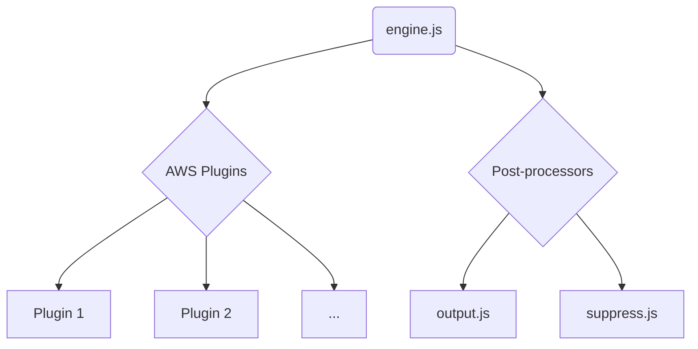
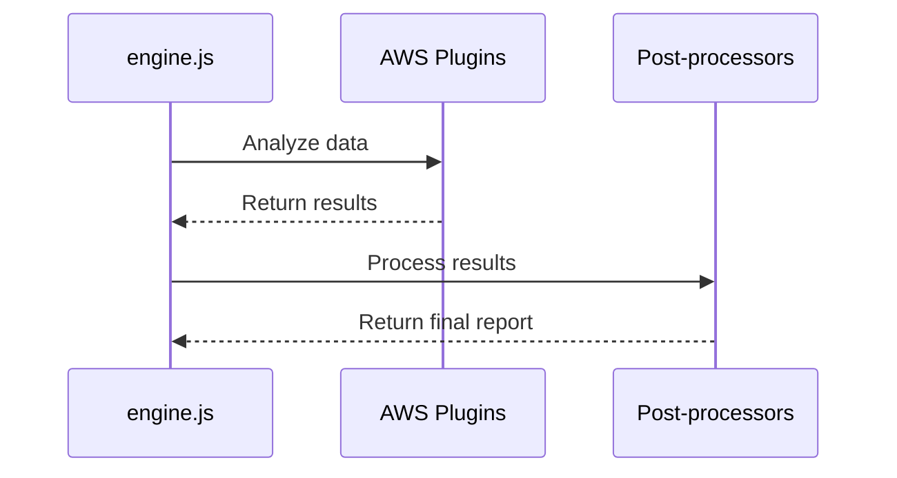

# AWS Plugins and Post-Processors Architecture

This document provides a comprehensive overview of the architecture of AWS plugins and post-processors, including their components, interactions, and technologies.

## Architecture Overview

The system's architecture for AWS plugins and post-processors is designed to be modular and extensible. After the AWS collector gathers data from the AWS environment, the `engine.js` passes this data to the AWS plugins for analysis.

Each AWS plugin is a self-contained module that checks for a specific security vulnerability. The plugins are located in the `plugins/aws` directory. After the plugins have been executed, the results are passed to the post-processors.

The post-processors, located in the `postprocess` directory, are responsible for formatting the output and suppressing any unwanted results. The `output.js` module formats the results into a user-friendly report, while the `suppress.js` module filters out any findings that have been suppressed by the user.

## Use Cases

The primary use case is the analysis of collected data and the generation of a final report.

### Use Case: Analyze AWS Data and Generate Report

1.  **System Process:**
    *   `engine.js` passes the collected AWS data to the AWS plugins.
    *   Each AWS plugin analyzes the data for a specific security issue and returns a result (pass, fail, or unknown).
    *   `engine.js` collects the results from all plugins and passes them to the post-processors.
    *   `suppress.js` filters the results based on user-defined suppression rules.
    *   `output.js` formats the final results into a report.
2.  **Expected Outcome:** A formatted report is generated and displayed to the user, showing the security posture of their AWS environment.

## System Diagrams

### Sequence Diagram: Data Analysis and Reporting

## Technology Stack

-   **Programming Language:** Node.js
-   **Core Modules:**
    -   `engine.js`: Orchestrates the plugin and post-processor execution.
    -   `plugins/aws/*`: Individual AWS security check plugins.
    -   `postprocess/output.js`: Formats the output report.
    -   `postprocess/suppress.js`: Filters results based on suppression rules.

## Key Design Decisions

-   **Plugin-Based Architecture:** The use of individual plugins for each security check makes the system highly extensible. New checks can be added by simply creating a new plugin file, without modifying the core logic of the system.
-   **Separation of Concerns:** The clear separation between data collection (collectors), analysis (plugins), and reporting (post-processors) makes the system easier to understand, maintain, and extend.
-   **Configurable Post-Processing:** The post-processing step is configurable, allowing users to suppress unwanted findings and customize the output format. This provides greater flexibility in how the results are consumed.
