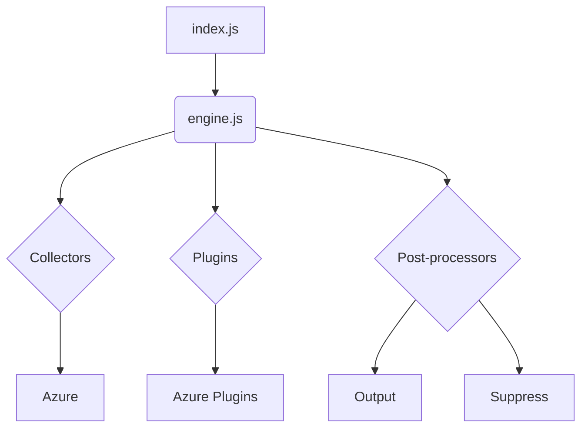
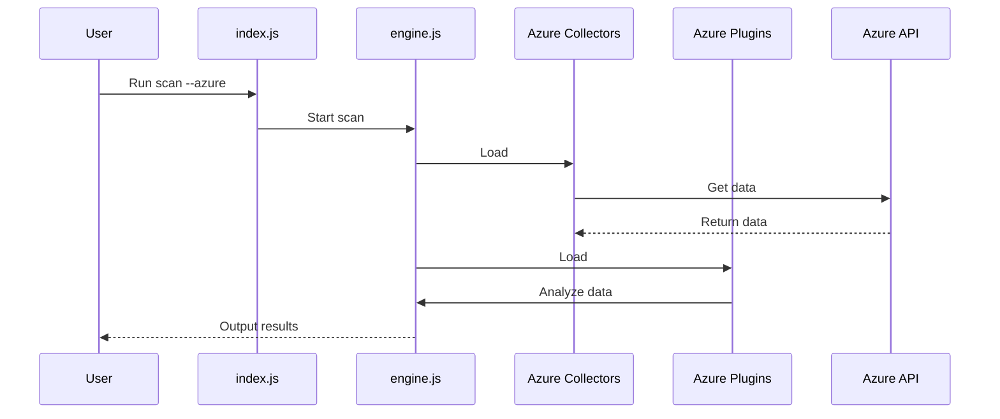

# Azure Architecture Documentation

This document provides a comprehensive overview of the system's Azure integration architecture, including its components, interactions, and technologies.

## Architecture Overview

The system utilizes a modular architecture to integrate with Microsoft Azure. The core `engine.js` is responsible for the overall orchestration of the scanning process. When an Azure scan is initiated, the engine dynamically loads the Azure-specific collector and plugins.

The Azure collector, located in `collectors/azure`, interacts with Azure APIs to gather data about the cloud environment. It uses libraries such as `@azure/storage-blob`, `@azure/storage-queue`, `@azure/storage-file-share`, and `ms-rest-azure` to communicate with various Azure services.

The collected data is then processed by the Azure plugins (`plugins/azure`), which are designed to detect specific security misconfigurations and vulnerabilities within the Azure environment.



## Use Cases

The primary use case for the Azure integration is to perform security scans on Azure environments to identify potential risks.

### Use Case: Scan Azure Environment

1.  **User Interaction:** The user executes the `index.js` script with the `--azure` flag.
2.  **System Process:**
    *   `index.js` recognizes the target environment as Azure and calls the `engine.js`.
    *   `engine.js` loads the Azure collector and the corresponding Azure plugins.
    *   The Azure collector authenticates with Azure and makes API calls to fetch configuration data from the user's subscription.
    *   The Azure plugins analyze the fetched data against a set of security best practices.
    *   The post-processing modules format the findings into a clear and actionable report.
3.  **Expected Outcome:** A report is generated and displayed to the user, listing all identified security issues within the Azure environment.

## System Diagrams

### Deployment Diagram

```mermaid
deployment
    user
    server
    subgraph Azure
        vm
    end

    user -> server: Run scan
    server -> vm: Scan
```

### Sequence Diagram: Azure Scan



## Technology Stack

-   **Programming Language:** Node.js
-   **Azure Integration:**
    -   `@azure/storage-blob`
    -   `@azure/storage-queue`
    -   `@azure/storage-file-share`
    -   `@azure/data-tables`
    -   `ms-rest-azure`
    -   `azure-storage`
-   **Testing:** Mocha, Chai
-   **Linting:** ESLint
-   **Code Coverage:** nyc

## Key Design Decisions

-   **Decoupled Components:** By separating the Azure collector and plugins from the core engine, the system remains flexible and easy to maintain. Updates to the Azure SDKs or changes in Azure services only require modifications to the Azure-specific modules, not the entire application.
-   **Asynchronous API Calls:** To handle the potentially large number of API requests to Azure without blocking the main thread, all I/O operations are performed asynchronously. This results in a faster and more responsive scanning process.
-   **Extensible Plugin Framework:** The plugin architecture is designed to be simple, allowing new security checks for Azure services to be developed and integrated with minimal effort.
