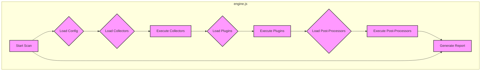
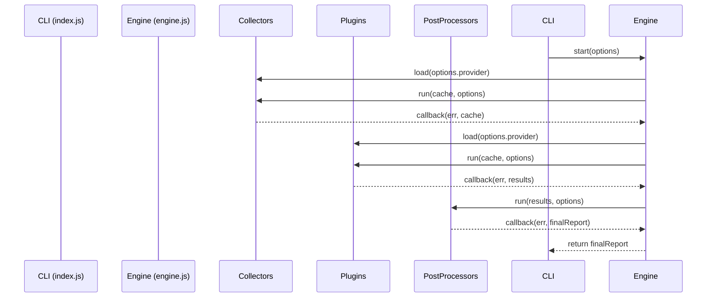

# `engine.js` Architecture Documentation

This document provides a detailed overview of the `engine.js` file, which is the core component of the CloudSploit scanning engine.

## Architecture Overview

`engine.js` acts as the central orchestrator for the entire scanning process. It follows a layered and event-driven architectural pattern. Its primary responsibility is to manage the lifecycle of a scan, which includes:
1.  **Initialization**: Setting up the scan environment based on user-provided options.
2.  **Collector Execution**: Dynamically loading and running the appropriate data collectors for the target cloud provider (e.g., AWS, Azure, GCP).
3.  **Plugin Execution**: Once data is collected, the engine feeds it to the relevant plugins for analysis.
4.  **Post-Processing**: After plugins have run, the engine passes the results to post-processors for filtering (suppression) and formatting.
5.  **Result Aggregation**: Consolidating all the results into a final report.

This design decouples the core logic from the provider-specific implementations, making the system highly modular and scalable.

## Use Cases

The main use case for `engine.js` is to execute a security scan from start to finish.

### Use Case: Executing a Cloud Security Scan

1.  **User Interaction:** A user initiates a scan via the command line (`index.js`).
2.  **System Process:**
    *   `index.js` parses the arguments and passes them to `engine.js`.
    *   `engine.js` initializes the cache and settings.
    *   It identifies the target cloud provider (e.g., 'aws').
    *   It finds and loads the corresponding collector files from the `collectors/` directory.
    *   The collectors are executed asynchronously to fetch data from the cloud provider's APIs.
    *   Once collection is complete, `engine.js` finds and loads the plugins for the provider from the `plugins/` directory.
    *   Each plugin is executed with the collected data (cache).
    *   The results from the plugins are passed to the post-processing modules (`suppress.js`, `output.js`).
    *   `suppress.js` filters out any results the user has chosen to ignore.
    *   `output.js` formats the remaining results into the desired output format (e.g., JSON, CSV, table).
3.  **Expected Outcome:** The final, formatted report is returned and displayed to the user.

## System Diagrams

### Sequence Diagram: Scan Orchestration

This diagram shows the sequence of operations handled by `engine.js` during a typical scan.

## Technology Stack

-   **Programming Language:** Node.js
-   **Key Node.js Modules:**
    -   `async`: For managing asynchronous control flow, especially for running collectors and plugins in series or parallel.
    -   `fs`: For dynamically reading the `collectors`, `plugins`, and `postprocess` directories.
    -   `path`: For handling file paths.

## Key Design Decisions

-   **Centralized Orchestration:** `engine.js` is the single source of truth for the scan lifecycle. This centralizes the core logic and makes the overall workflow predictable and easier to debug.
-   **Dynamic Module Loading:** Instead of hardcoding collectors and plugins, the engine dynamically discovers and loads them from the file system. This is a critical feature that makes the system extensible. New cloud providers, plugins, or post-processors can be added just by creating new files in the correct directories, without any changes to the engine itself.
-   **Asynchronous-First Approach:** The entire engine is built around asynchronous operations. This is essential for performance, as data collection involves numerous network I/O calls that would otherwise block the application. The `async` library is used to manage the complexity of these operations.
-   **Data Caching:** The engine utilizes a caching mechanism (`cache` object) to store the data collected from the cloud provider. This data is then passed to all plugins, avoiding the need for each plugin to re-fetch the same information, which significantly reduces API calls and speeds up the scan.
