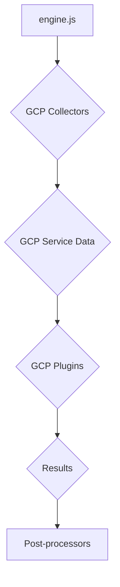
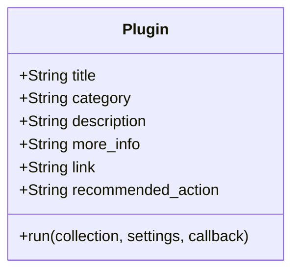
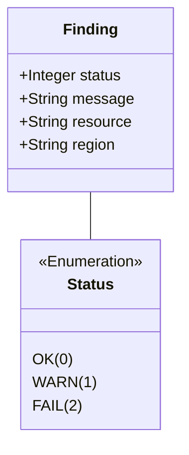

# GCP Plugins Documentation

This document provides a comprehensive overview of the GCP plugins within the CloudSploit system.

## Architecture Overview

The GCP plugins are part of the CloudSploit scanning engine, designed to assess the configuration and security of various GCP services. The architecture follows the standard CloudSploit plugin pattern, where collectors gather data from GCP, and plugins analyze that data to identify potential security risks.

The GCP plugins are executed by the core engine (`engine.js`) after the relevant data has been collected by the GCP collectors. The results are then passed to the post-processing modules for suppression and output formatting.

## Technology Stack

-   **Programming Language:** Node.js
-   **Framework:** CloudSploit (custom plugin architecture)
-   **GCP SDK:** Used by the collectors to interact with the GCP API and retrieve service data.

## Plugin Interface and Finding Structure

This section details the standard interface for all CloudSploit plugins and the structure of the findings they generate.

### Plugin Module Exports

Each plugin is a Node.js module that exports a standard set of properties and a `run` function.

### The `run` Function

The `run` function is the entry point for the plugin's execution.

`run(collection, settings, callback)`

-   **Parameters:**
    -   `collection` (object): An object containing all the data gathered by the collectors.
    -   `settings` (object): An object containing global settings for the scan.
    -   `callback` (function): A standard Node.js callback function `(err, results)`.

### Finding (Result) Structure

The `run` function passes an array of "finding" objects to its callback.

