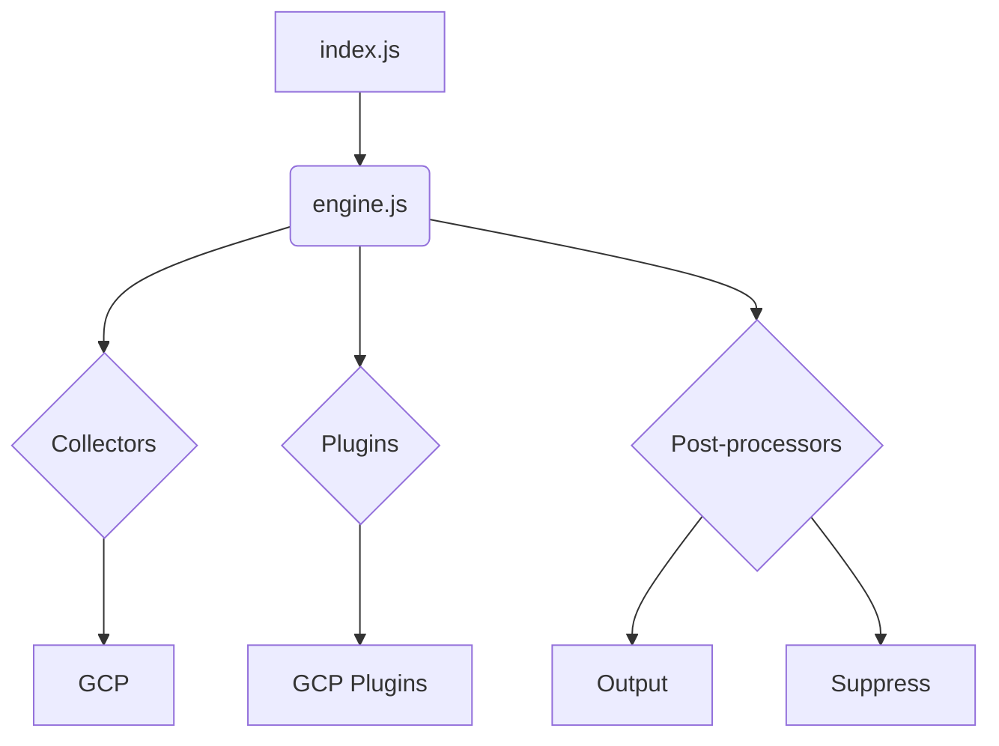
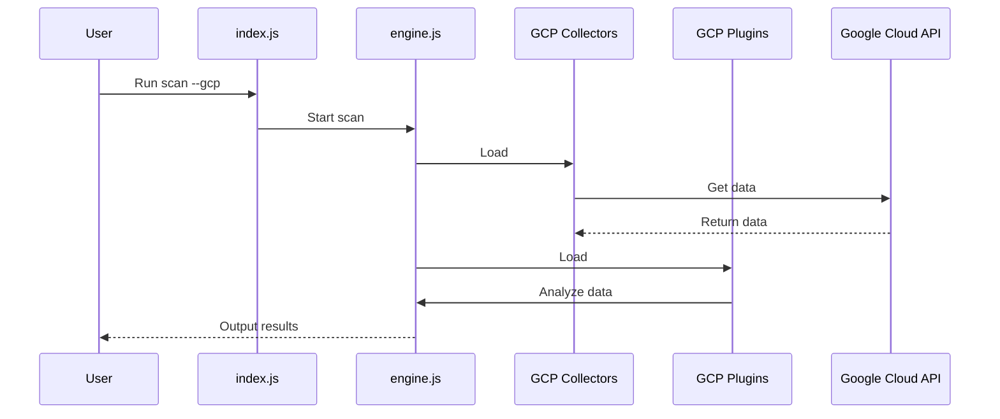

# GCP Architecture Documentation

This document provides a comprehensive overview of the system's GCP integration architecture, including its components, interactions, and technologies.

## Architecture Overview

The system follows a modular architecture, with distinct components for different cloud providers. For GCP, the integration is handled by a dedicated GCP collector and a set of GCP-specific plugins. The core `engine.js` orchestrates the scanning process. It dynamically loads the GCP collector and plugins when a GCP scan is initiated.

The GCP collector is responsible for gathering data from the Google Cloud Platform APIs using the `google-auth-library`. The collected data is then passed to the GCP plugins, which analyze it to identify potential security misconfigurations.



## Use Cases

The primary use case is to scan a GCP environment for security vulnerabilities.

### Use Case: Scan GCP Environment

1.  **User Interaction:** The user runs the `index.js` script with the `--gcp` flag.
2.  **System Process:**
    *   `index.js` parses the command-line arguments and invokes `engine.js`.
    *   `engine.js` loads the GCP collector and plugins.
    *   The GCP collector uses the `google-auth-library` to authenticate and gather data from GCP APIs.
    *   The GCP plugins analyze the collected data for security issues.
    *   The post-processors format the results into a user-friendly report.
3.  **Expected Outcome:** The system outputs a report detailing security vulnerabilities found in the GCP environment.

## System Diagrams

### Deployment Diagram

```mermaid
deployment
    user
    server
    subgraph GCP
        gce
    end

    user -> server: Run scan
    server -> gce: Scan
```

### Sequence Diagram: GCP Scan



## Technology Stack

-   **Programming Language:** Node.js
-   **GCP Integration:** `google-auth-library`
-   **Testing:** Mocha, Chai
-   **Linting:** ESLint
-   **Code Coverage:** nyc

## Key Design Decisions

-   **Provider-Specific Components:** Having a dedicated collector and plugins for GCP allows for focused and efficient integration with Google Cloud's specific APIs and services.
-   **Asynchronous Operations:** The use of async operations is crucial for non-blocking I/O when making API calls to GCP, ensuring the scanning process is performant.
-   **Standardized Plugin Interface:** A consistent plugin interface simplifies the process of adding new GCP-specific security checks, making the system easily extensible.
