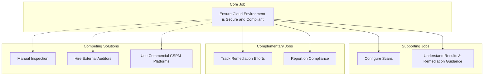
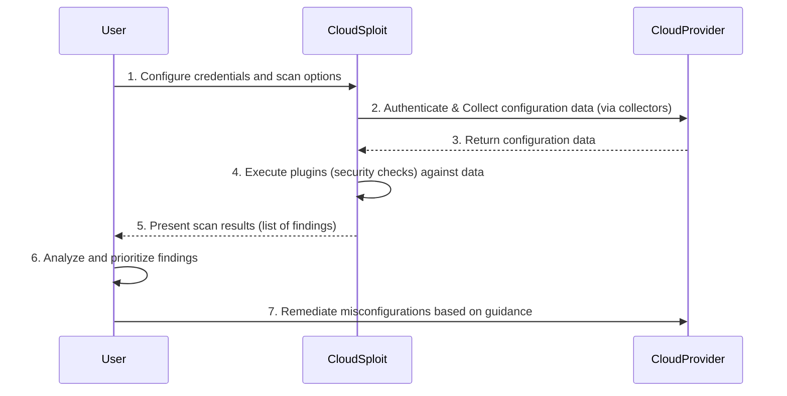

# Jobs to be Done (JTBD) Documentation for CloudSploit

This document outlines the "Jobs to be Done" (JTBD) that customers "hire" CloudSploit to perform. It provides a framework for understanding customer motivations and desired outcomes, based on an analysis of the CloudSploit source code.

## 1. Core Job Definition

The primary job that customers are trying to accomplish with CloudSploit can be defined as follows:

**When** I am managing a cloud infrastructure, **I want to** automatically and comprehensively scan for security misconfigurations and vulnerabilities, **so I can** proactively identify and prioritize risks to ensure my environment is secure and compliant.

## 2. Job Map

The following diagram illustrates the relationship between the core job, supporting jobs, and complementary jobs that users perform in the process of securing their cloud environment.

## 3. Related Jobs and Desired Outcomes

### Supporting Jobs

These are jobs that make it easier for the user to accomplish the core job.

**Job 1: Configure Scans**
*   **Statement:** When I am setting up a security scan, I want to easily configure authentication and select the specific checks to run, so I can tailor the scan to my specific environment and needs.
*   **Desired Outcomes:**
    *   Spend less than 10 minutes on the initial configuration for a new cloud account.
    *   Easily enable or disable specific checks based on relevance.
    *   Feel confident that the authentication method is secure.

**Job 2: Understand Results & Remediation Guidance**
*   **Statement:** When I am reviewing scan results, I want to quickly understand the risk level of each finding and get clear, actionable remediation guidance, so I can fix the identified issues effectively and efficiently.
*   **Desired Outcomes:**
    *   Reduce the time to understand the impact of a finding to under 2 minutes.
    *   Have a clear, step-by-step guide to remediate each identified vulnerability.
    *   Minimize false positives to focus only on relevant security risks.

### Complementary Jobs

These are jobs that users do in conjunction with or as a result of the core job.

**Job 1: Track Remediation Efforts**
*   **Statement:** When a vulnerability is found, I want to integrate the findings into my existing workflow tools (like ticketing or messaging systems), so I can track remediation efforts and collaborate with my team.
*   **Desired Outcomes:**
    *   Automatically create a ticket (e.g., in Jira, ServiceNow) for every high-severity finding.
    *   Receive notifications in a team chat application (e.g., Slack, Microsoft Teams) when new critical risks are detected.

**Job 2: Report on Compliance**
*   **Statement:** When an audit is required, I want to generate a comprehensive compliance report from the scan results, so I can demonstrate the security and compliance posture of my cloud environment to stakeholders, managers, or auditors.
*   **Desired Outcomes:**
    *   Generate a compliance report (e.g., for CIS, PCI-DSS) with a single command.
    *   Customize reports to show specific resource types or risk levels.
    *   Reduce the time it takes to prepare for an audit by over 80%.

## 4. Progress Diagram

This diagram illustrates the typical steps a customer takes to get the core job done using CloudSploit.

