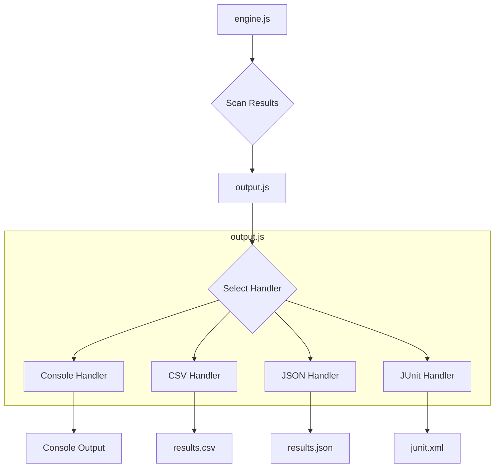
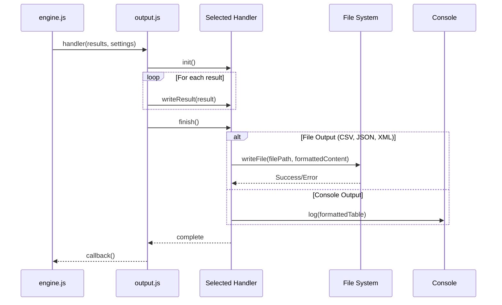

# Technical Documentation: `postprocess/output.js`

## File Overview

The `output.js` file is a crucial post-processing module in the CloudSploit scanning engine. Its primary responsibility is to take the raw JSON results from the plugin scans and format them into various human-readable or machine-readable formats. This allows users to consume the scan findings in a way that best suits their workflow, whether it's viewing them in the console, integrating with a CI/CD pipeline via JUnit, or importing them into another tool using CSV or JSON.

This file is written in **Node.js** and utilizes standard libraries like `fs` for file system operations and the external `tty-table` library for formatting console output.

## Architecture

In the CloudSploit architecture, `output.js` operates at the end of the scan lifecycle. The core `engine.js` orchestrates the scan, running collectors to gather data and plugins to analyze it. Once all plugins have executed, the engine passes the collated results to the post-processors, which include `suppress.js` (for filtering) and then `output.js` (for formatting and writing).

The file defines several "handler" objects, one for each output format (e.g., `consoleOutputHandler`, `csvHandler`, `jsonHandler`, `junitHandler`). The main exported `handler` function acts as a dispatcher, selecting the appropriate handler based on the user's configuration and directing the flow of results to it.



## Use Cases

- **Console Reporting:** When a user runs a scan from the command line without specifying a file output, `output.js` uses the `tty-table` library to present the findings in a clean, color-coded table directly in the terminal.
- **CSV Export:** For users who need to import scan results into spreadsheets or other data analysis tools, `output.js` can generate a `results.csv` file.
- **JSON Export:** To provide full, machine-readable details of the scan, `output.js` can output a `results.json` file. This is useful for programmatic integration with other systems.
- **CI/CD Integration:** For DevOps workflows, `output.js` can generate a `junit.xml` file. This standard format allows CI/CD platforms (like Jenkins, GitLab CI, etc.) to automatically parse the scan results and display them as test outcomes, enabling automated quality gates.

## Code Walkthrough

The file is structured around a main exported function and several helper objects and functions.

### `exports.handler(results, settings, callback)`

This is the main entry point for the module.

- **Purpose:** To orchestrate the entire output process.
- **Inputs:**
    - `results` (Array): An array of result objects from the scanning plugins.
    - `settings` (Object): The application configuration, which includes output format, file paths, and other options.
    - `callback` (Function): A function to call once the output has been written.
- **Behavior:**
    1. It first checks if there are any results. If not, it logs a message and returns.
    2. It determines which output handler to use based on `settings.output_format` or the extension of `settings.output_file`. If no file is specified, it defaults to the console handler.
    3. It initializes the selected handler using `handler.init()`.
    4. It iterates through each result, determines the compliance status, and calls `handler.writeResult()` for each one.
    5. After processing all results, it calls `handler.finish()` to finalize the output (e.g., write the file to disk or print the table to the console).
    6. Finally, it executes the `callback`.

### Helper Functions

- **`exchangeStatusWord(result)`**: Converts a numeric status (`0` for OK, `1` for WARN, `2` for FAIL) into a human-readable string.

    ```javascript
    function exchangeStatusWord(result) {
        if (result.status === 0) return 'OK';
        if (result.status === 1) return 'WARN';
        if (result.status === 2) return 'FAIL';
        return 'UNKNOWN';
    }
    ```

- **`commaSafe(str)` & `XMLSafe(str)`**: These are escaping functions to ensure that content written to CSV and XML files, respectively, does not break the file format.

### Output Handlers

Each handler is an object with three methods: `init`, `writeResult`, and `finish`.

- **`consoleOutputHandler`**:
    - `init`: Sets up the headers for the console table.
    - `writeResult`: Pushes a formatted row of data into an array.
    - `finish`: Uses `ttytable` to render the complete table to the console.

- **`csvHandler`**:
    - `init`: Opens a file stream and writes the CSV header row.
    - `writeResult`: Writes a single result as a comma-separated line to the file stream.
    - `finish`: Closes the file stream.

- **`jsonHandler`**:
    - `init`: Initializes an empty array to hold all the results.
    - `writeResult`: Pushes the raw result object into the array.
    - `finish`: Converts the entire array to a JSON string and writes it to the specified file.

- **`junitHandler`**:
    - `init`: Initializes an array and writes the opening `<testsuites>` tag.
    - `writeResult`: Formats the result into a `<testcase>` XML block. If the result is a FAIL, it adds a `<failure>` tag inside.
    - `finish`: Writes the closing `</testsuites>` tag and saves the `.xml` file.

## Dependencies

- **`fs` (built-in):** The Node.js File System module is essential for all file-based output handlers (CSV, JSON, JUnit) to write the results to disk.
- **`tty-table` (external):** This library is used exclusively by the `consoleOutputHandler` to render the array of results as a nicely formatted and aligned table in the terminal.

## System Diagrams

### Data Flow in `output.js`



## Error Handling and Edge Cases

- **No Results:** If the `results` array is empty, the `handler` function logs a message indicating that no results were found and exits gracefully.
- **File System Errors:** When writing to a file, standard `fs` module errors can occur (e.g., permissions denied, invalid path). These errors are passed up through the callback chain to the main `engine.js` execution flow, which will terminate the process and log the error.
- **Unknown Status:** The `exchangeStatusWord` function returns 'UNKNOWN' for any status code that is not 0, 1, or 2, preventing crashes from unexpected result data.
- **Mocha Testing:** The `log` function checks for `settings.mocha`. This ensures that console output is suppressed during automated tests, keeping the test logs clean.

## Testing

The functionality of `output.js` is tested in `postprocess/output.spec.js`. The tests likely cover:
- **Each Output Format:** There are dedicated tests to ensure that each handler (console, CSV, JSON, JUnit) correctly formats and writes the data as expected.
- **Correct Data Transformation:** Tests verify that functions like `exchangeStatusWord`, `commaSafe`, and `XMLSafe` are correctly transforming the data.
- **Edge Cases:** Scenarios like empty result sets or results with missing properties are tested to ensure the module handles them without crashing.
- **File Creation:** Tests will run the handler and then read the created file from disk to assert that its content is correct.

## Future Improvements

- **HTML Reports:** A new `htmlHandler` could be added to generate a more visual and user-friendly HTML report with charts and filterable tables.
- **Streaming for Large Datasets:** For extremely large result sets, the JSON handler currently buffers all results in memory. This could be optimized to stream JSON objects to the file to reduce memory consumption.
- **More Output Formats:** Support for other formats like YAML or integrations with specific security platforms (e.g., Security Hub format) could be added.
- **Templating Engine:** Instead of hard-coding the output strings, a templating engine (like Handlebars or EJS) could be used for more flexible and maintainable output formatting, especially for complex formats like HTML or XML.
