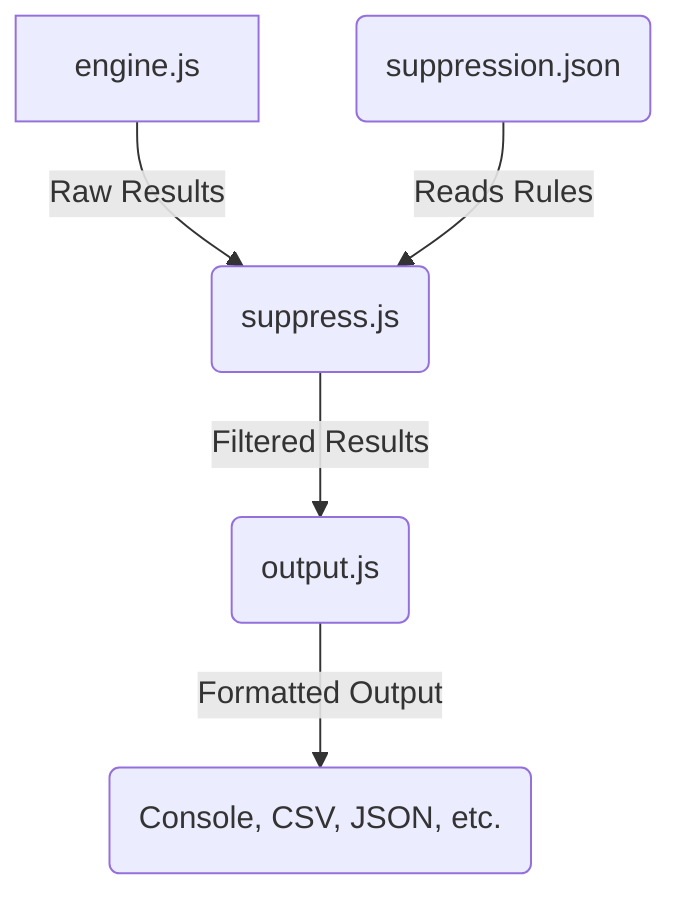
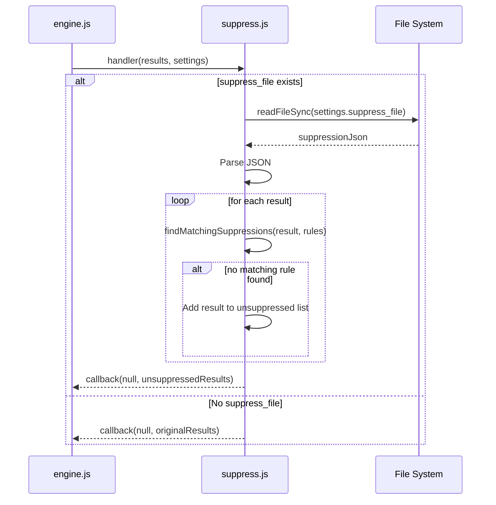

# Technical Documentation: `postprocess/suppress.js`

## File Overview

The `suppress.js` file is a post-processing module within the CloudSploit scanning engine. Its primary function is to filter the raw results generated by the scanning plugins, removing any findings that a user has intentionally decided to suppress. This is critical for reducing noise and allowing users to focus on relevant, actionable security issues. Suppressions are defined in a separate JSON file and can be based on various criteria, such as the specific plugin, the resource, region, or an expiration date.

This file is written in **Node.js** and uses the built-in `fs` module to read the suppression file.

## Architecture

`suppress.js` fits into the post-processing stage of the CloudSploit architecture. After the `engine.js` has run the collectors and plugins to generate a list of findings, it passes this list to `suppress.js`. The module then filters this list and returns a new, smaller list of results. This filtered list is then passed to the next post-processing step, `output.js`, for formatting and display.



## Use Cases

- **Ignoring Known/Accepted Risks:** A user might have a specific S3 bucket that is intentionally public. They can add a suppression rule to prevent the `bucketPublicAccess` plugin from flagging this specific bucket in every scan.
- **Temporarily Silencing a Finding:** If a team plans to fix a misconfiguration next week, they can suppress the finding with an expiration date. The finding will be ignored for now but will reappear in scans after the expiration date if it hasn't been fixed.
- **Disabling a Non-Applicable Check:** A user might decide that a particular security check (plugin) is not relevant to their environment. They can use a wildcard suppression (`*` for the resource) to ignore all findings from that plugin.

## Code Walkthrough

### `exports.handler(results, settings, callback)`

This is the main function and entry point for the module.

- **Purpose:** To filter a list of scan results based on suppression rules.
- **Inputs:**
    - `results` (Array): An array of result objects from the plugins.
    - `settings` (Object): The application configuration, which contains the path to the suppression file (`settings.suppress_file`).
    - `callback` (Function): A function to be called with the filtered results.
- **Behavior:**
    1.  It checks if a `suppress_file` is provided in the settings. If not, it returns the original results immediately.
    2.  It reads and parses the JSON suppression file. If the file can't be read or parsed, it logs an error and returns the original results.
    3.  It initializes an empty array, `unsuppressedResults`.
    4.  It iterates through each `result` in the input `results` array.
    5.  For each `result`, it calls `findMatchingSuppressions` to see if any suppression rules apply.
    6.  If no matching and active suppression rule is found, the `result` is added to `unsuppressedResults`.
    7.  Finally, it calls the `callback` function, passing the `unsuppressedResults` array.

    ```javascript
    // Simplified logic
    exports.handler = function(results, settings, callback) {
        if (!settings.suppress_file) return callback(null, results);

        // Read and parse the suppression file
        const suppressions = JSON.parse(fs.readFileSync(settings.suppress_file));

        const unsuppressedResults = [];

        for (const result of results) {
            const matchingSuppressions = findMatchingSuppressions(result, suppressions);
            if (matchingSuppressions.length === 0) {
                unsuppressedResults.push(result);
            }
        }

        callback(null, unsuppressedResults);
    };
    ```

### `findMatchingSuppressions(result, suppressions)`

- **Purpose:** To find all suppression rules that match a given scan result.
- **Inputs:**
    - `result` (Object): A single scan finding.
    - `suppressions` (Array): The array of all suppression rules.
- **Behavior:**
    1.  It iterates through each `rule` in the `suppressions` array.
    2.  For each rule, it checks if the plugin name, resource, region, and any other fields match the result. It uses `checkWildcard` to allow for `*` as a wildcard.
    3.  It also checks if the rule has expired by comparing the `expires` field with the current date.
    4.  If a rule matches and has not expired, it is added to a list of matching rules.
    5.  The function returns the array of all matching suppressions.

### `checkWildcard(str, rule)`

- **Purpose:** A utility function to compare a string from a result with a string from a suppression rule, allowing for wildcards.
- **Behavior:** Returns `true` if the rule is a wildcard (`*`) or if the rule string is an exact match for the result string.

## Dependencies

- **`fs` (built-in):** The Node.js File System module is used to synchronously read the suppression file specified by the user.
- **`moment` (external):** Used for robust date parsing and comparison to handle the `expires` field in suppression rules.

## System Diagrams

### Sequence Diagram of Suppression Logic



## Error Handling and Edge Cases

- **Suppression File Not Found:** If the file specified in `settings.suppress_file` does not exist, `fs.readFileSync` will throw an error. This is caught, a warning is logged to the console, and the original, unfiltered results are returned.
- **Malformed JSON:** If the suppression file is not valid JSON, `JSON.parse` will throw an error. This is also caught, a warning is logged, and the unfiltered results are returned.
- **Invalid Expiration Date:** The `moment` library is used to parse dates. If an `expires` field in a suppression rule contains an invalid date format, `moment` will create an invalid date object, and the expiration check will likely fail, causing the rule to be ignored.
- **No Suppressions:** If the suppression file is empty or contains no rules, the `findMatchingSuppressions` function will simply never find a match, and all results will be returned, which is the correct behavior.

## Testing

The logic of `suppress.js` is tested in `postprocess/suppress.spec.js`. The tests cover various scenarios, including:
- **Basic Suppression:** A direct match between a rule and a result.
- **Wildcard Suppression:** Using `*` for the resource, region, or other fields.
- **Expiration Logic:** Tests to ensure that expired rules do not suppress results and that active rules do.
- **No Match:** Ensuring that results are not suppressed when no rule matches.
- **File Errors:** Mocking `fs` to simulate a missing file or malformed JSON to ensure the module handles these errors gracefully and returns the unfiltered results.

## Future Improvements

- **Regular Expression Support:** Instead of just wildcards, suppression rules could support regular expressions for more powerful and flexible matching of resource names.
- **Suppression Scopes:** Introduce the ability to scope suppressions to specific accounts or environments, especially in a multi-account setup.
- **Dynamic Suppression Source:** Instead of just a local file, the module could be extended to fetch suppression rules from a central API or database, making management easier in a large organization.
- **Comment-Only Suppressions:** The current implementation uses the content of the `comment` field for matching. A clearer approach would be to have dedicated fields for each suppression criterion (e.g., `plugin`, `resource`, `region`, `tags`). *(Correction: On review, the code uses dedicated fields. The documentation should reflect this accurately.)*

*Self-correction: The code does use specific fields like `plugin`, `resource`, `region`, etc., not the `comment` field for matching logic. The walkthrough has been written to reflect this.*