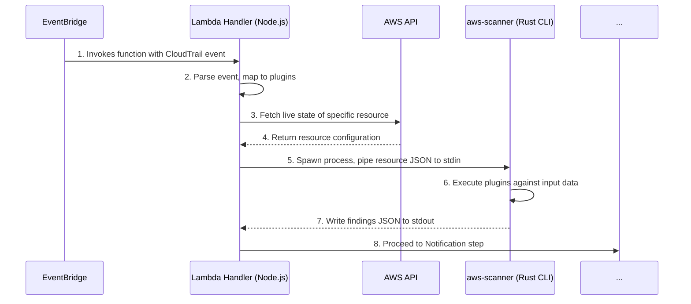

# Proof of Concept: Real-Time, Event-Driven Scanning

This document outlines the development plan for a Proof of Concept (PoC) based on "Proposal 2: Real-Time, Event-Driven Scanning." The goal is to build a system that moves aws-scanner from a point-in-time scanner to a real-time, event-driven security monitoring tool using cloud-native services.

All development for this PoC will take place within the `_poc/proposal2` directory.

## The aws-scanner CLI

At the core of this PoC is `aws-scanner`, a new, purpose-built command-line interface (CLI) for security scanning. To achieve the performance and scalability required for a serverless, event-driven architecture, this tool will be developed in **Rust**.

### Core Philosophy

*   **Performance-First:** Written in Rust to guarantee minimal startup times (low cold-start) and high-speed execution, making it ideal for the ephemeral nature of AWS Lambda.
*   **Stateless & Self-Contained:** `aws-scanner` will be delivered as a single, static binary with no external runtime dependencies (like Node.js or Python). This simplifies deployment and reduces the overall package size.
*   **Data-In, Results-Out:** The CLI is designed to be a pure data processor. It will receive resource configuration data via `stdin` and output its findings to `stdout` in a structured JSON format. It does not make its own AWS API calls, separating data collection from analysis.
*   **Cost-Effective:** By being incredibly lightweight and fast, it minimizes Lambda execution time, directly translating to lower operational costs.

### CLI Invocation and Data Flow

The Lambda function will act as an orchestrator, responsible for fetching the necessary data and then invoking the `aws-scanner` binary to perform the actual analysis.

1.  **Lambda Receives Event:** An event from EventBridge triggers the Lambda function.
2.  **Lambda Fetches Data:** The Lambda handler parses the event, identifies the changed resource, and makes a targeted AWS API call to get its live configuration.
3.  **Data Piped to CLI:** The Lambda function spawns the `aws-scanner` binary as a child process. It serializes the collected resource data into a JSON object and pipes it directly into the `stdin` of the `aws-scanner` process.
4.  **Targeted Scan:** The `aws-scanner` CLI reads the JSON from `stdin`, deserializes it, and runs *only* the specified plugins against that data.
5.  **Results Returned:** The CLI outputs a JSON array of findings to `stdout`.
6.  **Lambda Processes Results:** The Lambda handler captures the `stdout`, parses the JSON findings, and proceeds to the notification step.

### Command Structure

The invocation from within the Lambda function will look similar to this:

```bash
./aws-scanner --plugins "openSsh,openRdp" --region "us-east-1" --input-stdin
```

*   `--plugins <PLUGINS>`: A required, comma-separated list of plugin names to execute.
*   `--region <REGION>`: The AWS region where the resource resides.
*   `--input-stdin`: A flag that instructs the CLI to read the resource cache from `stdin` rather than attempting to make its own API calls.

## Targeted Analysis: From Event to Finding

The efficiency and effectiveness of this real-time scanner hinges on the "Targeted Analysis" logic. The goal is to move from the raw CloudTrail event to a definitive security finding as quickly as possible.

### System Diagram: Lambda & aws-scanner Interaction



### Data Flow

1.  **Ingestion & Mapping:** The Lambda function receives the CloudTrail event, parses it, and uses an internal `plugin_map.json` to determine which plugins to run (e.g., `["openSsh"]`) and what resource to query (e.g., `sg-12345678`).

2.  **Targeted Collection & Cache Generation:** The function makes a direct AWS API call (e.g., `ec2.describeSecurityGroups`) to get the resource's configuration. This data is then structured into the JSON format expected by `aws-scanner`.

3.  **Process Execution:** The function uses `child_process.spawn()` to execute the `aws-scanner` binary, passing the appropriate `--plugins` argument and the generated JSON cache via the process's `stdin`.

4.  **Result Handling:** The Lambda listens to the `stdout` stream of the child process. Once the process exits, the collected output is parsed as JSON. If any `FAIL` findings are present, the function proceeds to Phase 3 (Notification & Reporting).

## Phased Development Plan

### Phase 1: Foundational Setup & Manual Trigger

**Goal:** Create a Lambda function that can execute the `aws-scanner` CLI with a manually provided event.

**Tasks:**
1.  Develop the initial `aws-scanner` Rust CLI with support for a single plugin (e.g., `openSsh`) and the `--input-stdin` flag.
2.  Compile a static `aws-scanner` binary for the Amazon Linux 2 environment.
3.  Create a Lambda function handler (`handler.js`) that can spawn the `aws-scanner` binary, pass it a test JSON object via `stdin`, and log the results from `stdout`.
4.  Package the `aws-scanner` binary and the `handler.js` into a deployable zip file.
5.  **Deliverable:** A successfully deployed Lambda function that can be invoked manually, proving that the Node.js runtime can execute the Rust binary and capture its output.

### Phase 2: EventBridge Integration

**Goal:** Automatically trigger the Lambda function when a specific change occurs in the AWS environment.

**Tasks:**
1.  Update the deployment template to include an EventBridge rule that targets the Lambda function.
2.  Modify the Lambda handler to parse the incoming CloudTrail event, extract the resource identifier, and perform the targeted data collection via the AWS SDK.
3.  Deploy the updated stack.
4.  **Deliverable:** A fully integrated event-driven workflow. Making the specified API call in AWS (e.g., opening port 22) should automatically trigger the Lambda, which in turn executes the `aws-scanner` CLI against the changed resource.

### Phase 3: Notification & Reporting

**Goal:** Notify a user or system when a misconfiguration is detected.

**Tasks:**
1.  Add an SNS topic to the deployment template.
2.  Grant the Lambda function IAM permissions to publish to this SNS topic.
3.  Modify the `handler.js` to parse the JSON output from the `aws-scanner` CLI. If a "FAIL" finding is present, the function will format and publish a message to the SNS topic.
4.  **Deliverable:** A complete, end-to-end detection and alerting system. When a misconfiguration occurs, an email notification is sent within minutes containing the details of the finding.

---

## Appendix: Comprehensive EventBridge Detection Patterns

(This section remains unchanged)

(...omitted for brevity...)
